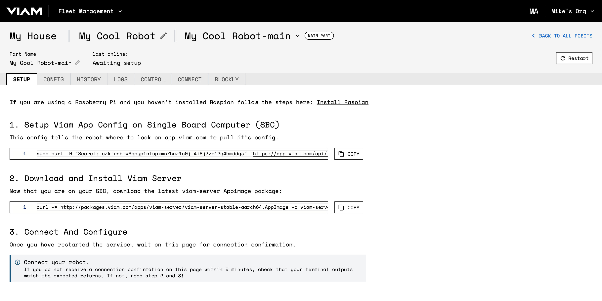

## Prerequisites

This tutorial requires the following hardware:

* A Raspberry Pi Single Board Computer
* A microSD card
* An internet connected computer
* A way to connect the microSD card to the computer (ex, microSD slot or microSD reader)

Before installing the Viam RDK, you will need a Raspberry Pi running a 64-bit Linux distribution.
If you do not have Linux installed on your Raspberry Pi, skip ahead to [Installing Raspian on the Raspberry Pi](#installing-raspian-on-the-raspberry-pi).
If you already have a Raspberry Pi with Linux installed on it, check if the Linux installation on your Raspberry Pi is 64-bit.
First, `ssh` into your Pi and then run `lscpu`.
Example output:


If the value of “Architecture: _'xxxxxx'_” ends in 64, skip ahead to [Installing viam-server](#installing-viam-server).
Otherwise continue to [Installing Raspian on the Raspberry Pi](#installing-raspian-on-the-raspberry-pi).

## Installing Raspian on the Raspberry Pi
A Raspberry Pi boots from a microSD card.
The first step is to set up a Linux installation on that microSD card.
Connect the microSD card to your computer.

You will be using the Raspberry Pi Imager to flash the microSD card.
If you do not already have the Raspberry Pi Imager, you can [download it and follow the install instructions](https://www.raspberrypi.com/software/).
After installing successfully, connect your microSD card to your computer and launch the Raspberry Pi Imager.
You should be greeted with a window that looks like:


Select `CHOOSE OS`.
Since you need a 64-bit version of Linux, you will need to select it from the `Rapsberry Pi OS (other)` menu.


Then select the entry titled `Raspberry Pi OS Lite (64-bit)`.


You should be brought back to the initial launch screen.
To make your Raspberry Pi easier to access, Viam recommends configuring hostname, ssh credentials, and wifi.
Click the gear-shaped settings icon in the lower right to bring up the Advanced options menu (note that if you are using a non-Raspberry Pi OS, altering the Advanced options will cause the initial bootup to fail):


Check `Set hostname` and enter the name you would like to access the Pi by in that field.
Remember the name you choose as you will need to make use of it later.
I’ve chosen "hazal-pi".

There are two ways you can secure your Raspberry Pi: You can either use an SSH key or password authentication.

To use the SSH key method: check `Enable SSH`.
Using SSH Keys for authentication is a great way of securing your Raspberry Pi as only someone with the private SSH key will be able to authenticate to your system.
If you select `Allow public-key authentication only`, and the section `set authorized_ keys for 'pi'` is pre-populated, that means you do have an existing public SSH key that is ready to use.
In that case, you do not have to change this section.

If this section is empty, you can either generate a new SSH key by following [these instructions](https://docs.github.com/en/authentication/connecting-to-github-with-ssh/generating-a-new-ssh-key-and-adding-it-to-the-ssh-agent), or you can use password authentication instead.


If you decide to use password authentication method: click on `Use password authentication`.
If you scroll down, you have the option to change the username, then to set a password:


Be sure to write down this information somewhere in a secure place to keep track of the `hostname`, `username`, and `password` you have configured.
You will use them later on.
Please do not skip this step as you will have to repeat all these steps if you lose your login credentials.

If you did not change the username, the default one is Pi.

Lastly, you should connect your Pi to Wi-Fi, so that you can run Viam's server wirelessly.
Check `Configure wireless LAN` and enter your wireless network credentials.
SSID (short for Service Set Identifier) is your Wi-Fi's name, followed by passcode.
Change the section `Wireless LAN country` to where your router is currently being operated and then you will hit save:


This should return you to the initial screen.
Now you need to pick your storage medium, so click `CHOOSE STORAGE`:


You may have many devices listed, select the microSD card you intend to use in your Raspberry Pi.
If this page is blank and you do not have any listed, make sure your microSD card is connected to your computer correctly:


After clicking save, double check your OS and Storage settings and then click `WRITE`:


You will be prompted to confirm erasing your microSD card: select `YES`.
You may also be prompted by your operating system to enter an Administrator password:


After granting permissions to the Imager, it will begin writing and then verifying the Linux installation to the MicroSD card:


Remove the microSD card from your computer when it is complete:


Place the SD card into your Raspberry Pi and boot the Pi by plugging it in to an outlet.
A red led will turn on to indicate its on.

## Connecting to your Pi with SSH

Once your Raspberry Pi is plugged in and turned on, wait a minute or so and then attempt to access your Pi from your terminal emulator.

Launch your terminal and run this command; the text in <> should be replaced (including the < and > symbols themselves) with the user and host names you configured above.

```bash
ssh <username>@<hostname>.local
```
Example: if your username is 'Hazal' and your hostname is 'pi': then it should be 
`ssh hazal@pi.local`

If you are prompted “Are you sure you want to continue connecting?”, type “yes” and hit enter.
Then, enter your password.
You should be greeted by a login message and a command prompt (`$USERNAME@$HOSTNAME:~ $`).

Next, it's good practice to update your Raspberry Pi to ensure all the latest packages are installed:

```bash
sudo apt-get update
sudo apt-get upgrade
```

## Enabling the I2C Protocol on the Raspberry Pi
    

You can skip the I2C configuration if you are not adding a breakout board to your Raspberry Pi.

I2C stands for inter-integrated circuit and is a method designed to allow one chip to talk to another synchronously.
We will need to enable I2C on your Raspberry Pi so that Viam will be able to connect and communicate with chips and boards connected to your Pi through the GPIO pins.

To enable support for I2C within the kernel, we will need to use the raspi-config tool.
Launch the config tool by running the following command.

```bash
sudo raspi-config
```

Select "Interfacing Options" -> I2C -> <YES> to enable the I2C driver by kernel.


For our changes to take effect, we need to restart our Raspberry Pi.

```bash
sudo reboot
```

## Adding your Pi on the Viam App

In your web browser, navigate to the Viam App ([https://app.viam.com](https://app.viam.com)) and log in.
This means either you can continue with your Viam email address or a personal email you can sign up with.

Once you are logged in, create a new location by filling out the form on the left and then clicking `New Location`.
Location means where your robot is hosted in real life.
This is useful if you have multiple robots in multiple locations and you would like to control them remotely via the cloud on our app.


Select your location and use the form on the right to create a new Robot. If this is the first robot in this location, the App displays an arrow pointer to the **New Robot** field (upper RH-corner). Enter a name for your robot, then click **Add Robot**:


Navigate to your new robot, which should show the setup page as shown below:



## Follow the steps on the setup tab. 

1. Setup Viam App Config on Single Board Computer (SBC)<br/>
_This config tells the robot where to look on app.viam.com to pull its config._<br/>
- Click the copy button to copy the text.
- Go to the terminal window connected to your Pi and paste the text and press enter.<br/>
_This creates an etc/viam.json file containing something like:<br/>
```
{"cloud":{"app_address":"https://app.viam.com:443","id":"{id}","secret":"{secret}"}}
```

2. Download and Install Viam Server<br/>
_Now that you are on your SBC, download the latest viam-server Appimage package:_<br/>
- Click the copy button to copy the text.
- Go to the terminal window connected to your Pi and paste the text and press enter.<br/>
_This installs the viam server._

3. Restart the viam-server:

```bash
sudo systemctl restart viam-server
```

Refresh the page on the Viam App ([https://app.viam.com](https://app.viam.com)) to confirm the Pi has connected and pulled the config by looking at the top of the Robot page and seeing that `host` and `ips` fields are populated and that the `last online` field reads `live`.

You should also see the the notification on the setup page that says "Your robot is connected!"


## Next Steps
Now that you have the viam-server up and running, you can start configuring your robot and the real fun can begin!

In the `CONFIG` tab, you can describe the hardware attached to your Pi which will allow viam to actuate it and expose API's for it.
Click on `NEW COMPONENT` and then populate the resulting component with the configuration information for your hardware.
Once your configuration changes are saved, you can switch to the `CONTROL` tab to actuate your hardware via the webUI.

From here, you can download Viam's [Python SDK](https://python.viam.dev/) and use it to write programs to make your robot autonomous.
The readme on the Python SDK landing page has [instructions](https://python.viam.dev/#easy-setup-via-app-viam-com) to guide you through connecting to and using your robot via the SDK.
