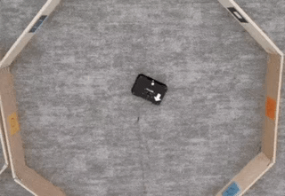
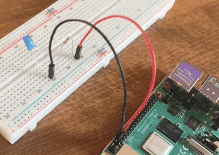

Viam is a complete software platform for robots.


Learn about [the Viam platform in 3 minutes](viam).


  

    

        

            <h4>Try Viam</h4>
            
<a href="try-viam">Borrow a Viam rover</a> from the comfort of your home right now or follow along with some <a href="tutorials">example robot rutorials</a>.

        
    

    

    

        

        <h4>Configure your robots</h4>
        

        <ol style="padding-inline-start: 1.1rem">
        <li><a href="installation">Install Viam</a> on your robot</li>
        <li><a href="manage/app-usage/">Connect to the Viam app</a></li>
        <li>Configure the robot's <a href="components">components</a> and <a href="services">services</a></li>
        </ol>
        
        

    

<<<<<<< HEAD
    

    <a href="components">
        
        <h4 style="text-align: left; margin-left: 0px; margin-top: 1em;">Components</h4>
        
Configure and control the components of your robot.

    </a>
    

    

        <a href="services">
            
            <h4 style="text-align: left; margin-left: 0px;margin-top: 1em;">Services</h4>
            
Make use of Viam's services for data and fleet management, as well as other services that make using your components easier.

        </a>
    

    

        <a href="program">
            
             <h4 style="text-align: left; margin-left: 0px; margin-top: 1em;">Program a Robot</h4>
            
Use the Robot Development Kit to bring your robot to life.

        </a>
=======
>>>>>>> 0bb8acf (Landing pagge v3)
    

  

  

    

        

        <h4>Program your robots</h4>
        

            Program and control your robots in <a href="https://python.viam.dev/">Python</a> or <a href="https://pkg.go.dev/go.viam.com/rdk">Go</a>.
        

        
More language support coming soon!

        
        

    

    

        

<<<<<<< HEAD
        <a href="https://discord.gg/viam">
            <h4>Community</h4>
            
Have questions, or want to meet other people working on robots? Join us in the Community Discord!

            
=======
        <a href="https://join.slack.com/t/viamrobotics/shared_invite/zt-1f5xf1qk5-TECJc1MIY1MW0d6ZCg~Wnw">
            <h4>Join the Community</h4>
            
Have questions, or want to meet other people working on robots? Join us in the Community Slack!

            
>>>>>>> c46ac59 (Add alt text)
        </a>
        

    

    

