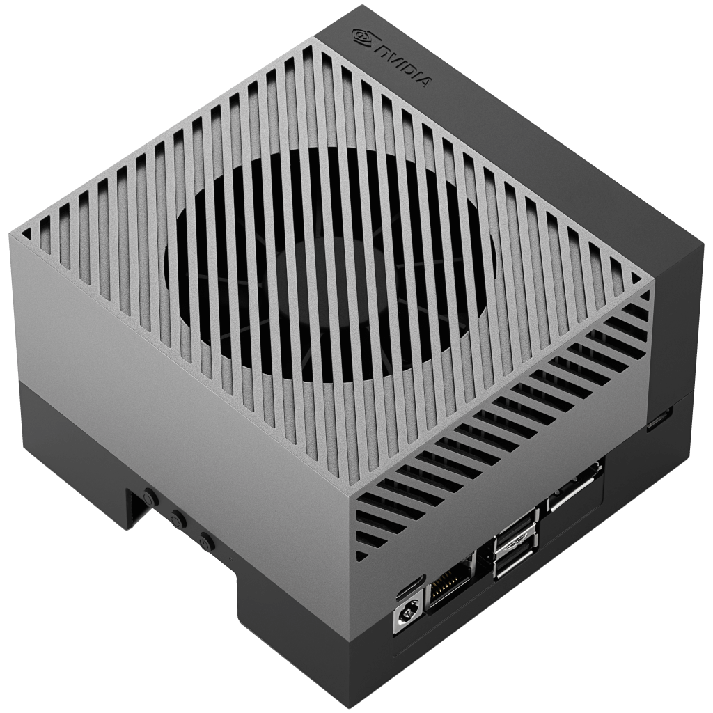

Welcome to the Viam Documentation!
Viam is a complete software platform for robots that runs on Linux and macOS and supports a wide variety of popular systems, including:

  <ul tabindex="0">
   <li id="c1_slide1">
    <a href="installation/prepare/jetson-nano-setup/">
        
        <h6>NVIDIA Jetson Nano</h6>
    </a>
  </li>
  <li id="c1_slide2">
    <a href="installation/prepare/rpi-setup/">
        
        <h6>Raspberry Pi 4</h6>
    </a>
  </li>
  <li id="c1_slide3">
    <a href="installation/prepare/beaglebone-setup/">
        
        <h6>BeagleBone AI-64</h6>
    </a>
  </li>
  <li id="c1_slide4">
    <a href="installation/prepare/sk-tda4vm/">
        
        <h6>Texas Instruments TDA4VM</h6>
    </a>
  </li>
  <li id="c1_slide5">
    <a href="installation/prepare/microcontrollers/">
        
        <h6>Espressif ESP32</h6>
    </a>
  </li>
  <li id="c1_slide6">
    <a href="installation/prepare/rpi-setup/">
        
        <h6>Raspberry Pi 3</h6>
    </a>
  </li>
  <li id="c1_slide7">
    <a href="installation/prepare/jetson-agx-orin-setup/">
        
        <h6>NVIDIA Jetson AGX Orin</h6>
    </a>
  </li>
  <li id="c1_slide8">
    <a href="components/board/jetson/">
        
        <h6>NVIDIA Jetson Xavier NX</h6>
    </a>
  </li>
  <li id="c1_slide9">
    <a href="installation/prepare/rpi-setup/">
        
        <h6>Raspberry Pi Zero 2W</h6>
    </a>
  </li>
  <li id="c1_slide10">
    <a href="components/board/nanopi/">
        
        <h6>FriendlyElec NanoPi</h6>
    </a>
  </li>
  <li id="c1_slide11">
    <a href="components/board/numato/">
        
        <h6>Numato GPIO Modules</h6>
    </a>
  </li>
  <li id="c1_slide12">
    <a href="components/board/pca9685/">
        
        <h6>PCA9686 Arduino I2C Interface</h6>
    </a>
  </li>
  </ul>
  <ol style="visibility: hidden" aria-hidden="true">
    <li><a href="#c1_slide1">NVIDIA Jetson Nano</a></li>
    <li><a href="#c1_slide2">Raspberry Pi 4</a></li>
    <li><a href="#c1_slide3">BeagleBone AI-64</a></li>
    <li><a href="#c1_slide4">Texas Instruments TDA4VM</a></li>
    <li><a href="#c1_slide5">Espressif ESP32</a></li>
    <li><a href="#c1_slide6">Raspberry Pi 3</a></li>
    <li><a href="#c1_slide7">NVIDIA Jetson AGX Orin</a></li>
    <li><a href="#c1_slide8">NVIDIA Jetson Xavier NX</a></li>
    <li><a href="#c1_slide9">Raspberry Pi Zero 2W</a></li>
    <li><a href="#c1_slide10">FriendlyElec NanoPi</a></li>
    <li><a href="#c1_slide11">Numato GPIO Modules</a></li>
    <li><a href="#c1_slide12">PCA9686 Arduino I2C Interface</a></li>
  </ol>
  
‹

  
›

 

Explore more about the Viam platform or try it out for yourself:

  

    

        

            

            <h4>Learn and Try</h4>
            

            Learn about <a href="viam/">the Viam platform in 3 minutes</a> and then
            <a href="try-viam/">drive a Viam rover</a> from the comfort of your home or follow along with a <a href="tutorials/"> tutorial</a>.

            

            
        

    

    

        

        

          <h4>Configure your robots</h4>
          

              <ol style="padding-inline-start: 1.1rem">
              <li><a href="manage/configuration/">Configure your robot<a> or <a href="manage/fleet/">fleet</a></li>
              <li><a href="installation/">Install Viam on your robot</a></li>
              <li><a href="components/">Configure robot components</a> and <a href="services/">add services</a></li>
              <li><a href="manage/fleet/robots/#control">Control and test your robot</a></li>
              </ol>
              

            
        

    

    

    

        

        

          <h4>Program your robots</h4>
          

              Program and control your robots in <a href="program/apis/"> the languages you already know</a> like <a href="https://python.viam.dev/">Python</a>, <a href="https://pkg.go.dev/go.viam.com/rdk">Go</a>, or <a href="https://ts.viam.dev/">TypeScript</a>.
          

        

        
        

    

    

        

            

            <h4>Community</h4>
            
Have questions, or want to meet other people working on robots? <a href="https://discord.gg/viam">Join us in the Community Discord!</a>

            

            
        

    

    

<h2>Capabilities and APIs</h2>

  

    

        

            

            <h4>Manage</h4>
            
            

        

    

    

        

            

            <h4>Components</h4>
            
            

        

    

    

        

            

            <h4>Services</h4>
            
            

        

    

    

        

            

            <h4>SDKs</h4>
            <ul>
            <li><a href="https://python.viam.dev/" target="_blank">Python SDK</a></li>
            <li><a href="https://pkg.go.dev/go.viam.com/rdk" target="_blank">Go SDK</a></li>
            <li><a href="https://ts.viam.dev/" target="_blank">TypeScript SDK</a></li>
            <li><a href="https://cpp.viam.dev/" target="_blank">C++ SDK (alpha)</a></li>
            <li><a href="https://github.com/viamrobotics/viam-flutter-sdk" target="_blank">Flutter SDK (alpha)</a></li>
            </ul>
            

        

    

  

<h2>Popular Tutorials</h2>

  

  

    
  

  

  
  

  

  
  

  

  
  

  

<link rel="stylesheet" href="css/carousel-min.css">
