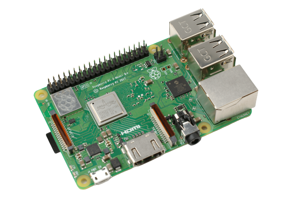

Viam is a complete software platform for robots that runs on any 64-bit Linux OS and macOS.
Viam supports a wide variety of systems, including:

  <ul tabindex="0">
   <li id="c1_slide1">
    <a href="installation/prepare/jetson-nano-setup/">
        
        <h6>NVIDIA Jetson Nano</h6>
    </a>
  </li>
  <li id="c1_slide2">
    <a href="installation/prepare/rpi-setup/">
        
        <h6>Raspberry Pi 4</h6>
    </a>
  </li>
  <li id="c1_slide3">
    <a href="installation/prepare/beaglebone-setup/">
        
        <h6>BeagleBone AI-64</h6>
    </a>
  </li>
  <li id="c1_slide4">
    <a href="installation/prepare/sk-tda4vm/">
        
        <h6>Texas Instruments TDA4VM</h6>
    </a>
  </li>
  <li id="c1_slide5">
    <a href="installation/prepare/microcontrollers/">
            
            <h6>Espressif ESP32</h6>
    </a>
  </li>
  <li id="c1_slide6">
    <a href="installation/prepare/rpi-setup/">
        
        <h6>Raspberry Pi 3</h6>
    </a>
  </li>
  <li id="c1_slide7">
    <a href="installation/prepare/jetson-agx-orin-setup/">
        
        <h6>NVIDIA Jetson AGX Orin</h6>
    </a>
  </li>
  <li id="c1_slide8">
    <a href="components/board/jetson/">
            
            <h6>NVIDIA Jetson Xavier NX</h6>
    </a>
  </li>
  <li id="c1_slide9">
    <a href="installation/prepare/rpi-setup/">
        
        <h6>Raspberry Pi Zero 2W</h6>
    </a>
  </li>
  <li id="c1_slide10">
    <a href="components/board/nanopi/">
        
        <h6>FriendlyElec NanoPi</h6>
    </a>
  </li>
  <li id="c1_slide11">
    <a href="components/board/numato/">
        
        <h6>Numato GPIO Modules</h6>
    </a>
  </li>
  <li id="c1_slide12">
    <a href="components/board/pca9685/">
        
        <h6>PCA9686 Arduino I2C Interface</h6>
    </a>
  </li>
  </ul>
  <ol style="visibility: hidden">
    <li></li>
    <li></li>
    <li></li>
    <li></li>
    <li></li>
    <li></li>
    <li></li>
    <li></li>
    <li></li>
    <li></li>
    <li></li>
    <li></li>
  </ol>
  
‹

  
›

  

    

        

            <h4>Learn and Try</h4>
            

            Learn about <a href="viam/">the Viam platform in 3 minutes</a> and then
            <a href="try-viam/">drive a Viam rover</a> from the comfort of your home or follow along with a <a href="tutorials/"> tutorial</a>.

            
        

    

    

        

        <h4>Configure your robots</h4>
        

            <ol style="padding-inline-start: 1.1rem">
            <li><a href="/manage/fleet/robots/">Set up your robot</a> or<a href="manage/fleet/"> fleet</a></li>
            <li><a href="installation/">Install Viam on your robot</a></li>
            <li><a href="manage/configuration/">Configure your robot</a></li>
            <li><a href="manage/fleet/robots/#control">Test your robot</a></li>
            </ol>
            
        

    

    

  

  

    

        

        <h4>Program your robots</h4>
        

            Program and control your robots in <a href="program/sdks/"> the languages you already know</a> like <a href="https://python.viam.dev/">Python</a>, <a href="https://pkg.go.dev/go.viam.com/rdk">Go</a>, or <a href="https://ts.viam.dev/">TypeScript</a>.
        

        
        

    

    

        

            <h4>Community</h4>
            
Have questions, or want to meet other people working on robots? <a href="https://discord.gg/viam">Join us in the Community Discord!</a>

            
        

    

    

<link rel="stylesheet" href="css/carousel-min.css">
