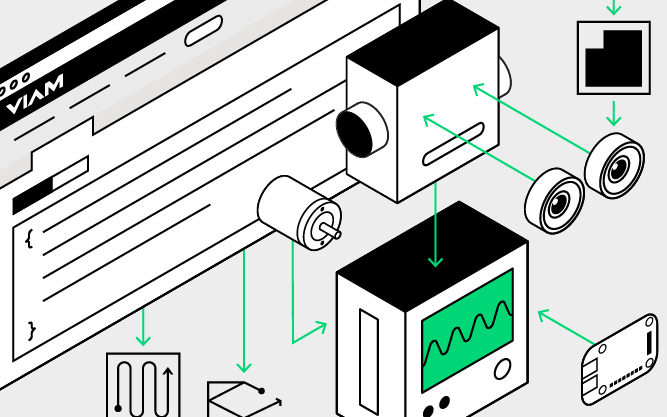
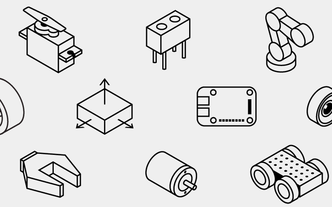
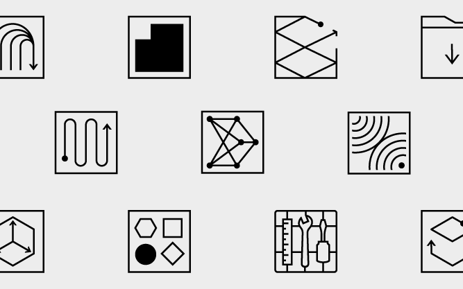

Learn how to prototype, configure, and program a robot using the Viam Platform.

  

    

        <a href="viam">
            
            <h4 style="text-align: left; margin-left: 0px; margin-top: 1em;">Viam in 3 Minutes</h4>
            
Build and manage your robots with Viam.

        </a>
    

    

        <a href="try-viam">
            
            <h4 style="text-align: left; margin-left: 0px; margin-top: 1em;">Try Viam</h4>
            
Control and program a borrowed rover.

        <a>
    

    

        <a href="installation">
            
            <h4 style="text-align: left; margin-left: 0px; margin-top: 1em;">Install Viam</h4>
            
Install viam-server on your robot and connect your robot to the Viam app.

        </a>
    

    <a href="components">
    

            
            <h4 style="text-align: left; margin-left: 0px; margin-top: 1em;">Components</h4>
            
Configure and control the components of your robot.

    

    </a>
    

        <a href="services">
            
            <h4 style="text-align: left; margin-left: 0px;margin-top: 1em;">Services</h4>
            
Make use of Viam's services for data and fleet management, as well as other services that make using your components easier.

        </a>
    

    

        <a href="program">
            
             <h4 style="text-align: left; margin-left: 0px; margin-top: 1em;">Program a Robot</h4>
            
Use the Robot Development Kit to bring your robot to life.

        </a>
    

  

 
 

Have questions, or want to meet other people working on robots? Join our <a href="https://discord.gg/FupYGq8W">Community Discord</a>.

