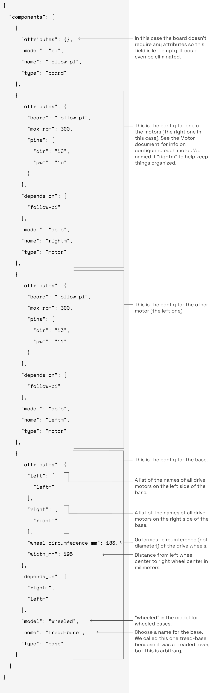
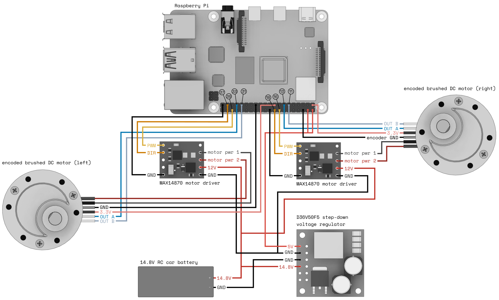

A `wheeled` base supports mobile robotic bases with drive motors on both sides (differential steering).
To configure a `wheeled` base as a component of your robot, first configure the [board](/components/board/) controlling the base and any [motors](/components/motor/) attached to the base.

Configure a `wheeled` base as follows:


{}

Navigate to the **Config** tab of your robot's page in [the Viam app](https://app.viam.com).
Click on the **Components** subtab and navigate to the **Create component** menu.
Enter a name for your base, select the type `base`, and select the `wheeled` model.

Click **Create component**.


Select the motors attached to the base as your **Right Motors** and **Left Motors**.
Edit and fill in the attributes as applicable.

{}
{}

```json {class="line-numbers linkable-line-numbers"}
{
  "components": [
    {
      ... <INSERT YOUR BOARD COMPONENT CONFIGURATION>
    },
    {
      ... <INSERT YOUR LEFT MOTOR COMPONENT CONFIGURATION>
    },
    {
      ... <INSERT YOUR RIGHT MOTOR COMPONENT CONFIGURATION>
    },
    {
      "name": "<your-base-name>",
      "model": "wheeled",
      "type": "base",
      "attributes": {
        "left": [
          "<your-left-motor-name>" // <INSERT ANY ADDITIONAL LEFT MOTOR NAMES>
        ],
        "right": [
          "<your-right-motor-name>" // <INSERT ANY ADDITIONAL RIGHT MOTOR NAMES>
        ],
        "wheel_circumference_mm": <#>,
        "width_mm": <#>
      }
    }
  ]
}
```

{}
{}

```json
{
  "components": [
    {
      "attributes": {},
      "model": "pi",
      "name": "follow-pi",
      "type": "board"
    },
    {
      "attributes": {
        "board": "follow-pi",
        "max_rpm": 300,
        "pins": {
          "dir": "16",
          "pwm": "15"
        }
      },
      "model": "gpio",
      "name": "rightm",
      "type": "motor"
    },
    {
      "attributes": {
        "board": "follow-pi",
        "max_rpm": 300,
        "pins": {
          "dir": "13",
          "pwm": "11"
        }
      },
      "model": "gpio",
      "name": "leftm",
      "type": "motor"
    },
    {
      "attributes": {
        "left": [
          "leftm"
        ],
        "right": [
          "rightm"
        ],
        "wheel_circumference_mm": 183,
        "width_mm": 195
      },
      "model": "wheeled",
      "name": "tread-base",
      "type": "base"
    }
  ]
}
```

{}
{}



{}


The following attributes are available for `wheeled` bases:

| Name | Type | Inclusion | Description |
| ---- | ---- | --------- | ----------- |
| `left` | array | **Required** | Array with the `name` of any drive motors on the left side of the base. |
| `right` | array | **Required** | Array with the `name` of any drive motors on the right side of the base. |
| `wheel_circumference_mm` | int | **Required** | The outermost circumference of the drive wheels in millimeters. Used for odometry. Can be an approximation. |
| `width_mm` | int | **Required** | Width of the base in millimeters. In other words, the distance between the approximate centers of the right and left wheels. Can be an approximation. |
| `spin_slip_factor` | float | Optional | Can be used in steering calculations to correct for slippage between the wheels and the floor. If utilized, calibrated by the user. |

## Wire a Wheeled Base

An example wiring diagram for a base with one motor on each side:



Note that your base's wiring will vary depending on your choice of board, motors, motor drivers, and power supply.
