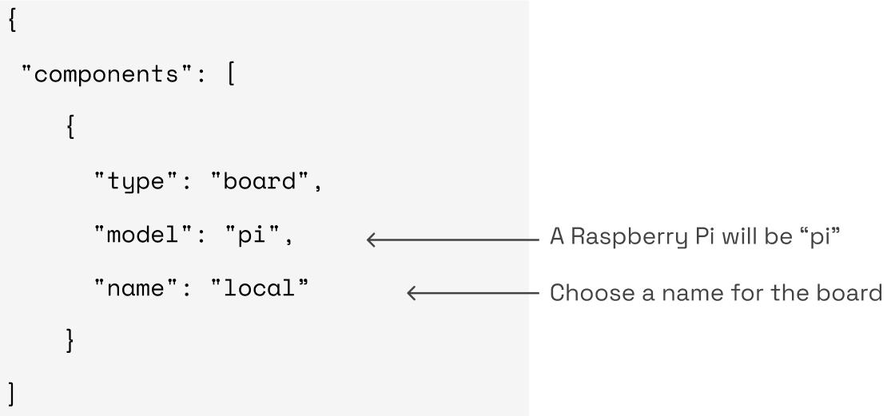

# Board Component

In the Viam framework, a **board** is the signal wire hub of a [robot
part](https://docs.viam.com/product-overviews/organization-management/#robots-and-their-parts).
It sends signals to the other hardware components, and may or may not
also act as the software hub, running an instance of the Viam server on
its CPU. Boards have general purpose input/output (GPIO) pins through
which they can transmit
[PWM](https://en.wikipedia.org/wiki/Pulse-width_modulation)
and other signals.

Some examples of boards include Raspberry Pi, BeagleBone, and Jetson.
These are all single-board computers (SBCs) capable of advanced
computation, including running the Viam server. These all come with
built-in GPIO pins.

Another type of board is a GPIO peripheral such as a Numato GPIO Module,
which cannot run the Viam server itself, but can take input from another
computer running Viam and communicate with other hardware components.
Note that a desktop computer does not typically have GPIO pins, so it
cannot act as a board without a GPIO peripheral.


*Figure 1. Two different board options: SBC with GPIO pins running Viam
server locally; or GPIO peripheral plugged into a computer's USB port,
with the computer running Viam server.*


!!! note
    The GPIO pins of various boards (including Raspberry Pi) are not accessible to external computers. In these cases, the board itself must run an instance of Viam server.

## General Hardware Requirements

A common board setup comprises the following:

-   A computing device with general purpose input/output (GPIO) pins such as a Raspberry Pi or other single-board computer, or a desktop computer outfitted with a GPIO peripheral.

-   Power supply

    -   A power supply must supply the correct voltage and sufficient current to avoid damaging or power cycling the board. See the board's data sheet for requirements. For example, a Raspberry Pi 4 takes a 5V power supply and converts it to 3.3V for its logic circuitry. The easiest way to power it is with a 5V USB-C power supply.

-   Some component(s) for the board to talk to! The board can't do much on its own so you'll probably want some actuators and/or sensors to make your robot a robot!

## General Configuration

If your application only involves GPIO and no other board attributes or
communication methods are required, your board can be configured quite
simply as in this example:



All boards will be of type **board**. Specify the correct **model** for
your board. The following board models are currently supported (not
exhaustive):

-   **pi**: Raspberry Pi 4 or Pi Zero W

-   **ti**: BeagleBone AI 64

-   **jetson**: Nvidia Jetson Xavier NX

-   **numato**

Give your board a **name** of your choosing. You will use this name when configuring other components that depend on your board, to specify the
board on which they depend.

## Communication Methods

Boards can communicate with other hardware components in a few different
ways. Some devices only require basic GPIO pins whereas others require
more specialized methods. For example, the TMC5072 stepper motor
microcontroller requires SPI bus communication. The following are brief
descriptions of each protocol Viam supports, as well as the
corresponding configuration information.

### SPI Bus

[Serial Peripheral Interface (SPI)](https://en.wikipedia.org/wiki/Serial_Peripheral_Interface) uses several pins for serial communication: serial data in (SDI, 
sometimes called MOSI); serial data out (SDO, sometimes called MISO);
SCLK which is a clock for serial communication; and chip enable pins
(labeled CE0 and CE1 in the case of a Pi). A peripheral which uses SPI
bus may or may not use the chip enable pins. The required connections
between corresponding board pins and peripheral device pins must be
wired, but each of these pins does not need to be specified in the
config as most boards have them configured by default. You only need to specify the index of the entire bus.

#### Configuration

The attributes section of a board using SPI will contain the following:

```JSON
{
  "spis": [
    {
      "name": "main",
      "bus_select": "0"
    }
  ]
}
```
#### Required Fields

**name** (string): Choose a name for the SPI bus. Note that a component
that uses this bus must then have this same name configured in its
attributes.

**bus_select** (string): A Raspberry Pi has two SPI buses: 0 and 1. See
data sheet for specifics on other boards.

### I2C

I2C stands for inter-integrated circuit and is similar to SPI but
requires fewer pins: serial data (SDA) and serial clock (SCL). Again,
boards that support I2C often have the requisite pins configured by
default, so in your config file you need only specify which I2C bus you
are using.

#### Configuration

```JSON
{
  "i2cs": [
    {
      "name": "bus1",
      "bus": "1"
    }
  ]
}
```
#### Required Fields

**name** (string): Choose a name for the SPI bus. Note that a component
that uses this bus must then have this same name configured in its
attributes.

**bus** (string): Usually a number such as 1. See board data sheet for
specifics on its I2C wiring.

### Analogs

If an analog to digital converter (ADC) chip is being used in your
robot, analog readers (analogs) will have to be configured. An ADC takes
a voltage as input and converts it to an integer output (for example, a
number between 0 and 1023 in the case of the 10 bit MCP3008 chip).

#### Configuration

The ADC communicates with the board over SPI so both analog and SPI must
be configured. An example:

```JSON
{
  "components": [
    {
      "attributes": {
        "analogs": [
          {
            "chip_select": "24",
            "name": "current",
            "pin": "1",
            "spi_bus": "main"
          },
          {
            "chip_select": "24",
            "name": "pressure",
            "pin": "0",
            "spi_bus": "main"
          }
        ],
        "spis": [
          {
            "bus_select": "0",
            "name": "main"
          }
        ]
      },
      "model": "pi",
      "name": "local",
      "type": "board"
    }
  ]
}
```

Note that the name of the SPI bus ("main") matches between the analog
configuration and SPI configuration.

#### Required Fields

**name** (string): Choose a name for the analog reader.

**spi_bus** (string): Should match the name given to the relevant SPI
bus in its section of the config file.

**pin** (string): Specify which pin of the ADC chip to use.

**chip_select** (string): Specify the pin number of the board GPIO pin
connected to the ADC chip. Use the pin number, not the GPIO number.

#### Optional Fields

**average_over_ms** (int) and **samples_per_sec** (int): Together these
allow for the use of AnalogSmoother. Specify the duration in
milliseconds over which the rolling average of the input should be
taken, and the sampling rate in samples per second, respectively.

### Digital Interrupts

Digital interrupts are useful when your code needs to be notified
immediately anytime there is a change in GPIO value. Contrast this with
running the Get method on a GPIO pin only at specific times when you
want to know its value, which you can do without configuring interrupts;
you only need to getGPIOpin by name.

#### Configuration

An example:

```JSON
{
  "components": [
    {
      "attributes": {
        "digital_interrupts": [
          {
            "name": "encoder",
            "pin": "15"
          },
          {
            "name": "encoder-b",
            "pin": "16"
          }
        ]
      },
      "model": "pi",
      "name": "local",
      "type": "board"
    }
  ]
}
```

#### Required Fields

**name** (string): Choose a name for the analog reader.

**pin** (string): Specify which GPIO pin of the board to use. Use the
pin number, not the GPIO number.

#### Optional Fields

**type** (string): Set type to "basic" to count the number of interrupts
that occur. Set type to "servo" to count the average time between the
interrupts (akin to pulse width).

**formula** (string): Apply a mathematical function to the input.

## Implementation

[Python SDK
Documentation](https://python.viam.dev/autoapi/viam/components/board/board/index.html)
