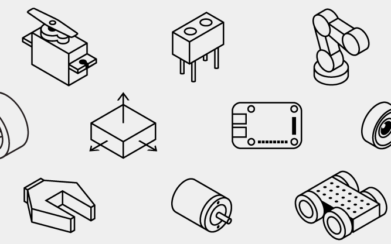

Brief description of the component and what you can do with it.

Use cases:

- A brief description of one sample use case.
- ...

Most robots with a COMPONENT need at least the following hardware:

- Board
- ...

## Configuration

The COMPONENT component supports the following models.
Click on the component model name for detailed configuration information.

Model | Description
----- | -----------
[`model1`](model1/) | An XYZ unit made by Some Company(INSERT LINK AS APPLICABLE)
[`model2`](model2/) | An ABCDE unit made by Some Other Company(INSERT LINK AS APPLICABLE)

If you want to use another COMPONENT model with Viam, you can [define a custom component](../../extend/).

## Control your board with Viam's client SDK libraries

To get started using Viam's SDKs to connect to and control your robot, go to your robot's page on [the Viam app](https://app.viam.com), navigate to the **code sample** tab, select your preferred programming language, and copy the sample code generated.

When executed, this sample code will create a connection to your robot as a client.
Then control your robot programmatically by getting your `COMPONENT` component from the robot with `FromRobot` and adding API method calls, as shown in the following examples.

These examples assume you have a board called "my_board" configured as a component of your robot.
If your board has a different name, change the `name` in the code.

Be sure to import the COMPONENT package for the SDK you are using:


{}

```python
from viam.components.componentname import ComponentName
```

{}
{}

```go
import (
  "go.viam.com/rdk/components/componentname"
)
```

{}


## API

The COMPONENT component supports the following methods:

*Writing Instructions: Use the method names in the protobuf, not the Python or Go-specific method names.*

Method Name | Description
----------- | -----------
[GetReadings](#getreadings) | Do the thing the method does.
[MethodName2](#methodname2) | Do the thing this method does.

### GetReadings

Get the measurements or readings that this sensor provides.


{}

**Parameters:**

- `extra` [(Optional[Dict[str, Any]])](https://docs.python.org/library/typing.html#typing.Optional): Extra options to pass to the underlying RPC call.
- `timeout` [(Optional[float])](https://docs.python.org/library/typing.html#typing.Optional): An option to set how long to wait (in seconds) before calling a time-out and closing the underlying RPC call.

**Returns:**

- `readings` [(Mapping[str, Any])](https://docs.python.org/3/library/typing.html#typing.Mapping): The measurements or readings that this sensor provides.

For more information, see the [Python SDK Docs](https://python.viam.dev/autoapi/viam/components/sensor/index.html#viam.components.sensor.Sensor.get_readings) (INSERT RELEVANT LINK).

```python
my_sensor = Sensor.from_robot(robot=robot, name='my_sensor')

# Get the readings provided by the sensor.
readings = await my_sensor.get_readings()
```

{}
{}

**Parameters:**

- `ctx` [(Context)](https://pkg.go.dev/context): A Context carries a deadline, a cancellation signal, and other values across API boundaries.
- `extra` [(map[string]interface{})](https://go.dev/blog/maps): Extra options to pass to the underlying RPC call.

**Returns:**

- `readings` [(map[string]interface{})](https://go.dev/blog/maps): The measurements or readings that this sensor provides.
- [(error)](https://pkg.go.dev/builtin#error): An error, if one occurred.

For more information, see the [Go SDK Docs](https://pkg.go.dev/go.viam.com/rdk/components/sensor#Sensor).

```go
mySensor, err := sensor.FromRobot(robot, "my_sensor")
if err != nil {
  logger.Fatalf("cannot get sensor: %v", err)
}

readings, err := mySensor.Readings(context.Background(), nil)
```

{}


### MethodName2

1-2 sentence description of what the method does.


{}

**Parameters:**

- `extra` [(Optional[Dict[str, Any]])](https://docs.python.org/library/typing.html#typing.Optional): Extra options to pass to the underlying RPC call.
- `timeout` [(Optional[float])](https://docs.python.org/library/typing.html#typing.Optional): An option to set how long to wait (in seconds) before calling a time-out and closing the underlying RPC call.

**Returns:**

- None

For more information, see the [Python SDK Docs](https://python.viam.dev/autoapi/viam/components/sensor/index.html#viam.components.sensor.Sensor.get_readings) (INSERT RELEVANT LINK).

```python
my_sensor = Sensor.from_robot(robot=robot, name='my_sensor')

# Do the thing that the method does.
await my_sensor.method_name_two()
```

{}
{}

**Parameters:**

- `ctx` [(Context)](https://pkg.go.dev/context): A Context carries a deadline, a cancellation signal, and other values across API boundaries.
- `extra` [(map[string]interface{})](https://go.dev/blog/maps): Extra options to pass to the underlying RPC call.

**Returns:**

- [(error)](https://pkg.go.dev/builtin#error): An error, if one occurred.

For more information, see the [Go SDK Docs](https://pkg.go.dev/go.viam.com/rdk/components/sensor#Sensor).

```go
mySensor, err := sensor.FromRobot(robot, "my_sensor")
if err != nil {
  logger.Fatalf("cannot get sensor: %v", err)
}

err := mySensor.MethodNameTwo(context.Background(), nil)
```

{}


## Troubleshooting

Troubleshooting information for configuration errors.

You can find additional assistance in the [Troubleshooting section](/appendix/troubleshooting/).



## Next Steps


    {}
    {}

