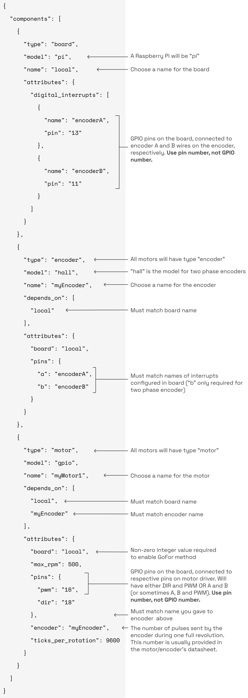

# Motors

*If you are looking for information about hobby servos (servomotors), [click here](https://github.com/viamrobotics/tutorials-and-docs/blob/main/docs/components/servo.md).*  

Electric motors are the most common form of actuator in robotics. The majority of motors used in robotics require a direct current (DC) input. This page covers how to wire, configure and control various types of DC motor with Viam.

## Contents
- [General Hardware Requirements](motor.md#general-hardware-requirements)
- [Brushed DC Motor](motor.md#brushed-dc-motor)
- [Brushless DC Motor](motor.md#brushless-dc-motor)
- [DC Motor with Encoder](motor.md#dc-motor-with-encoder)
- [Stepper Motor](motor.md#stepper-motor)

## General Hardware Requirements
A common motor control setup comprises the following:

- A computing device with general purpose input/output (GPIO) pins such as a Raspberry Pi or other single-board computer, or a desktop computer outfitted with a GPIO peripheral
    - Note: there are other ways to interface with motors such as Serial, CAN bus and EtherCAT that require special motor controllers and are beyond the scope of this document
- A DC motor
- An appropriate motor driver
    - Takes GPIO signals from the computer and sends the corresponding signals and power to the motor
    - Selected based on the type of motor (i.e. brushed, brushless or stepper) and its power requirements
- An appropriate power supply
    - Note that the logic side of the driver may be powered by 3.3V from the Pi or other device, but the motor power side should not be powered by the computer’s GPIO pins. The motor driver should be connected to an independent power supply that can provide the peak current required by the motor.

> *Always disconnect devices from power before plugging, unplugging or moving wires or otherwise modifying electrical circuits.*

## Brushed DC Motor
### Mechanism
DC motors use magnetic fields to convert direct (one-way) electrical current into mechanical torque. [Brushed DC motors](https://en.wikipedia.org/wiki/Brushed_DC_electric_motor) use an electrical contact called a “brush” to route current to the right place at a given moment to create continuous rotation. Increasing the input current increases the output motor torque (and also speed, assuming a constant load). Switching the direction of the input current changes the direction of motor rotation.

### Brushed DC Motor Drivers
A motor driver is a physical chip or power amplification circuit that converts input signals from a computing device into a high power output capable of actuating a motor. There are three common ways for the computing device to communicate with a brushed DC motor driver chip. The driver data sheet will specify which one to use.

- PWM/DIR: One digital input (such as a GPIO pin) sends a [pulse width modulation](https://en.wikipedia.org/wiki/Pulse-width_modulation) (PWM) signal to the driver to control speed while another digital input sends a high or low signal to control the direction.
- A/B: One digital input is set to high and another set to low turns the motor in one direction and vice versa, while speed is controlled via PWM through one or both pins.
- A/B + PWM: Three pins: an A and B to control direction and a separate PWM pin to control speed.

---

> Note: Often, instead of buying just the tiny motor driver chip itself, you’ll purchase a motor driver carrier board which consists of the chip containing the logic gates, attached to a small breakout board which gives you places to attach the necessary wires. In this article we’ll refer to this whole motor driver board as a motor driver. Note that in RDK, “board” refers to the device with GPIO pins (such as a Raspberry Pi, or a GPIO peripheral attached to a desktop computer) that sends signals to the motor drivers and other devices. In the config file, “motor” technically refers to the motor driver for a given motor.

---

### Wiring
Brushed DC motors are relatively simple to wire. Taking a 12V brushed DC motor controlled by a Raspberry Pi via [this motor driver](https://www.pololu.com/product/4038) as an example, the wiring diagram would look like this:  
  
  

The signal wires in the diagram run from two GPIO pins on the Pi to the DIR and PWM pins on the motor driver. Refer to a Raspberry Pi pinout schematic to locate generic GPIO pins and determine their pin numbers for configuration.

### Viam Configuration
A brushed DC motor without an encoder should be configured with “gpio” as the model. Most motor types require a “board” attribute, and also need to depend on that same board. For example:  

  
[Click here for the raw JSON.](example-configs/motor-gpio-config.json)

`max_rpm` (float64): For non-encoded motors, this is an estimate of the maximum RPM the motor will run at with full power under no load. (For encoded motors, it actually limits the motor to that speed.) If unknown, it can be set to zero but this will render the “GoFor” method unusable.

#### Optional Attributes
`min_power_pct` (float64): Sets a limit on minimum power percentage sent to the motor; default is 0.0  
`max_power_pct` (float64): Sets a limit on maximum power percentage sent to the motor; range is 0.06 to 1.0  
`pwm_freq` (uint): Sets the PWM pulse frequency  
`dir_flip` (bool): Flips the direction of the signal sent if there is a DIR pin  
`en_high` / `en_low` (string): Some drivers have optional enable pins that enable or disable the driver chip. If your chip requires a high signal to be enabled, use en_high with the pin number to the pins section. If you need a low signal use en_low.  

## Brushless DC Motor

### Mechanism
A brushless DC motor (BLDC motor) uses an electronic system to switch its electromagnets on and off at the correct times, instead of the physical brush used in brushed motors. BLDCs function similarly to brushed motors, but they are more durable and efficient because they don’t contain a brush that wears out as it rubs on the spinning components. The relative position of the magnets must be known by the driver so that the right coils can be powered at any given moment. Some motors have a built-in set of Hall effect sensors for this purpose, and others detect forces in the unpowered coils for a “sensorless” configuration.

### Brushless DC Motor Drivers
Brushless DC motor drivers work in much the same way as brushed DC motor drivers. They typically require a PWM/DIR input or a A/B and PWM input to set the motor power and direction. The key difference between a brushed and brushless motor driver is on the motor output side. Brushless motors typically have three power connections (commonly referred to as A, B and C; or sometimes Phase 1, 2 and 3) and 3 sensor connections (commonly referred to as Hall A, Hall B and Hall C) running between the motor and driver.

### Wiring and Configuration
The configuration file of a BLDC motor with Viam is the same as that of a brushed motor. Only the output side of the driver board is different, i.e. more wires connect the driver to the motor.  

  

## DC Motor With Encoder

### Mechanism
An encoder is a device that is integrated with a motor to sense the angular position, direction and/or speed of rotation. Viam supports [quadrature encoders](https://en.wikipedia.org/wiki/Incremental_encoder#Quadrature_outputs), which output two phases that can be used together to determine speed and direction. Viam also supports single pin “pulse output” encoders which give speed but not direction. In either case position can only be determined relative to the starting position; these encoders are incremental and do not indicate absolute position.

### Wiring  

  

### Viam Configuration

Viam supports a brushed or brushless DC motor with a quadrature encoder within model “gpio.” Configuration of a quadrature encoder requires digital interrupts on the board for A and B in addition to the standard “gpio” model attributes. Single pin encoders require configuring one digital interrupt. Here’s an example config file:  

  
[Click here for the raw JSON.](example-configs/motor-encoded-config.json)

#### Optional Attributes

In addition to the optional attributes listed in the previous non-encoded motor section, encoded motors have the following additional options:  

`encoder_board` (string): Name of the board where encoders are; default is same as 'board'  
`max_rpm` (float64): Sets a limit on max RPM  
`max_acceleration` (float64): Sets a limit on max RPM per second  
`ramp_rate` (float64): How fast to ramp power to motor when using RPM control  

## Stepper Motor

### Mechanism
A stepper motor, though it is technically a type of brushless DC motor, differs from what we generally think of as a DC motor in wiring, control and purpose. Whereas DC motors are designed for continuous rotation, sometimes at high speeds, stepper motors are for precise open loop control (without feedback) and turn in discrete increments. Stepper motors have many electromagnets arranged such that each rotation is broken down into many (often 200) steps. These steps can be further subdivided into half steps and even smaller micro steps by controlling current to the motor windings with PWM.

### Wiring
Typically, a stepper motor will have an even number of wires. Each pair of wires makes a loop through a coil of the motor. In the case of a four wire (bi-polar) stepper, one pair of wires may be labeled A1 and A2 and the other B1 and B2. Refer to the motor data sheet for correct wiring.  

  

In this particular example the enable pin on the upper left corner of the driver is connected to ground to pull it low for our purposes.  

### Viam Configuration
Viam supports steppers controlled in one of two ways: a basic stepper driver chip that takes step and DIR input via GPIO and simply moves one step per pulse, or more advanced chips (ex: TMC5072, DMC4000) that have their own microcontrollers that conveniently handle things like speed and acceleration control. Here’s an example of a basic stepper driver config:  

  
[Click here for the raw JSON.](example-configs/motor-gpiostepper-config.json)

#### Optional Attributes
`stepper_delay` (uint): Time in microseconds to remain high for each step. Default is 20.

## Implementation
[Python SDK Documentation](https://python.viam.dev/autoapi/viam/components/motor/client/index.html)