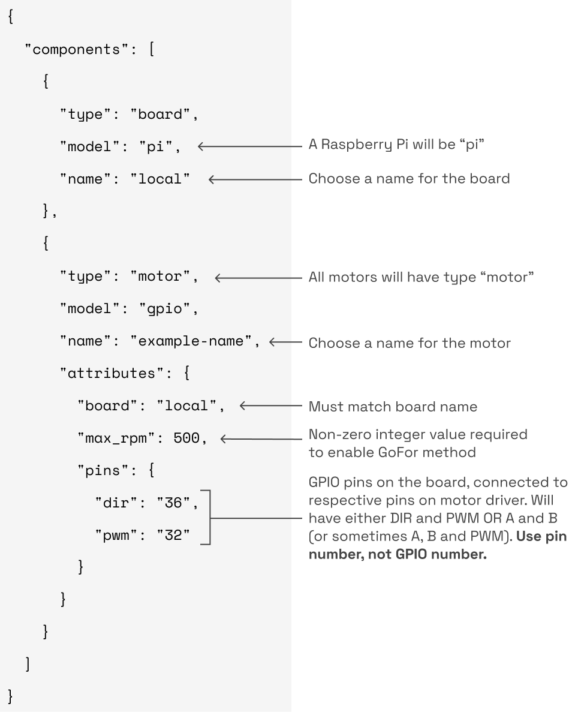

The `gpio` model supports [DC motors](https://en.wikipedia.org/wiki/DC_motor) (both brushed and brushless).

[Encoders](/components/encoder/) can be configured to work with `gpio` motors.
Find more information in the [encoded motor documentation](/components/motor/gpio/encoded-motor/).


{}

Navigate to the **config** tab of your robot's page in [the Viam app](https://app.viam.com).
Click on the **Components** subtab and navigate to the **Create component** menu.
Enter a name for your motor, select the type `motor`, and select the `gpio` model.

Click **Create component** and then fill in the attributes for your model:


{}
{}

```json
{
  "components": [
    {
      "name": <board_name>,
      "type": "board",
      "model": <board_model>,
      "attributes": {},
      "depends_on": [],
    },
    {
      "name": <motor_name>,
      "type": "motor",
      "model": "gpio",
      "attributes": {
        "pins": {
          <...>
        },
        "board": <board_name>,
        "max_rpm": <int>,
        "min_power_pct": <float>,
        "max_power_pct": <float>,
        "pwm_freq": <float>,
        "dir_flip": <float>,
        "en_low": <float>
      },
      "depends_on": []
    }
  ]
}
```

{}
{}

An example configuration for a `gpio` motor:

```json
{
  "components": [
    {
      "name": "local",
      "type": "board",
      "model": "pi",
      "attributes": {},
      "depends_on": [],
    },
    {
      "name": "example-gpio",
      "type": "motor",
      "model": "gpio",
      "attributes": {
        "pins": {
          "dir": "36",
          "pwm": "32",
        },
        "board": "local",
        "max_rpm": 500
      },
      "depends_on": []
    }
  ]
}
```

{}
{}



{}


### Required Attributes

Name | Type | Default Value | Description
-------------- | ---- | ------------- | ---------------
`board` | string | -- | Name of board to which the motor driver is wired.
`max_rpm` | float | -- | This is an estimate of the maximum RPM the motor will run at with full power under no load. The [`GoFor`](/components/motor/#gofor) method calculates how much power to send to the motor as a percentage of `max_rpm`. If unknown, you can set it to 100, which will mean that giving 40 as the `rpm` argument to `GoFor` or `GoTo` will set it to 40% speed.
`pins` | object | -- | A structure that holds pin configuration information.

Nested within `pins` (note that only two or three of these are required depending on your motor driver; see [Pin Information](#pin-information) below for more details):

Name | Type | Description |
---- | ---- | ----- |
`a` | string | See [Pin Information](#pin-information). Corresponds to "IN1" on many driver data sheets. Pin number such as "36." Viam uses board pin numbers, not GPIO numbers.
`b` | string | See [Pin Information](#pin-information). Corresponds to "IN2" on many driver data sheets. Pin number such as "36." Viam uses board pin numbers, not GPIO numbers.
`dir` | string | See [Pin Information](#pin-information). Pin number such as "36." Viam uses board pin numbers, not GPIO numbers.
`pwm` | string | See [Pin Information](#pin-information). Pin number such as "36." Viam uses board pin numbers, not GPIO numbers.

#### Pin Information

There are three common ways for the computing device to communicate with a brushed DC motor driver chip.
The driver data sheet will specify which one to use.

- PWM/DIR: One digital input (such as a GPIO pin) sends a [pulse width modulation (PWM)](https://en.wikipedia.org/wiki/Pulse-width_modulation) signal to the driver to control speed while another digital input sends a high or low signal to control the direction.
- In1/In2 (or A/B): One digital input is set to high and another set to low turns the motor in one direction and vice versa, while speed is controlled with PWM through one or both pins.
- In1/In2 + PWM: Three pins: an In1 (A) and In2 (B) to control direction and a separate PWM pin to control speed.

{}

The PWM pin does not have to be configured for motor drivers that use only In1 and In2, and not a third PWM pin.

{}

### Optional Attributes

Name | Type | Default Value | Description
-------------- | ---- | ------------- | ---------------
`min_power_pct` | float | 0.0 | Sets a limit on minimum power percentage sent to the motor.
`max_power_pct` | float | 1.0 | Range is 0.06 to 1.0; sets a limit on maximum power percentage sent to the motor.
`pwm_freq` | uint | 800 | Sets the PWM pulse frequency in Hz. Many motors operate optimally in the kHz range.
`dir_flip` | bool | False | Flips the direction of "forward" versus "backward" rotation.
`en_high` / `en_low` | string | -- | Some drivers have optional enable pins that enable or disable the driver chip. If your chip requires a high signal to be enabled, add `en_high` with the pin number to the pins section. If you need a low signal use `en_low`.
`encoder` | string | -- | The name of an encoder attached to this motor. See [encoded motor](/components/motor/gpio/encoded-motor/).

## Wiring examples

{}

The following are just examples and do not apply to all motor setups.
Refer to your motor and motor driver data sheets for information on power requirements and how to properly wire your motor.

{}

### Brushed DC motor

Taking a 12V brushed DC motor controlled by a [DRV8256E Single Brushed DC Motor Driver Carrier](https://www.pololu.com/product/4038) wired to a Raspberry Pi as an example, the wiring diagram would look like this:


The signal wires in the diagram run from two GPIO pins on the Pi to the DIR and PWM pins on the motor driver.
Refer to a [Raspberry Pi pinout schematic](https://pinout.xyz/) to locate generic GPIO pins and determine their pin numbers for configuration.

### Brushless DC motor

Brushless DC motor drivers work in much the same way as brushed DC motor drivers.
They typically require a PWM/DIR input or an A/B (In1/In2) and PWM input to set the motor power and direction.
The key difference between a brushed and brushless motor driver is on the motor output side.
Brushless motors typically have three power connections (commonly referred to as A, B and C; or sometimes Phase 1, 2 and 3) and 3 sensor connections (commonly referred to as Hall A, Hall B, and Hall C) running between the motor and driver.

The configuration file of a BLDC motor with Viam is the same as that of a brushed motor.
Only the output side of the driver board is different in that more wires connect the driver to the motor.


