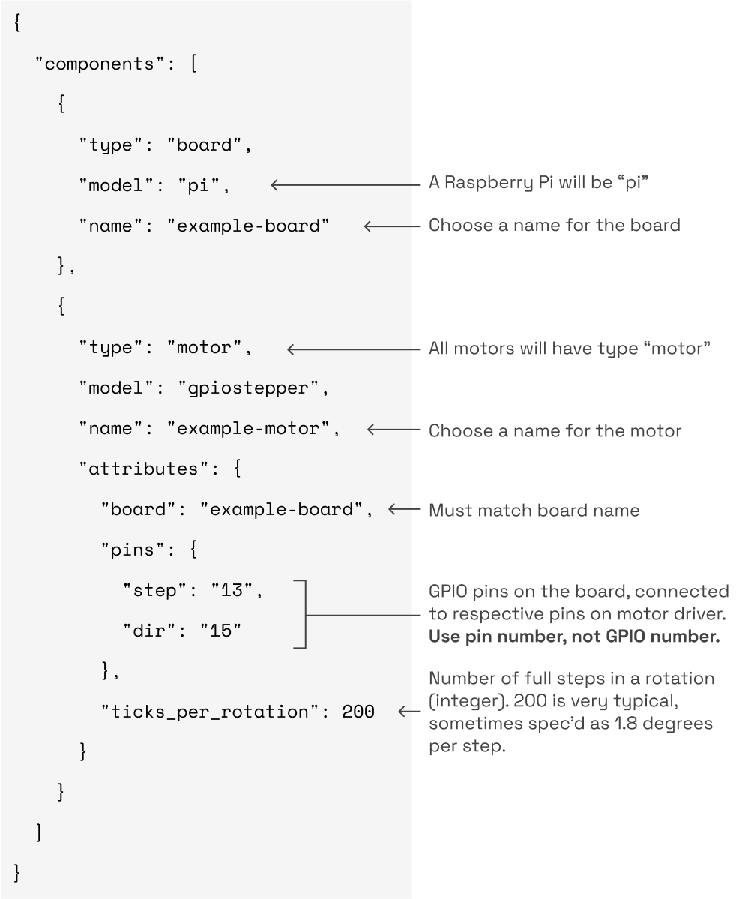

The Viam `gpiostepper` model of motor component supports [stepper motors](https://en.wikipedia.org/wiki/Stepper_motor) controlled basic stepper driver chips that take step and DIR input via GPIO and simply move the motor one step per pulse

Viam also supports some more advanced stepper driver chips ([TMC5072](/components/motor/tmc5072/), [DMC4000](/components/motor/dmc4000/)) that have their own microcontrollers that handle things like speed and acceleration control.
Refer to those
Here’s an example of a basic stepper driver config:

[Click here for the raw JSON.](../example-configs/motor-gpiostepper-config.json)

#### Required Attributes for Steppers

Name | Type | Description
-------------- | ---- | ---------------
`board` | string | Should match name of board to which the motor driver is wired.
`pins` | object | A structure containing "step" and "dir" pin numbers; see example JSON above.
`ticks_per_rotation` | integer | Number of full steps in a rotation. 200 (equivalent to 1.8 degrees per step) is very common.

#### Optional Attributes

Name | Type | Description
-------------- | ---- | ---------------
`stepper_delay` | uint | Time in microseconds to remain high for each step. Default is 20.

## Wiring Example

