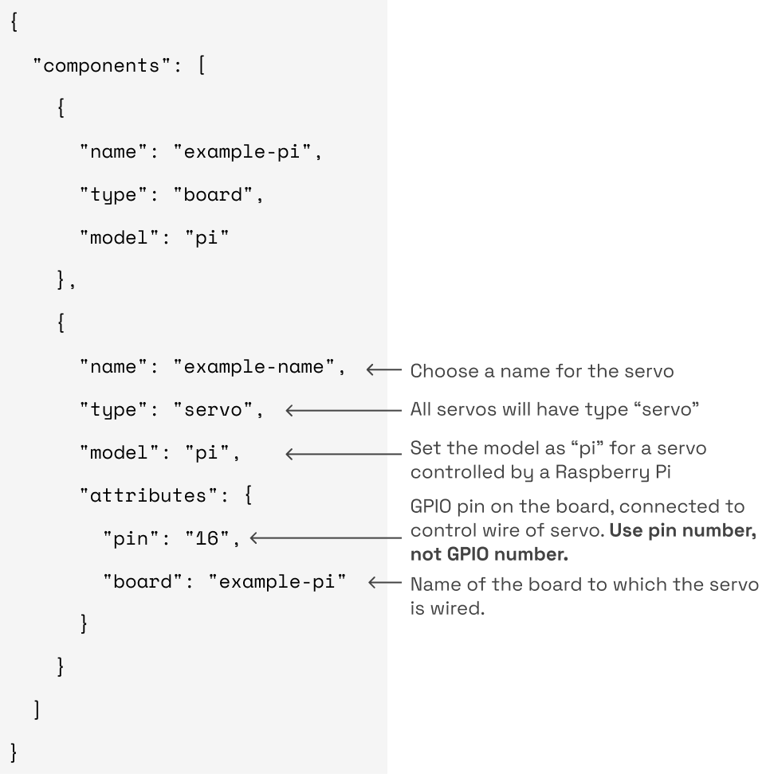

{}

Unlike other servo models, `pi` servos are implemented as part of the [`pi` board component](https://github.com/viamrobotics/rdk/blob/main/components/board/pi/impl/servo.go).

{}

Configure a `pi` servo to integrate a hobby servo controlled by general-purpose input/output (GPIO) pins on a [Raspberry Pi board](components/board/pi) into your robot:


{}

Navigate to the **config** tab of your robot's page in [the Viam app](https://app.viam.com).
Click on the **Components** subtab and navigate to the **Create component** menu.
Enter a name for your servo, select the type `servo`, and select the `gpio` model.

Click **Create component**:


Edit and fill in the `"attributes"` JSON to align with your `board` `name` and GPIO wiring.

{}
{}

```json {class="line-numbers linkable-line-numbers"}
{
    "components": [
        {
            "name": <"your-servo-name">,
            "type": "servo",
            "model": "pi",
            "attributes": {
                "pin": <"#">,
                "board": <"your-board-name">
            }
        }, ... <insert your board component config>
    }
```

{}
{}

```json {class="line-numbers linkable-line-numbers"}
{
  "components": [
    {
        "name": "your-servo-name",
        "type": "servo",
        "model": "pi",
        "attributes": {
            "pin": "16",
            "board": "your-board-name"
        }
    }, 
    {
        "name": "your-board-name",
        "type": "board",
        "model": "pi"
    }
  ]
}
```

{}
{}



{}


The following attributes are available for `pi` servos:

| Name | Type | Inclusion | Description |
| ---- | ---- | --------- | ----------- |
| `pin` | string | **Required** | The  of the pin the servo's control wire is wired to on the [board](/components/board). |
| `board` | string | **Required** | `name` of the [board](/components/board) the servo is wired to. |
| `min` | float | Optional | The minimum angle in degrees that the servo can move from its starting position. Refer to your servo's data sheet for specifications. Does not affect [pulse-width modulation (PMW)](/components/board/#pwm) calculation. |
| `max` | float | Optional | The maximum angle in degrees that the servo can move from its starting position. Refer to your servo's data sheet for specifications. Does not affect PWM calculation. |
| `starting_position_degs` | float | Optional | Starting position of the servo in degrees. |
| `hold_position` | boolean | Optional | If `true`, disable a servo once it has reached a position or after a certain amount of time has passed. |
| `max_rotation_deg` | int | Optional | The maximum angle the servo can rotate. Refer to your servo's data sheet for specifications. <br> Default = 180 |
