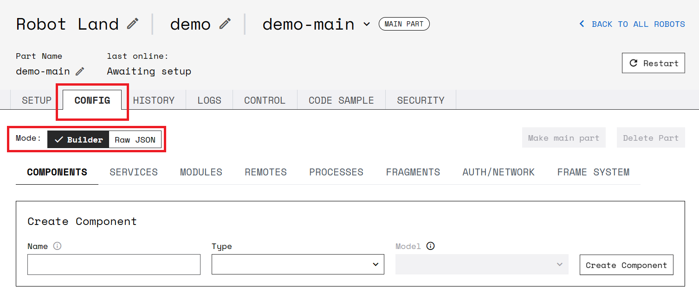

Before you can program a robot, you must configure it.

A robot's configuration tells the code running the robot what *resources* (hardware *components* and software *services*) it has access to, as well as any relevant parameters for those resources.

To start configuring, go to the [Viam app](https://app.viam.com), create a new robot and follow the steps on your new robot’s **SETUP** tab.

The setup steps copy your robots credentials to your robot and store them at <file>/etc/viam.json</file>.
The credentials look like this:

```json
{"cloud":{"app_address":"https://app.viam.com:123","id":"123456ab-a1b2-12a3-a123-1a2b345cdefg6",
"secret":"ab0cd0efghijkl0m12no3pqrstuvw0xyza4bcd567891abcd"}}
```

When you turn on your robot, `viam-server` starts up and uses the credentials in its local <file>/etc/viam.json</file> to fetch its full config from the [Viam app](https://app.viam.com).
Once the robot has a configuration, it caches it locally and can use the configuration for up to 60 days.
The robot checks for new configurations every 15 seconds and changes its configuration automatically when a new configuration is available.
All communication happens securely over HTTPS using secret tokens that are in a robot's configuration.

After you have completed the setup steps and successfully connected to your robot, go to the **CONFIG** tab to start adding to the configuration.

{}

Your robot does not need to stay connected to the Viam app after it has obtained its configuration file.
The configuration is cached locally.
If you cannot connect your robot to the internet at all, you can also [store the configuration file](#local-setup) on the robot itself.

{}

## The CONFIG tab

The **CONFIG** tab on the [Viam app](https://app.viam.com) is the place to configure everything about your robot.

You can use the mode selector to switch between **Builder** and **Raw JSON**:

- **Builder** mode provides a graphical interface for configuring your robot resources.
- **Raw JSON** mode provides a text editing field where you can write and edit the config manually.



Regardless of the mode you choose, Viam stores the configuration file in [JSON (JavaScript Object Notation)](https://en.wikipedia.org/wiki/JSON).

If you add components in **Builder** mode and click **Save Config** at the bottom of the screen, you can switch to **Raw JSON** and see the JSON that has been generated by the builder.

{}

```json
{
  "components": [
    {
      "name": "local",
      "type": "board",
      "model": "pi",
      "attributes": {},
      "depends_on": []
    },
    {
      "name": "my-motor",
      "type": "motor",
      "model": "gpio",
      "attributes": {
        "pins": {
          "a": "13",
          "b": "15"
        },
        "board": "local",
        "max_rpm": 120
      },
      "depends_on": [],
    },
    {
      "name": "my_camera",
      "type": "camera",
      "model": "webcam",
      "attributes": {
        "video_path": "video0"
      }
    }
  ],
  "services": [
    {
      "name": "detector",
      "type": "vision",
      "attributes": {
        "register_models": [
          {
            "parameters": {
              "segment_size_px": 200,
              "hue_tolerance_pct": 0.05,
              "detect_color": "#19FFD9"
            },
            "type": "color_detector",
            "name": "green_detector"
          }
        ]
      }
    }
  ],
  "modules": []
}
```

{}

The **CONFIG** tab has sub-tabs for each section of your robot's config:


  {}
  {}
  {}
  {}
  {}
  {}
  {}
  <!--[Authorization keys](#authnetwork) -->


{}

Simple robots often use only a few components (and perhaps services).
Depending on your robot, you may not need to configure any modules, remotes, processes, fragments or frames.

{}

## Troubleshooting

If you run into issues, here are some things to try:

- Check the **LOGS** tab to check for any errors or other info from `viam-server`.
- You can also view logs locally by running the following command on the robot:

  
  {}

  ```bash
  sudo journalctl --unit=viam-server
  ```

  {}
  {}

  ```bash
  cat $(brew --prefix)/var/log/viam.log
  ```

  {}
  

- Make sure all configured components are actually saved to your config.
   If they aren't, you will see an **Unsaved Changes** note next to the **Save Config** button at the bottom of the config screen.
- Try restarting `viam-server` by clicking **Restart** in the upper right corner of the app.
   It takes a few minutes for the server to shut down and restart.
- Make sure the issue is not hardware related.
  Some things to check are that the robot has adequate power, all wires are properly connected, and no chips or other hardware components are shorted or overheated.
- 

## Local Setup

If you need to configure a robot that will never connect to the internet, you can manually create a local config file on your robot.
Rather than following the steps on the Viam app **SETUP** tab to put config fetching credentials in that file, you'll need to paste the full raw JSON config for your robot into your robot's <file>/etc/viam.json</file> file.

You can write JSON manually, or you can use the Viam app's config builder (without connecting your robot to it) to generate JSON.
Once you finish configuring in **Builder** mode, switch to **Raw JSON** and copy the entire raw JSON into your <file>/etc/viam.json</file>.

Technically, you can put your config file anywhere you want as long as when starting `viam-server`, you pass in the path to the config file.
<file>/etc/viam.json</file> is just the default location.

## Next Steps

After configuring your robot, you can use the [Viam SDKs](../program/sdk-as-client/) to program and control your robot.
