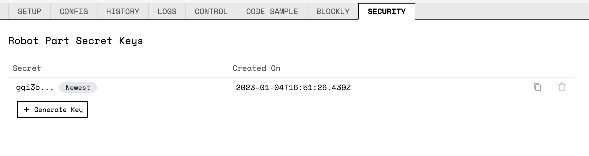

Fleet Management in Viam allows you to configure, control, debug, and manage your robots from the [Viam app](https://app.viam.com).

For each robot in your fleet, you start by setting up the robot on the **SETUP** tab:

## Setup

The **SETUP** tab contains information for starting an instance of `viam-server` on your robot's computer.

Once you select the correct **Mode** and **Architecture** for your system in the upper left of the tab, follow the instructions on the page to connect and set up your robot.

{}
More in-depth information on installing `viam-server` can be found in our [Install Guide](/installation#install-viam-server).
{}

## Configuration

After connecting your robot, go to the **CONFIG** tab, and start adding robot , , and other robot resources.

For more information, see the [configuration documentation](../configuration/#the-config-tab).


If you are managing a large fleet, you can use  when [configuring your robot](../configuration).


## Logs

Each robot automatically sends logs to the cloud which you can view on the **LOGS** tab.

## History

The configuration of your robot and the code it runs are kept separate to make debugging easier.
The **HISTORY** tab shows a timestamped diff view of your robot's configuration changes.

## Code Sample

To start programming your robot, go to the **CODE SAMPLE** tab which contains boilerplate code snippets you can copy and paste into your SDK code to connect to your robot.

For more information on the SDKs, see [Program your Robot with Viam's SDKs](../program/sdk-as-client/).

There is also a JSON stub you can copy if you wish to have your robot communicate with another robot as a [remote](../configuration/remotes/).

{}

## Control

Once you have configured components and services for your robot, you can visually test and remotely operate them from the **CONTROL** tab in the [Viam app](https://app.viam.com).
For example, if you have configured a base with wheels, you can control your robot's movement with an arrow pad and fields to change base’s speed.
If you have configured a camera component, a window in the **CONTROL** tab displays the camera output.

If you use remote control in the [Viam app](https://app.viam.com) UI, all communication to the robot uses [WebRTC](https://pkg.go.dev/go.viam.com/utils@v0.0.3/rpc#hdr-Connection).
For local communication between [parts](../organization/robots#robot-parts) Viam uses gRPC or WebRTC.

## Security

Your robot and the Viam app communicate securely by using unique secrets.

The **SECURITY** tab allows you to access and change the **Robot Part Secret Keys** of your robot.

Copy the secret key by clicking on the clipboard icon.
Click on the **Generate Key** button to generate a new key.

{}
Be cautious when sharing robot part secret keys in your code or messages.

Do not make a secret key publicly available, as any entity who has this token has access to your robot, compromising the security of your system.

Note _where_ and _when_ you share a robot part secret key.
After generating a new secret key, remember that it's best practice to update all references to the key in your code as soon as possible, even though Viam supports flexible key rotation with up to two keys in use at one time.
{}

## Package Deployment

_Coming soon._

Deploy control logic, [modular resources](/program/extend/modular-resources/), sidecar [processes](../configuration/processes), or [machine learning models](../data/ml/deploy-model/), to your fleet of robots without manually copying files by uploading it to Viam's cloud and deploying it to your fleet.
