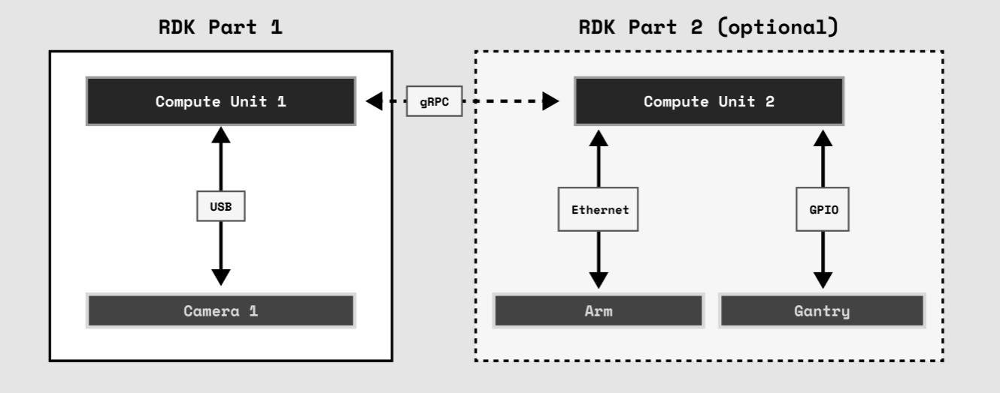
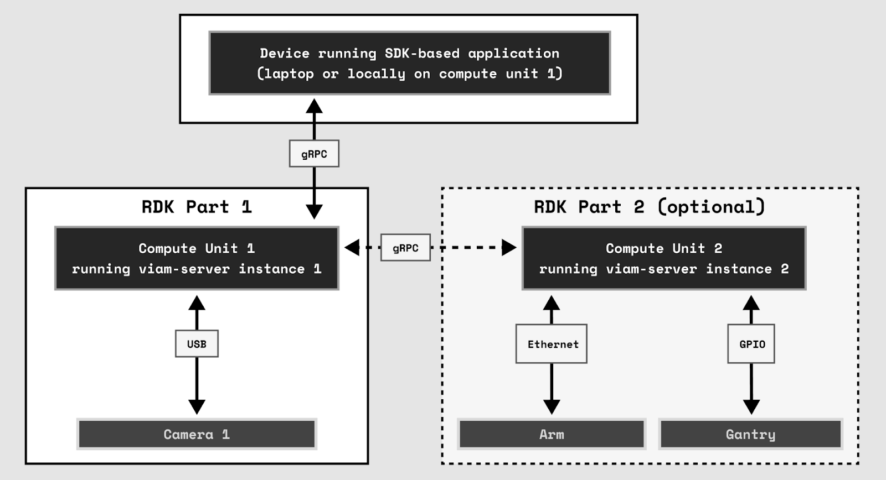

# Viam Overview

A robot is very similar to a computer, but for one important difference: it interacts with its environment. This can involve collecting information about the environment and making decisions on behavior based on that information.

Robots can take many forms, from a simple wheeled rover to a much more complex system involving many [_components_](../index.md#components) such as a wheeled base, grippers, arms, various cameras and other sensors working together. A simpler system might be controlled by a single microcontroller or microprocessor (such as a Raspberry Pi, Jetson or Arduino), whereas a more complex system might contain more than one of these compute units. In addition to physical hardware, a robot may employ one or more Viam-built software modules such as navigation or vision algorithms, which we call [_services_](../index.md#services).

At Viam, we call each compute unit (and the components it controls) a _part_. Thus a robot is organized into one or more parts, depending on the number of compute units it contains. Each part runs a session of the Viam server, which handles receiving API requests and translates them to hardware actuation. The Viam server reads in a configuration file that defines the components, services, and potentially other processes for the part.

Processes are scripts or programs run by the [Robot Development Kit (RDK)](../product-overviews/RDK.md) whose life cycle is managed by the Viam server. One example is running a [Software Development Kit (SDK)](../product-overviews/SDK-as-server.md) server like the Python SDK where the implementation of a component is easier to create than in the RDK. 

Each `viam-server` instance is defined by a configuration file that describes the components it’s made of, the services it offers, and other parts of the robot that it wants to communicate with, which we call _remotes_. A remote represents a connection to another robot part that is part of the same robot.

  
_Figure 1. An example of a two-part robot. Each part has its own compute unit which runs an instance of `viam-server` and communicates with its respective components. Part 1 is the main part and could exist without Part 2. Part 2 is a remote._

Parts communicate with one another using a consistent and unified API, regardless of the hardware they are running on. This is done via [WebRTC](https://en.wikipedia.org/wiki/WebRTC) using the [gRPC and protobuf APIs](../deeper-dive/architecture-and-protobuf.md). This SDK API is available in any language, and provides direct and secure connections to and between parts.

After installing the Viam server on a computer (like a Raspberry Pi), you can connect your newly minted part to app.viam.com. The web app provides a page for each robot to do the following:

- Logs: Displays `viam-server` logs including status changes and error messages.
- Config: Provides a UI for building out your robot configuration. 
- Control: Provides a basic UI for testing your robot components and services without needing to write any script–for example, driving the motors and viewing camera feeds.
- Connect: Contains boilerplate connection code to copy and paste into any script you write using SDKs.

SDK-based applications can be run locally on one part of the robot or on an entirely separate computer (like your laptop) if you wish. They use the same APIs as the web UI.

  
_Figure 2. Example architecture showing how SDK-based applications communicate with your robot’s main instance of `viam-server` over gRPC._

If the particular model of hardware you are working with is not supported in Viam’s RDK, you can write your own implementation of a component model. If there is an existing library, this can be done in just a few dozen lines of code. To read more on how to do this, check out [Using Our SDKs for a Server Component Implementation document](../product-overviews/SDK-as-server.md). Your part can manage this process and will expose the API in the same way as with all your other components.

As you create more robots or start collaborating, you may wish to manage other users’ access to different machines. You can organize robots, users, and organizations using [Viam’s organizational management system](../product-overviews/organization-management.md). 

More detailed information can be found in the product overview and deep dive documents. To start making robots with Viam, [get a Viam server running on a Raspberry Pi](../getting-started/installation.md) or check out our other [tutorials](../index.md#tutorials).
