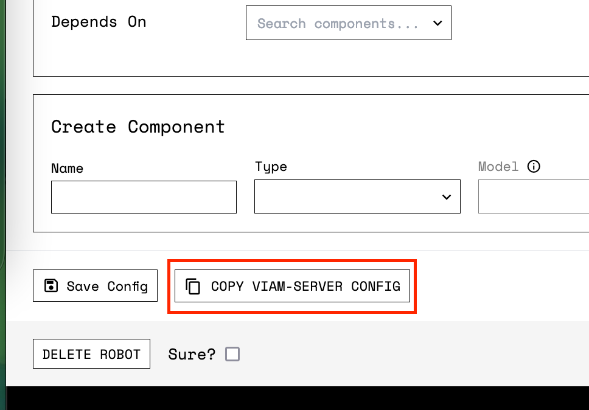

`viam-server` is available for macOS users via [Homebrew](https://docs.brew.sh).
You should install `viam-server` on your Mac if you are using a Mac as the basis for your robot, or if you want to [build a mock robot](../../tutorials/how-to-build-a-mock-robot/).
If your robot runs a linux-based OS, then be sure to follow the [installing Viam Server on Linux](../linux-install/) guide.

{}
This guide is only intended for users that are intending on creating a robot that is running on macOS.
If you are running macOS on your development computer and intend to program a robot that runs Linux, you must follow our [using a Viam SDK to connect to your robot](../../product-overviews/sdk-as-client/) guide.
{}

## How to install viam-server using Homebrew

In short, you must ensure that you have Homebrew installed on your computer running macOS, download your robot's app viam-server config, and download `viam-server` with Homebrew.

The simplest way to install `viam-server` on your Mac is to go to the **SETUP** page of your robot on the [Viam app](https://app.viam.com).
There you will find setup instructions that are auto-populated with your robot's unique ID. Let's explore the installation process in detail:

1.  Ensure that you have Homebrew installed ([https://docs.brew.sh/Installation](https://docs.brew.sh/Installation)) and add `viamrobotics` to Homebrew. After you have installed Homebrew, run this command in your terminal:

```bash
brew tap viamrobotics/brews
```

2.  Set up your robot's config file. This config file tells the robot where to look on app.viam.com to pull its configuration information and allows you to monitor and control your robot from the Viam app.

3.  You can get this command from the **SETUP** tab of your robot on the Viam app.

{}
This curl command will download your robot's unique configuration file from the Viam app into a Homebrew directory so you can call it with the locally installed version of viam-server.
{}

```bash
curl -H "Secret: [PASTE YOUR SECRET KEY HERE]" "https://app.viam.com/api/json1/config?id=[PASTE YOUR ID HERE]&client=true" -o "$(brew --prefix)/etc/viam.json"
```

{}
Your robot's configuration file is saved in your Homebrew directory.
{}

3.  Now that you have saved your robot's config file onto your Mac, you can now download the latest `viam-server` AppImage package via Homebrew.

```bash
brew install viam-server
```

4.  Go to the **SETUP** page on the Viam app and wait for confirmation that your robot has successfully connected.

## How to specify the viam-server config using Homebrew

The recommended way to run `viam-server` on macOS is to copy your robot's viam-server config file locally and to run an instance of viam-sever with your robot's config.

Under the **CONFIG** tab of your robot on the Viam app, click **COPY VIAM-SERVER CONFIG**.



On your local machine, create a new file named <file>viam.json</file> paste the contents of your `viam-server` config into that file, and save.
From the terminal, navigate to the directory where you saved the config file and run this command to create a new instance of `viam-server` using this configuration.`

```bash
viam-server -config viam.json
```

## How to run viam-server as a service on macOS

Installing `viam-server` as a system service is not recommended for most use cases on macOS.
However, if you are looking to create a robot that runs on macOS and you want it to run `viam-server` every time your OS boots up, then you will need to run `viam-server` as a service.
Once you have `viam-server` downloaded locally from Homebrew, you will need to run:

```bash
brew services start viam-server
```

You can stop the `viam-server` service with:

```bash
brew services stop viam-server
```

Or restart the `viam-server` service with:

```bash
brew services restart viam-server
```

## How to update viam-server using Homebrew on macOS

You can upgrade to the latest version of `viam-server` using Homebrew.

```bash
brew upgrade viam-server
```

## How to troubleshoot viam-server on macOS

If you have already successfully connected `viam-server` to the Viam app, you can find all the `viam-server` logs on the **LOGS** tab of the Viam app.

You can also read viam-server's log files locally.

```bash
cat $(brew --prefix)/var/log/viam.log
```
