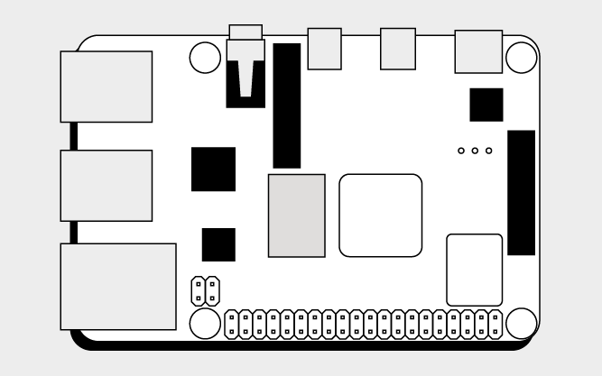
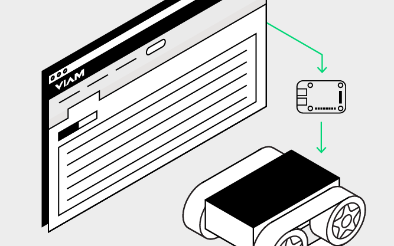
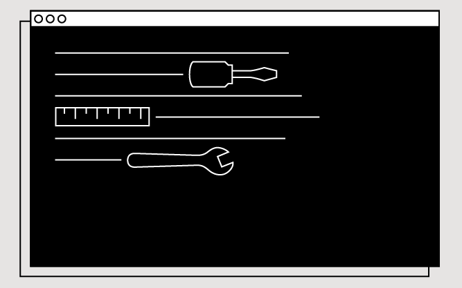
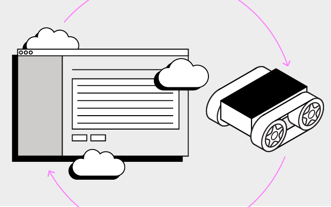

To use Viam software with your robot, you need to install and run an binary called `viam-server` on the computer you want to use to control the robot.

If that computer is a single-board-computer like a Raspberry Pi or Beaglebone, you need to prepare the computer by setting up the board with a viam-compatible operating system.

See [What is Viam?](/viam/) for more information.

  

    

        <a href="prepare">
             
            
            <h4 style="text-align: left; margin-left: 0px;">Prepare</h4>
            
Prepare your computer before installing viam-server.

        <a>
    

    

        <a href="install">
             
            
            <h4 style="text-align: left; margin-left: 0px;">Install</h4>
            
Install <code>viam-server</code> on your robot's computer.

        </a>
    

  

  

    

        <a href="manage">
             
            
            <h4 style="text-align: left; margin-left: 0px;">Manage</h4>
            
Control and troubleshoot viam-server.

        </a>
    

    

        <a href="update">
             
            
            <h4 style="text-align: left; margin-left: 0px;">Update</h4>
            
Keep your version of <code>viam-server</code> up to date.

        </a>
    

  

