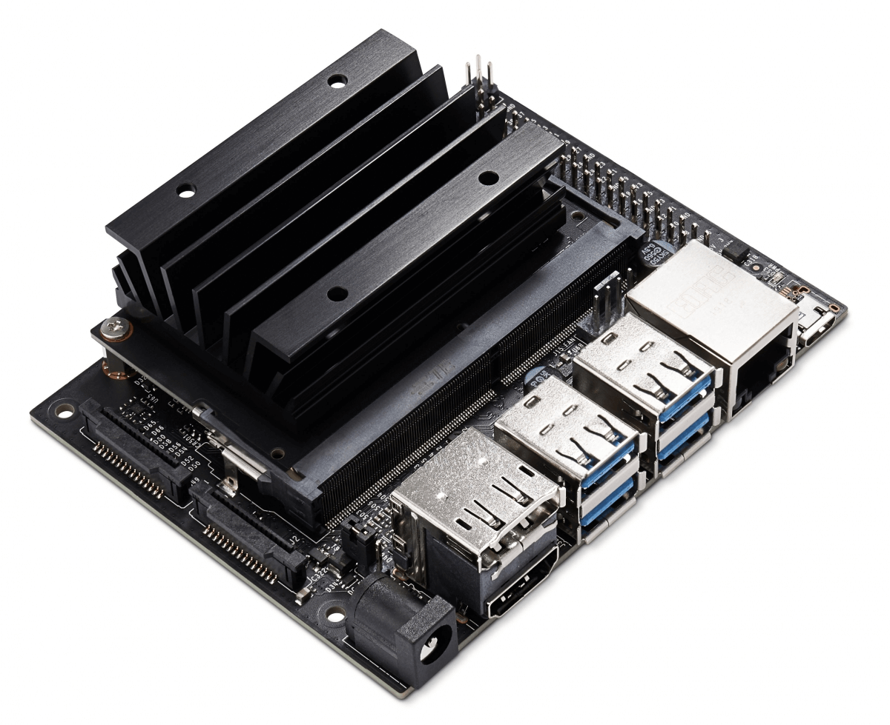
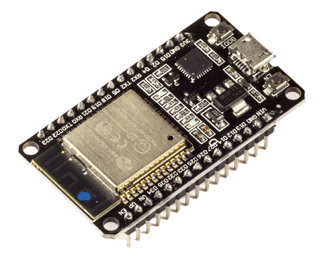

To use Viam software with your robot, you need to install and run the `viam-server` binary on the computer that you want to use to control the robot.
In most cases, this will be a [single board computer (SBC)](#install-on-a-single-board-computer), like a Raspberry Pi, but you can also use a [macOS or Linux computer](#install-on-a-macos-or-linux-computer) to evaluate `viam-server` in development.

For an overview of Viam software, see [Viam in 3 minutes](/viam/).

## Install on a single board computer

### Prepare your board

If you haven't already, you must install a supported operating system to your .
`viam-server` supports Linux 64-bit operating systems running on the `aarch64` or `x86_64` architectures.
If you are using one of the following boards, you can follow our guide for that board to prepare it for installation:

<div id="board-carousel" class="carousel td-max-width-on-larger-screens">
  <ul tabindex="0">
   <li id="c1_slide1">
    <a href="../installation/prepare/jetson-nano-setup/">
        
        <h6>NVIDIA Jetson Nano</h6>
    </a>
  </li>
  <li id="c1_slide2">
    <a href="../installation/prepare/rpi-setup/">
        
        <h6>Raspberry Pi 4</h6>
    </a>
  </li>
  <li id="c1_slide3">
    <a href="../installation/prepare/beaglebone-setup/">
        
        <h6>BeagleBone AI-64</h6>
    </a>
  </li>
  <li id="c1_slide4">
    <a href="../installation/prepare/sk-tda4vm/">
        
        <h6>Texas Instruments TDA4VM</h6>
    </a>
  </li>
  <li id="c1_slide5">
    <a href="../installation/prepare/microcontrollers/">
        
        <h6>Espressif ESP32</h6>
    </a>
  </li>
  <li id="c1_slide6">
    <a href="../installation/prepare/rpi-setup/">
        
        <h6>Raspberry Pi 3</h6>
    </a>
  </li>
  <li id="c1_slide7">
    <a href="../installation/prepare/jetson-agx-orin-setup/">
        
        <h6>NVIDIA Jetson AGX Orin</h6>
    </a>
  </li>
  <li id="c1_slide8">
    <a href="../installation/prepare/rpi-setup/">
        
        <h6>Raspberry Pi Zero 2W</h6>
    </a>
  </li>
  </ul>
  <ol style="visibility: hidden" aria-hidden="true">
    <li><a href="#c1_slide1">NVIDIA Jetson Nano</a></li>
    <li><a href="#c1_slide2">Raspberry Pi 4</a></li>
    <li><a href="#c1_slide3">BeagleBone AI-64</a></li>
    <li><a href="#c1_slide4">Texas Instruments TDA4VM</a></li>
    <li><a href="#c1_slide5">Espressif ESP32</a></li>
    <li><a href="#c1_slide6">Raspberry Pi 3</a></li>
    <li><a href="#c1_slide7">NVIDIA Jetson AGX Orin</a></li>
    <li><a href="#c1_slide8">Raspberry Pi Zero 2W</a></li>
  </ol>
  <div class="prev" style="display: block">‹</div>
  <div class="next" style="display: block">›</div>
</div>

### Install `viam-server`

Once you have a compatible operating system on your board, follow along with the video below, or walk through the steps outlined beneath it, to install `viam-server` on your board:



#### Installation steps

1. Go to the [Viam app](https://app.viam.com) and [add a new robot](/manage/fleet/robots/#add-a-new-robot).
   If this is your first time using the Viam app, you must create an account first.

1. Click the **Setup** tab on your robot page.

1. Select `Linux` under **Mode** and select the appropriate **Architecture** for your board.

1. Follow the steps on the **Setup** tab to install `viam-server` on your board.

1. Once `viam-server` is installed and running on your board, return to the **Setup** page on the [Viam app](https://app.viam.com) and wait for confirmation that your robot has successfully connected.

## Install on a macOS or Linux computer

You can also install `viam-server` on a macOS or Linux computer.
This is useful if you don't have a board available, or if you want to run a Viam [service](/services/) with your robot that requires more computing resources than is otherwise available on an SBC.
Select the tab below for your operating system:


{}

### Install on a macOS computer

`viam-server` is available for macOS users through [Homebrew](https://docs.brew.sh/Installation), and supports both Intel and Apple Silicon macOS computers.
To install `viam-server` on a macOS computer, follow these instructions:

1. Go to the [Viam app](https://app.viam.com) and [add a new robot](/manage/fleet/robots/#add-a-new-robot).
   If this is your first time using the Viam app, you must create an account first.

1. Click the **Setup** tab on your robot page.

1. Select `Mac` under **Mode**

1. Follow the steps on the **Setup** tab to install `viam-server` on your macOS computer.

1. Once `viam-server` is installed and running, return to the **Setup** page on the [Viam app](https://app.viam.com) and wait for confirmation that your computer has successfully connected.

{}
{}

### Install on a Linux computer

`viam-server` is distributed for Linux as an [AppImage](https://appimage.org/).
The AppImage is a single, self-contained binary that runs on 64-bit Linux systems running the `aarch64` or `x86_64` architectures, with no need to install any dependencies.
To install `viam-server` on a Linux computer, follow these instructions:

1. Go to the [Viam app](https://app.viam.com) and [add a new robot](/manage/fleet/robots/#add-a-new-robot).
   If this is your first time using the Viam app, you must create an account first.

1. Click the **Setup** tab on your robot page.

1. Select `Linux` under **Mode** and select the appropriate **Architecture** for your computer.

1. Follow the steps on the **Setup** tab to install `viam-server` on your Linux computer.

1. Once `viam-server` is installed and running, return to the **Setup** page on the [Viam app](https://app.viam.com) and wait for confirmation that your computer has successfully connected.

{}


## Local installation

If desired, you can also install and run `viam-server` locally without connecting to the [Viam app](https://app.viam.com).
This is useful for situations where you have limited internet access, or if your robot will never connect to the internet itself.
You can install `viam-server` in this fashion to a board (SBC), macOS computer, or Linux computer.
Select the tab below appropriate for your installation:


{}

`viam-server` is distributed for Linux as an [AppImage](https://appimage.org/).
The AppImage is a single, self-contained binary that runs on 64-bit Linux systems running the `aarch64` or `x86_64` architectures, with no need to install any dependencies.
To install `viam-server` on a board, follow these instructions:

1. If you haven't already, you must install a supported operating system to your board.
   Follow the instructions to [prepare your board](#prepare-your-board) to install a supported OS on your board.

1. Next, `ssh` to your board and run `uname -m` to determine the architecture of your board.
   `viam-server` supports the `aarch64` and `x86_64` architectures.

<!-- The below has to be in HTML because we're using a table inside another table with indentation-->
<ol start="3">
<li>Select the tab below matching your board's architecture, and run the command listed to download and install <code>viam-server</code>.
   We recommend the stable release for most users:


{}

**Stable:**

```sh {id="terminal-prompt" class="command-line" data-prompt="$"}
curl https://storage.googleapis.com/packages.viam.com/apps/viam-server/viam-server-stable-aarch64.AppImage -o viam-server &&
  chmod 755 viam-server && sudo ./viam-server --aix-install
```

**Latest:**

```sh {id="terminal-prompt" class="command-line" data-prompt="$"}
curl https://storage.googleapis.com/packages.viam.com/apps/viam-server/viam-server-latest-aarch64.AppImage -o viam-server &&
  chmod 755 viam-server && sudo ./viam-server --aix-install
```

{}
{}

**Stable:**

```sh {id="terminal-prompt" class="command-line" data-prompt="$"}
curl https://storage.googleapis.com/packages.viam.com/apps/viam-server/viam-server-stable-x86_64.AppImage -o viam-server &&
  chmod 755 viam-server && sudo ./viam-server --aix-install
```

**Latest:**

```sh {id="terminal-prompt" class="command-line" data-prompt="$"}
curl https://storage.googleapis.com/packages.viam.com/apps/viam-server/viam-server-latest-x86_64.AppImage -o viam-server &&
  chmod 755 viam-server && sudo ./viam-server --aix-install
```

{}


</li>
</ol>

{}
{}
`viam-server` is available for macOS users through [Homebrew](https://docs.brew.sh/Installation), and supports both Intel and Apple Silicon macOS computers.
To install `viam-server` on a macOS computer, follow these instructions:

1. First, run the following command to download and install `viam-server` on your macOS computer using `brew`:

   ```sh {id="terminal-prompt" class="command-line" data-prompt="$"}
   brew tap viamrobotics/brews && brew install viam-server
   ```

1. Next, copy the example configuration file to a convenient location on your filesystem.
   The following example places the file in your home directory:

   ```sh {id="terminal-prompt" class="command-line" data-prompt="$"}
   cp /opt/homebrew/etc/viam.json ~/viam.json
   ```

   This example configuration file contains some example [component](/components/) and [service](/services/) configurations, as well as an example of a .

1. Then, start `viam-server` with the following command:

   ```sh {id="terminal-prompt" class="command-line" data-prompt="$"}
   viam-server -config ~/viam.json
   ```

1. To make configuration changes to your robot, edit the <file>~/viam.json</file> configuration file, then stop and restart `viam-server`.
   You can also build a configuration file on the [Viam app](https://app.viam.com) without connecting your robot to it.
   Use the **Config** tab to add and configure the components and services you'll be using, then switch the **Mode** to `Raw JSON` to view and download your configuration file.
{}
{}

`viam-server` is distributed for Linux as an [AppImage](https://appimage.org/).
The AppImage is a single, self-contained binary that runs on 64-bit Linux systems running the `aarch64` or `x86_64` architectures, with no need to install any dependencies.
To install `viam-server` on a Linux computer, follow these instructions:

1. Run `uname -m` on your Linux computer's command line to determine your system architecture.
   `viam-server` supports the `aarch64` and `x86_64` architectures.

<!-- The below has to be in HTML because we're using a table inside another table with indentation-->
<ol start="2">
<li>Select the tab below matching your computer's architecture, and run the command listed to download and install <code>viam-server</code>.
   We recommend the stable release for most users:


{}

**Stable:**

```sh {id="terminal-prompt" class="command-line" data-prompt="$"}
curl https://storage.googleapis.com/packages.viam.com/apps/viam-server/viam-server-stable-aarch64.AppImage -o viam-server &&
  chmod 755 viam-server && sudo ./viam-server --aix-install
```

**Latest:**

```sh {id="terminal-prompt" class="command-line" data-prompt="$"}
curl https://storage.googleapis.com/packages.viam.com/apps/viam-server/viam-server-latest-aarch64.AppImage -o viam-server &&
  chmod 755 viam-server && sudo ./viam-server --aix-install
```

{}
{}

**Stable:**

```sh {id="terminal-prompt" class="command-line" data-prompt="$"}
curl https://storage.googleapis.com/packages.viam.com/apps/viam-server/viam-server-stable-x86_64.AppImage -o viam-server &&
  chmod 755 viam-server && sudo ./viam-server --aix-install
```

**Latest:**

```sh {id="terminal-prompt" class="command-line" data-prompt="$"}
curl https://storage.googleapis.com/packages.viam.com/apps/viam-server/viam-server-latest-x86_64.AppImage -o viam-server &&
  chmod 755 viam-server && sudo ./viam-server --aix-install
```

{}


</li>
</ol>

3. Then, start `viam-server` with the following command:

   ```sh {id="terminal-prompt" class="command-line" data-prompt="$"}
   sudo viam-server -config /etc/viam.json
   ```

4. To make configuration changes to your robot, edit the <file>/etc/viam.json</file> configuration file, then stop and restart `viam-server`.
   You can also build a configuration file on the [Viam app](https://app.viam.com) without connecting your robot to it.
   Use the **Config** tab to add and configure the components and services you'll be using, then switch the **Mode** to `Raw JSON` to view and download your configuration file.

{}


## Next Steps


  {}
  {}

