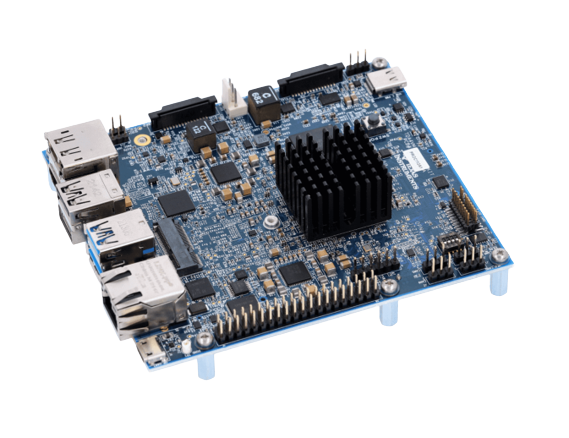

To use Viam software with your robot, you need to install and run a binary called `viam-server` on the computer you want to use to control the robot.
See [What is Viam?](/viam/) for more information.

## Preparation

Make sure your system is compatible with Viam.
Viam is supported on:

- Linux 64-bit operating systems
- macOS

<div class="container text-left td-max-width-on-larger-screens">
    <div class="row">
        
        <div class="col">
            <br>
            <p> If you plan to run <code>viam-server</code> on your laptop or desktop with a Linux or Mac operating system, no special prep is required. Proceed to <a href="#install-viam-server">Install <code>viam-server</code></a>. </p>
        </div>
    </div>
</div>

<br>

If you are using a single board computer (SBC) or a microcontroller, prepare your device by following the relevant setup document:

<div class="container text-center td-max-width-on-larger-screens">
  <div class="row">
    <div class="col hover-card hover-card-small">
        <a href="prepare/rpi-setup/">
            
            <h4 style="text-align: left; margin-left: 0px; font-weight:bold">Raspberry Pi</h4>
        <a>
    </div>
    <div class="col hover-card hover-card-small">
        <a href="prepare/beaglebone-setup/">
            
            <h4 style="text-align: left; margin-left: 0px; font-weight:bold">BeagleBone AI-64</h4>
        </a>
    </div>
    <div class="col hover-card hover-card-small">
        <a href="prepare/sk-tda4vm/">
            
            <h4 style="text-align: left; margin-left: 0px; font-weight:bold">Texas Instruments SK-TDA4VM</h4>
        </a>
    </div>
    <div class="col hover-card hover-card-small">
        <a href="prepare/jetson-nano-setup/">
            
            <h4 style="text-align: left; margin-left: 0px; font-weight:bold">Jetson Nano</h4>
        </a>
    </div>
    <div class="col hover-card hover-card-small">
        <a href="prepare/jetson-agx-orin-setup/">
            
            <h4 style="text-align: left; margin-left: 0px; font-weight:bold">Jetson AGX Orin</h4>
        </a>
    </div>
      <div class="col hover-card hover-card-small">
        <a href="prepare/microcontrollers">
            
            <h4 style="text-align: left; margin-left: 0px; margin-top: 1rem; font-weight:bold">Expressif ESP32</h4>
        </a>
    </div>
  </div>
</div>

## Install `viam-server`

<div class="embed-responsive embed-responsive-16by9">
    <iframe class="embed-responsive-item" src="https://www.youtube.com/embed/gmIW9JoWStA" allowfullscreen></iframe>
</div>
<br>

Once you have a compatible operating system on your computer, you are ready to install `viam-server`.

1. Go to the [Viam app](https://app.viam.com) and [add a new robot](/manage/app-usage/#adding-a-new-robot).
   If this is your first time using the Viam app, you [first need to create an account](/manage/app-usage/#creating-an-account).
2. Click the **SETUP** tab on your robot page.
3. Select the **Mode** and **Architecture** settings for your device.
4. Follow the steps on the **SETUP** tab to install `viam-server`.
   Also detailed in [Detailed Installation Instructions](#detailed-installation-instructions).

### Detailed Installation Instructions


{}

<br>

`viam-server` is distributed as an AppImage.
The AppImage is a single, self-contained binary that runs on any Linux system (except FUSE) with the correct CPU architecture, with no need to install any dependencies.

1. **Download the Viam app config to your computer.** `viam-server` uses this config file to connect to app.viam.com.
   This connection allows the robot to pull its full configuration information and allows you to monitor and control your robot from the Viam app.
   Download your robot's config file from the **SETUP** tab of your robot on the Viam app. </li>

<!-- The below has to be in HTML because we're using a table inside another table with indentation-->
<ol start="2">
<li> <strong>Download and install <code>viam-server</code>.</strong>

   Run viam-server locally on your Mac with the config you just downloaded.
   Replace `<YOUR_ROBOT_NAME>` with the name of your robot from the Viam app.

   To determine the CPU architecture (x86_64 or aarch64) of your device, run `uname -m` on the command line.
   Raspberry Pi and Jetson boards are aarch64 and most desktops and laptops are x86_64.


{}

<br>

Stable:

```bash
curl http://packages.viam.com/apps/viam-server/viam-server-stable-aarch64.AppImage -o viam-server &&
  chmod 755 viam-server && sudo ./viam-server --aix-install
```

Latest:

```bash
curl http://packages.viam.com/apps/viam-server/viam-server-latest-aarch64.AppImage -o viam-server &&
  chmod 755 viam-server && sudo ./viam-server --aix-install
```

{}
{}

<br>

Stable:

```bash
curl http://packages.viam.com/apps/viam-server/viam-server-stable-x86_64.AppImage -o viam-server &&
  chmod 755 viam-server && sudo ./viam-server --aix-install
```

Latest:

```bash
curl http://packages.viam.com/apps/viam-server/viam-server-latest-x86_64.AppImage -o viam-server &&
  chmod 755 viam-server && sudo ./viam-server --aix-install
```

{}


If you do not want to run `viam-server` as a service, you can also [run it manually as a binary](#start-manually-from-the-command-line).

</li>
</ol>

3. **Connect and configure.** Go to the **SETUP** page on the Viam app and wait for confirmation that your robot has successfully connected.

{}
{}

<br>

`viam-server` is available for macOS users through [Homebrew](https://docs.brew.sh/Installation).

1. **Install `viam-server` on your Mac**

   ```bash
   brew tap viamrobotics/brews && brew install viam-server
   ```

2. **Download the Viam app config to your Mac.** `viam-server` uses this config file to connect to app.viam.com.
   This connection allows the robot to pull its full configuration information and allows you to monitor and control your robot from the Viam app.
   Download your robot's config file from the **SETUP** tab of your robot on the Viam app.

3. **Start `viam-server` on your Mac.** Run viam-server locally on your Mac with the config you just downloaded.
   Replace `<YOUR_ROBOT_NAME>` with the name of your robot from the Viam app.

   ```bash
   viam-server -config ~/Downloads/viam-<YOUR_ROBOT_NAME>-main.json
   ```

4. **Connect and configure.** Go to the **SETUP** page on the Viam app and wait for confirmation that your robot has successfully connected.

{}


### Starting `viam-server` on Linux

To run `viam-server`, you have two options:

#### Start manually from the command line

To run `viam-server` directly from the command line, you can use the following command, replacing "myconfig" with the name of your configuration file.
`sudo` is necessary on some devices to access hardware.

```bash
sudo ./viam-server -config myconfig.json
```

#### Start automatically on boot

If you install `viam-server` as a system service, `viam-server` starts automatically every time you boot your device.
Note that this is the default way `viam-server` is set up if you follow the **SETUP** tab instructions on the [Viam app](https://app.viam.com).

For this setup your configuration file must be at <file>/etc/viam.json</file>.

The following command creates a systemd service file at <file>/etc/systemd/system/viam-server.service</file> and sets it to start on boot, using a config placed at <file>/etc/viam.json</file>.
It will also move the actual binary (AppImage) to <file>/usr/local/bin/viam-server</file> (regardless of the previous filename).

```bash
sudo ./viam-server --aix-install
```

Start the service by running:

```bash
sudo systemctl start viam-server
```

The service is an AppImage and will check for updates and self-update automatically each time the service is started.
Self-updates can take a couple of minutes, so the service may sometimes take a moment to start while this runs.
You can disable this by commenting out the ExecPre line (the one with --aix-update on it) in the service file.

## Next Steps

<div class="container text-center td-max-width-on-larger-screens">
  <div class="row">
    <div class="col hover-card">
      <a href="manage">
        
        <h4 style="text-align: left; margin-left: 0px">Manage</h4>
        <p style="text-align: left">
          Control and troubleshoot <code>viam-server</code>.
        </p>
      </a>
    </div>
    <div class="col hover-card">
      <a href="update">
        
        <h4 style="text-align: left; margin-left: 0px">Update</h4>
        <p style="text-align: left">
          Keep your version of <code>viam-server</code> up to date.
        </p>
      </a>
    </div>
  </div>
</div>
