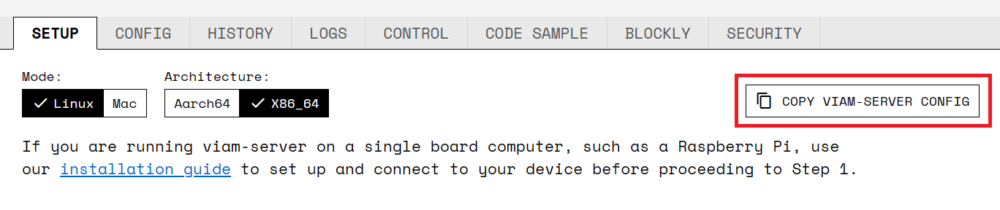

The viam-server is distributed as an AppImage.
The AppImage is a single, self-contained binary that should run on any Linux system with the correct CPU architecture, with no need to install any dependencies (excepting FUSE as detailed in the troubleshooting section at the end).
MacOS users will need to follow the [installing viam-server on macOS guide](../macos-install/).
Windows and 32-bit systems are not supported.

## Installation Instructions

In short, you'll download the file, make it executable, and run its self-install option to set it up as a system service. If you don't want to run it as a service, just run it. It's simply an executable binary.

### URLs

- **Stable**:
  - x86_64: [http://packages.viam.com/apps/viam-server/viam-server-stable-x86_64.AppImage](http://packages.viam.com/apps/viam-server/viam-server-stable-x86_64.AppImage)
  - AArch64 (ARM64): [http://packages.viam.com/apps/viam-server/viam-server-stable-aarch64.AppImage](http://packages.viam.com/apps/viam-server/viam-server-stable-aarch64.AppImage)

- **Latest**:
  - x86_64: [http://packages.viam.com/apps/viam-server/viam-server-latest-x86_64.AppImage](http://packages.viam.com/apps/viam-server/viam-server-latest-x86_64.AppImage)
  - AArch64 (ARM64): [http://packages.viam.com/apps/viam-server/viam-server-latest-aarch64.AppImage](http://packages.viam.com/apps/viam-server/viam-server-latest-aarch64.AppImage)

### Detailed Steps

Determine the CPU architecture (x86_64 or aarch64) of the target device by running `uname -m` on the command line. (Raspberry Pi and Jetson boards are aarch64 and most desktops and laptops are x86_64.)

Choose which URL to download from the list above. Run the following command ([**with the correct URL**](#urls)) to both download it and rename it to "viam-server" for ease of use:

```bash
curl -o viam-server http://packages.viam.com/apps/viam-server/viam-server-latest-aarch64.AppImage
```

Make the file executable by running:

```bash
chmod 755 viam-server
```

To run viam-server, you have two options:

#### Running Directly from the Command Line

To run viam-server directly from the command line, you can use the following command, replacing "myconfig" with the name of your configuration file. `sudo` is necessary on a Pi to access GPIO pins, and it may be necessary in other cases depending on hardware permissions.

```bash
sudo ./viam-server -config myconfig.json
```

To connect this instance of viam-server with a [Viam app](https://app.viam.com) robot, the contents of <file>myconfig.json</file> should be pasted from the **COPY VIAM-SERVER CONFIG** button at the top right of the **SETUP** tab of your robot on [https://app.viam.com](https://app.viam.com).



#### Installing as a System Service

This is more common when setting up viam-server on a Raspberry Pi or something that will essentially only be turned on when you want to use the robot, so you want viam-server to start every time on boot.

The following command will create a systemd service file at <file>/etc/systemd/system/viam-server.service</file> and set it to start on boot, using a config placed at <file>/etc/viam.json</file>. It will also move the actual binary (AppImage) to `/usr/local/bin/viam-server` (regardless of the previous filename.) Run the following command:

```bash
sudo ./viam-server --aix-install
```

To connect this viam-server with a [Viam app](https://app.viam.com) robot, navigate to your robot page on [https://app.viam.com](https://app.viam.com). At the top right of the **SETUP** tab, click **COPY VIAM-SERVER CONFIG** and paste it into <file>/etc/viam.json</file>.

Start the service by running:

```bash
sudo systemctl start viam-server
```

The service is an AppImage and will check for updates and self-update automatically each time the service is started. Self-updates can take a couple of minutes, so the service may sometimes take a moment to start while this runs.
You can disable this by commenting out the ExecPre line (the one with --aix-update on it) in the service file.

### Next Steps

Continue to our [Managing viam-server guide](/docs/installation/manage/_index) to learn about running viam-server.

### Troubleshooting

#### SquashFS Errors

Looks like this...

```bash
Feb 10 13:11:26 hydro3-pi viam-server[933]: Something went wrong trying to read the squashfs image.
Feb 10 13:11:26 hydro3-pi viam-server[933]: open dir error: No such file or directory
```

The update process may have been interrupted and left a corrupt file. Simply redownload the new file as instructed above.

#### FUSE Errors

FUSE (Filesystem-in-Userspace), is included in almost all modern Linux distributions by default. (The one real exception is that it doesn’t work (by default) due to security restrictions within Docker containers.) For more information on troubleshooting FUSE-related issues (including Docker workarounds) see here: [I get some errors related to something called “FUSE” — AppImage documentation](https://docs.appimage.org/user-guide/troubleshooting/fuse.html)
