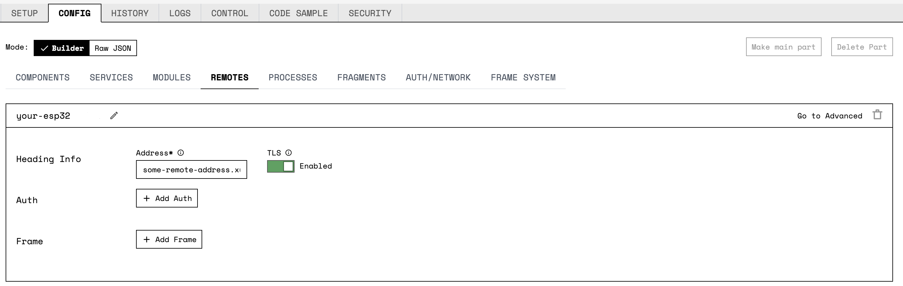

A guide to getting started with using an [Expressif ESP32 microcontroller](https://www.espressif.com/en/products/socs/esp32) to control your robot.

## The micro-RDK

The micro-RDK is a lightweight version of Viam's [Robot Development Kit](https://github.com/viamrobotics/rdk) that supports running `viam-server` on resource-limited embedded systems like the ESP32.

The micro-RDK version of `viam-server` supports:

- Viam app connectivity
- Component control

The only microcontroller the micro-RDK currently supports is the ESP32.

See [Github](https://github.com/viamrobotics/micro-rdk) for code examples and more information about the micro-RDK.

## Getting Started

ESP-IDF is the development framework for Espressif SoCs (System-on-Chips), supported on Windows, Linux and macOS.
Viam recommends using [our fork](https://github.com/npmenard/esp-idf) of the ESP-IDF framework to support camera configuration.

## Hardware Requirements

You need the following hardware, tools, and software to create a new project on an ESP32 with the micro-RDK:

- An Expressif ESP32 microcontroller.
Viam recommends purchasing the ESP32 with a development board: see development kit options [here](https://www.espressif.com/en/products/devkits).
- A USB-C cable for connecting the ESP32 to your development machine (included with ESP32 DevKits).
- A Micro-USB (recommended, included with ESP32 DevKits), 5V/GND header pin or 3V3/GND header pin power supply.



If you are using a personal computer without a USB-C port as your development machine, you may need to purchase a [USB-C Female to USB Male adapter](https://www.amazon.com/s?k=USB+C+Female+to+USB+Male+Adapter&i=electronics&crid=1Q54BEA33DKU3&sprefix=usb+c+female+to+usb+male+adapter%2Celectronics%2C90&ref=nb_sb_noss_1) to connect the ESP32 to your PC.

{}

### Install ESP-IDF

Start by completing Step 1 of [these instructions](https://docs.espressif.com/projects/esp-idf/en/latest/esp32/get-started/linux-macos-setup.html), following the appropriate steps for your development machine's architecture, and then return here.

Clone Viam's fork of the ESP-IDF:

``` shell
mkdir -p ~/esp
cd ~/esp
git clone https://github.com/npmenard/esp-idf
cd esp-idf
git checkout v4.4.1
git submodule update --init --recursive
```

Then, install the required tools for ESP-IDF:

``` shell
cd ~/esp/esp-idf
./install.sh esp32
```

Finally, to activate ESP-IDF, source the activation script `export.sh`:

``` shell
. $HOME/esp/esp-idf/export.sh
```

To avoid conflicts with other toolchains, adding this command to your `.bashrc` or `.zshrc` is not recommended.
Save this command to run in any future terminal session where you need to activate the ESP-IDF development framework.

### Install Rust

#### MacOS & Linux

If you don't already have the Rust programming language installed on your development machine, run the following command to download Rustup and install Rust:

``` shell
curl --proto '=https' --tlsv1.2 -sSf https://sh.rustup.rs | sh
```

See [Rust](https://www.rust-lang.org/tools/install) for more information and other installation methods.

### Install the Rust ESP Toolchain

To install the Rust ESP toolchain, run:

``` shell
curl -LO https://github.com/esp-rs/rust-build/releases/download/v1.64.0.0/install-rust-toolchain.sh
chmod a+x install-rust-toolchain.sh
./install-rust-toolchain.sh
```

#### Activate the ESP-RS Virtual Environment

Running this script will prompt you to add two variables to your `.zshrc` or `.bashrc` if you want to activate the ESP-RS environment automatically in every terminal session:

``` shell
IMPORTANT!
 The following environment variables need to be updated:
export LIBCLANG_PATH= ...
```

Doing so is not recommended, as this may cause conflicts with other toolchains.
As an alternative, the script prompts you to save the export file `export-esp.sh`.
Viam recommends following this method.

Run the following command to save the `./export-esp.sh` file at `$HOME/esp/esp-idf/export-esp-rs.sh`:

``` shell
mv ./export-esp.sh $HOME/esp/esp-idf/export-esp-rs.sh
```

After doing so, run the following command to source (`.`) this file, activating the ESP-RS Virtual Environment:

``` shell
. $HOME/esp/esp-idf/export-esp-rs.sh
```

Save this command to run in any future terminal session where you need to activate the Virtual Environment.

### Install `cargo-generate` with `cargo`

 `cargo` installs automatically when downloading Rust with Rustup.

If you need to install `cargo`, run the following command, or see the [Rust Documentation](https://doc.rust-lang.org/cargo/getting-started/installation.html) for other installation methods:

``` shell
curl https://sh.rustup.rs -sSf | sh
```

Run the following command to install `cargo-generate`:

``` shell
cargo install cargo-generate
```

### Update `cargo-espflash`

Run the following command to install `cargo-espflash` in Viam's recommended version:

``` shell
cargo install cargo-espflash@2.0.0-rc.1
```

## Your First ESP32 Robot

### Create a New Robot

Navigate to [the Viam app](https://app.viam.com) and create a new robot in your desired location.
Leave your `Mode` and `Architecture` selections at default.
Skip any steps on the **SETUP** tab that refer to downloading, installing, or starting `viam-server`, since it is not used on the ESP32 board.

### Generate a New Project from the micro-rdk Template

Using [this template](https://github.com/viamrobotics/micro-rdk-template.git), create a new micro-rdk project to upload to your ESP32 microcontroller board.

Run the following command to generate a new project with `cargo`:

``` shell
cargo generate --git https://github.com/viamrobotics/micro-rdk-template.git
```

If you would like, you can use `mkdir` to initialize a new repository in the directory you created by running `cargo-generate`, to track any changes you make to the generated project.

You will be prompted to paste a Viam robot configuration file (`viam.json`) into the terminal.
Click the **Copy viam-server config** button on the **SETUP** tab of your robot on [the Viam app](https://app.viam.com) to obtain the `.json`.

All of the generated files should be safe to commit as a project on Github, with the exception of `viam.json`, since it contains a secret key.

### Upload the Project

Modify the contents of the file src/main.rs to your liking and run:

``` shell
make upload
```

While running `make upload`, you may be presented with an interactive menu of different serial port options to use to connect to the ESP32 board.
Once you have identified the correct choice for your environment, you may bypass the menu by providing the correct port as a command line argument to future invocations of `make upload`:

``` shell
make ESPFLASH_FLASH_ARGS="-p /dev/cu.usbserial-130" upload
```

If successful, `make upload` will retain a serial connection to the board until `Ctrl-C` is pressed.
To manage this connection, consider running it within a dedicated terminal session, or under `tmux` or `screen`.
While the serial connection is live, you can also restart the currently flashed image with `Ctrl-R`.

If everything went well, your ESP32 will be programmed so that you will be able to see your robot live on [the Viam app](https://app.viam.com).



If you encounter a crash due to stack overflow, you may need to increase the stack available to the main task.

Edit the generated `sdkconfig.defaults` file as follows, and flash the board again:

``` diff
diff --git a/sdkconfig.defaults b/sdkconfig.defaults
index f75b465..2b0ba9c 100644
--- a/sdkconfig.defaults
+++ b/sdkconfig.defaults
@@ -1,5 +1,5 @@
 # Rust often needs a bit of an extra main task stack size compared to C (the default is 3K)
-CONFIG_ESP_MAIN_TASK_STACK_SIZE=24576
+CONFIG_ESP_MAIN_TASK_STACK_SIZE=32768
 CONFIG_ESP_MAIN_TASK_AFFINITY_CPU1=y
 # Use this to set FreeRTOS kernel tick frequency to 1000 Hz (100 Hz by default).
```

{}

## Next Steps

### Configure the ESP32 as a Remote

To programmatically control the robot now running on the ESP32, you need to connect it to another robot that is running the full-featured `viam-server`, as the microcontroller lacks the required processing power to do so.
This second "robot" can be as simple as an instance of `viam-server` running on your development machine.

By configuring the ESP32 robot as a remote of a robot running `viam-server`, you can establish a secure connection between the two robots.

Navigate to [the Viam app](https://app.viam.com).
Create and configure a new robot, or select an existing robot that you want to add the ESP32 to.

Add the ESP32-backed robot as a remote of your new or existing robot:

<p style="max-width:800px;"></p>

1. Navigate to the **CONTROL** tab of the robot and copy its `Remote Address`.
2. Navigate to the **CONFIG** tab, select the `Remotes` tab, and create a new remote.
3. Set the `Address` field of the new remote to be the `Remote Address` you copied above.
4. Set `TLS` for the remote to `Enabled`.

Ensure that the controlling robot is live in [the Viam app](https://app.viam.com).
If the connection is present, the ESP32-backed robot is now programmatically available.
  
### Modify the Generated Template

You can find the declaration of the robot in the generated file `src/main.rs`.
This example exposes one GPIO pin (pin 18), and one analog reader attached to GPIO pin 34.

#### Expose Other GPIO Pins

Once you have selected an appropriate GPIO pin, according to the pinout diagram included with your ESP32, you can add to the collection of exposed pins.

For example, to expose GPIO pin 21, change the line:

``` rust
let pins = vec![PinDriver::output(periph.pins.gpio18.downgrade_output())?];
```

to

``` rust
let pins = vec![PinDriver::output(periph.pins.gpio18.downgrade_output())?,
    PinDriver::output(periph.pins.gpio21.downgrade_output())?,];
```

Now you can change & read the state of pin 21 from [the Viam app](https://app.viam.com).

#### Add a New Analog Reader

Adding a new analog reader requires a few more steps.
First, you will want to identify a pin capable of analog reading.

In the pinout diagram of the ESP32, the pins are labeled like this:

- `ADCn_y`: where `n` is the adc number (1 or 2, note that 2 cannot be used with WiFi enabled), and `y` is the channel number.

Once you have identified an appropriate pin, follow these steps to add it.
In this example, we want to add GPIO pin 35, which is labeled `ADC1_7` in the pinout diagram:

- Create a new ADC channel:

``` rust
let my_analog_channel = adc_chan: AdcChannelDriver<_, Atten11dB<adc::ADC1>> =
            AdcChannelDriver::new(periph.pins.gpio35)?;
```

- Create the actual Analog reader (note that `adc1` is declared above):

``` rust
let my_analog_reader = Esp32AnalogReader::new("A2".to_string(), my_analog_channel, adc1.clone());
```

- Finally, add the collection of analog readers:

``` rust
let analog_readers = vec![
            Rc::new(RefCell::new(analog1)),
            Rc::new(RefCell::new(my_analog_reader)),
        ];
```

### Install Espressif's QEMU ESP32 Emulator

Espressif maintains a pretty good QEMU emulator supporting the ESP32, we recommend using it during
development.
See [here](https://github.com/espressif/qemu) for more information.

#### MacOS

Run the following command to install the QEMU ESP32 Emulator:

``` shell
git clone https://github.com/espressif/qemu
cd qemu
./configure --target-list=xtensa-softmmu \
    --enable-gcrypt \
    --enable-debug --enable-sanitizers \
    --disable-strip --disable-user \
    --disable-capstone --disable-vnc \
    --disable-sdl --disable-gtk --extra-cflags="-I/opt/homebrew/Cellar/libgcrypt/1.10.1/include -I/opt/homebrew//include/"
cd build && ninja
```

#### Linux

On Ubuntu or Debian, first make sure you have the `libgcrypt` library and headers installed by running the following command:

``` shell
sudo apt-get install libgcrypt20 libgcrypt20-dev
```

Then, run the following command to install QEMU:

``` shell
git clone https://github.com/espressif/qemu
cd qemu
./configure --target-list=xtensa-softmmu     --enable-gcrypt \
    --enable-debug --enable-sanitizers  --disable-strip --disable-user \
    --disable-capstone --disable-vnc --disable-sdl --disable-gtk
cd build && ninja
```

Add `export QEMU_ESP32_XTENSA=<path-to-clone-qemu>/build/` to your `.zshrc` or `.bashrc`, or save this command to run in your terminal every session you wish to use the QEMU emulator.

### Build with the QEMU ESP32 Emulator

Navigate to the root of the Micro-RDK repository.
Once you've `cd`'d to the correct repository, run `. $HOME/esp/esp-idf/export.sh` if you haven't done so already in this terminal session.

You will need to comment out two lines from the file `sdkconfig.defaults`:

``` editorconfig
CONFIG_ESPTOOLPY_FLASHFREQ_80M=y
CONFIG_ESPTOOLPY_FLASHMODE_QIO=y
```

You can then run:

``` shell
make sim-local
```

Or, if you want to connect a debugger:

``` shell
make debug-local
```

### Troubleshooting

If you are unable to connect to the esp32-backed robot as a remote, try adding `:4545` to the end of the value set in the remote's `Address` field.

You can find additional assistance in the [Troubleshooting section](/appendix/troubleshooting/).

You can also ask questions on the [Viam Community Slack](https://join.slack.com/t/viamrobotics/shared_invite/zt-1f5xf1qk5-TECJc1MIY1MW0d6ZCg~Wnw) and we will be happy to help.
