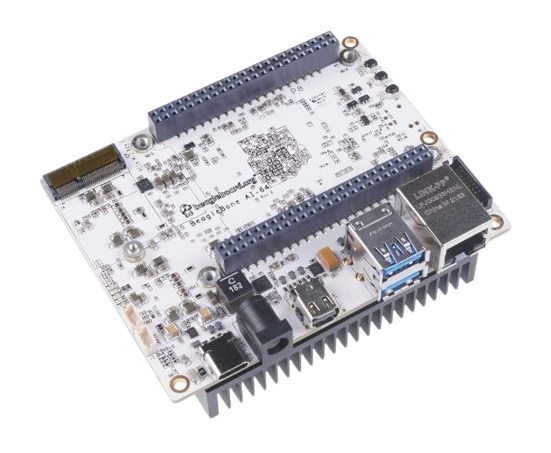

Make sure your system is compatible with Viam.
Viam is supported on:

- Linux 64-bit operating systems
- macOS

If you are using a single board computer (SBC) like a Raspberry Pi or BeagleBone, prepare your SBC by following the relevant setup document:

  

    

        <a href="/installation/prepare/rpi-setup/">
             
            
            
Raspberry Pi</h4>
        <a>
    

    

        <a href="/installation/prepare/beaglebone-setup/">
             
            
            
BeagleBone AI-64</h4>
        </a>
    

    

        <a href="/installation/prepare/sk-tda4vm/">
             
            
            
Texas Instruments SK-TDA4VM</h4>
        </a>
    

    

        <a href="/installation/prepare/jetson-nano-setup/">
             
            
            
Jetson Nano</h4>
        </a>
    

  

  

    

        
        

             
            
 If you plan to run <code>viam-server</code> on your laptop or desktop with a Linux or Mac operating system, no special prep is required. Proceed to <a href="/installation/install/">install <code>viam-server</code></a>. 

        

    

