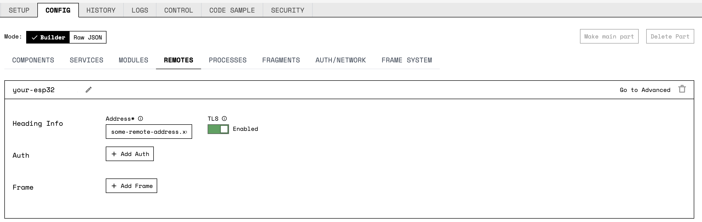
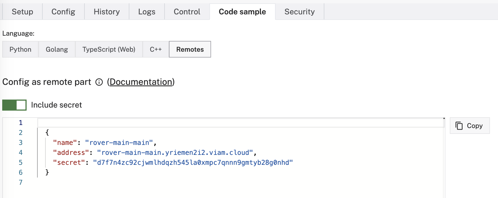
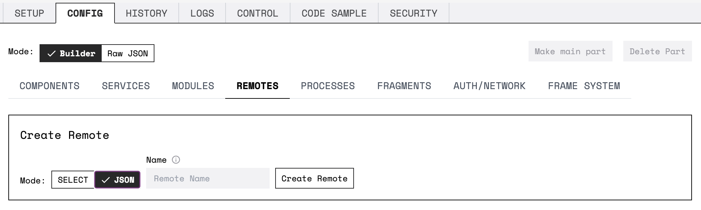
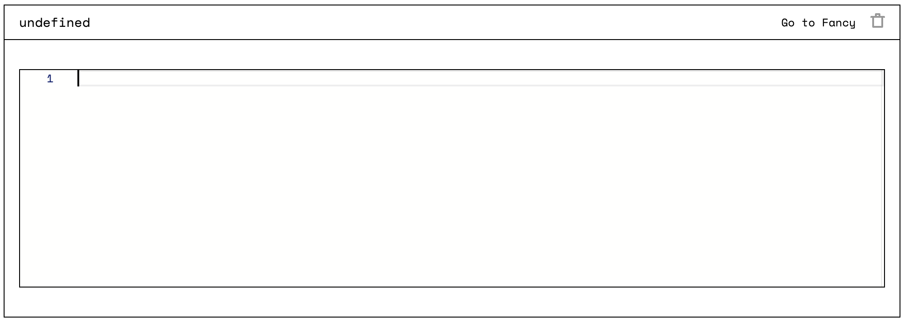

{}

## Hardware Requirements

You need an an Espressif ESP32 microcontroller to use the micro-RDK.
Viam recommends purchasing the ESP32 with a development board: see [development kit options](https://www.espressif.com/en/products/devkits).

Minimal configuration: 384kB Ram 4MB flash
Recommended configuration: 384kB Ram + 8MB SPIRAM + 4MB Flash

## Software Requirements

The micro-RDK is written in Rust.
To use the micro-RDK with your ESP32 board, you need to install:

- [ESP-IDF](#install-esp-idf)
- [Rust](#install-rust)
- [Rust ESP Toolchain](#install-the-rust-esp-toolchain-and-activate-the-esp-rs-virtual-environment)
- [`cargo-generate`](#install-cargo-generate-with-cargo)
- [`cargo-espflash`](#install-or-update-cargo-espflash)

The following instructions cover installation for macOS and Linux machines.

### Install ESP-IDF

ESP-IDF is the development framework for Espressif SoCs (System-on-Chips), supported on Windows, Linux and macOS.
You need to install it to be able to install the micro-RDK on your Espressif ESP32 microcontroller.

Start by completing Step 1 of [these instructions](https://docs.espressif.com/projects/esp-idf/en/latest/esp32/get-started/linux-macos-setup.html), following the appropriate steps for your development machine's architecture, and then return here.

Clone Viam's fork of the ESP-IDF:

```sh {id="terminal-prompt" class="command-line" data-prompt="$"}
mkdir -p ~/esp
cd ~/esp
git clone https://github.com/npmenard/esp-idf
cd esp-idf
git checkout v4.4.1
git submodule update --init --recursive
```

Then, install the required tools for ESP-IDF:

```sh {id="terminal-prompt" class="command-line" data-prompt="$"}
cd ~/esp/esp-idf
./install.sh esp32
```

To activate ESP-IDF, run the following command to source (`.`) the activation script `export.sh`:

```sh {id="terminal-prompt" class="command-line" data-prompt="$"}
. $HOME/esp/esp-idf/export.sh
```

To avoid conflicts with other toolchains, adding this command to your `.bashrc` or `.zshrc` is not recommended.
Save this command to run in any future terminal session where you need to activate the ESP-IDF development framework.

### Install Rust

```sh {id="terminal-prompt" class="command-line" data-prompt="$"}
curl --proto '=https' --tlsv1.2 -sSf https://sh.rustup.rs | sh
```

See [Rust](https://www.rust-lang.org/tools/install) for more information and other installation methods.

### Install the Rust ESP Toolchain and Activate the ESP-RS Virtual Environment

To install the Rust ESP toolchain, run the following command:

```sh {id="terminal-prompt" class="command-line" data-prompt="$"}
curl -LO https://github.com/esp-rs/rust-build/releases/download/v1.64.0.0/install-rust-toolchain.sh
chmod a+x install-rust-toolchain.sh
./install-rust-toolchain.sh
```

This command will prompt you to add two variables to your `.zshrc` or `.bashrc` if you want to activate the ESP-RS environment automatically in every terminal session:

```sh {id="terminal-prompt" class="command-line" data-prompt="$"}
IMPORTANT!
 The following environment variables need to be updated:
export LIBCLANG_PATH= ...
```

Doing so is not recommended, as this may cause conflicts with other toolchains.
As an alternative, the script prompts you to save the export script `export-esp.sh`.

Run the following command to save `./export-esp.sh` at `$HOME/esp/esp-idf/export-esp-rs.sh`:

```sh {id="terminal-prompt" class="command-line" data-prompt="$"}
mv ./export-esp.sh $HOME/esp/esp-idf/export-esp-rs.sh
```

After doing so, run the following command to source (`.`) this file, activating the ESP-RS Virtual Environment:

```sh {id="terminal-prompt" class="command-line" data-prompt="$"}
. $HOME/esp/esp-idf/export-esp-rs.sh
```

Save this source command to run in any future terminal session where you need to activate the ESP-RS Virtual Environment.

### Install `cargo-generate` with `cargo`

 `cargo` installs automatically when downloading Rust with Rustup.

If you need to install `cargo`, run the following command, or see the [Rust Documentation](https://doc.rust-lang.org/cargo/getting-started/installation.html) for other installation methods:

```sh {id="terminal-prompt" class="command-line" data-prompt="$"}
curl https://sh.rustup.rs -sSf | sh
```

Run the following command to install `cargo-generate`:

```sh {id="terminal-prompt" class="command-line" data-prompt="$"}
cargo install cargo-generate
```

### Install or Update `cargo-espflash`

Run the following command to install `cargo-espflash` in Viam's recommended version:

```sh {id="terminal-prompt" class="command-line" data-prompt="$"}
cargo install cargo-espflash@2.0.0-rc.1
```

## Install the Micro-RDK

To install the Micro-RDK on your ESP32 board:

- [create a new robot in the Viam app](#create-a-new-robot)
- [generate a new project from Viam's micro-RDK template](#generate-a-new-project-from-the-micro-rdk-template)
- [upload the project to your ESP32](#upload-the-project-and-connect-to-your-esp32-board)

### Create a New Robot

Navigate to [the Viam app](https://app.viam.com) and create a new robot in your desired location.
Keep your `Mode` and `Architecture` selections at default, and skip the instructions in the **Setup** tab for now as the setup instructions there are not for microcontrollers.

### Generate a New Project from the Micro-RDK Template

Use [the micro-RDK template](https://github.com/viamrobotics/micro-rdk-template.git) to create a new micro-RDK project to upload to your ESP32 by running:

```sh {id="terminal-prompt" class="command-line" data-prompt="$"}
cargo generate --git https://github.com/viamrobotics/micro-rdk-template.git
```

If you would like, you can use `mkdir` to initialize a new repository in the directory you created by running `cargo-generate`, to track any changes you make to the generated project.

You will be prompted to paste your Viam robot configuration information (`viam.json`) into the terminal.

To obtain this, navigate to [the Viam app](https://app.viam.com).
Click the **Copy viam-server config** button on the right side of the **Setup** tab of your robot.
The Micro-RDK uses the config for communication with the Viam app.
Paste this into your terminal.



All of the generated files should be safe to commit as a project on Github, with the exception of `viam.json`, since it contains a secret key.

{}

### Modify the Generated Template

You can find the declaration of the robot in the generated file `src/main.rs`.
This example exposes one GPIO pin (pin 18), and one analog reader attached to GPIO pin 34.
Change the example as needed.

You can, for example:

{}

Once you have selected an appropriate GPIO pin, according to the pinout diagram included with your ESP32, you can add to the collection of exposed pins.

For example, to expose GPIO pin 21, change the line:

``` rust
let pins = vec![PinDriver::output(periph.pins.gpio18.downgrade_output())?];
```

to

``` rust
let pins = vec![PinDriver::output(periph.pins.gpio18.downgrade_output())?,
    PinDriver::output(periph.pins.gpio21.downgrade_output())?,];
```

Now you can change and read the state of pin 21 from [the Viam app](https://app.viam.com).

{}

{}

Adding a new analog reader requires a few more steps.
First, identify a pin capable of analog reading.

In the pinout diagram of the ESP32, the pins are labeled like this:

- `ADCn_y`: where `n` is the adc number (1 or 2, note that 2 cannot be used with WiFi enabled), and `y` is the channel number.

Once you have identified an appropriate pin, follow these steps to add it.
In this example, we want to add GPIO pin 35, which is labeled `ADC1_7` in the pinout diagram:

1. Create a new ADC channel:

    ``` rust
    let my_analog_channel = adc_chan: AdcChannelDriver<_, Atten11dB<adc::ADC1>> =
                AdcChannelDriver::new(periph.pins.gpio35)?;
    ```

2. Create the actual Analog reader:

    ``` rust
    let my_analog_reader = Esp32AnalogReader::new("A2".to_string(), my_analog_channel, adc1.clone());
    ```

3. Finally, add the collection of analog readers:

    ``` rust
    let analog_readers = vec![
                Rc::new(RefCell::new(analog1)),
                Rc::new(RefCell::new(my_analog_reader)),
            ];
    ```

{}

{}

You can find a full example [on GitHub](https://github.com/viamrobotics/micro-rdk/blob/main/examples/esp32/esp32.rs).

{}

### Upload the Project and Connect to your ESP32 Board

After modifying the contents of <file>src/main.rs</file> to your liking, run:

```sh {id="terminal-prompt" class="command-line" data-prompt="$"}
make upload
```

While running `make upload`, you may be presented with an interactive menu of different serial port options to use to connect to the ESP32 board.

If successful, `make upload` will retain a serial connection to the board until `Ctrl-C` is pressed.
To manage this connection, consider running it within a dedicated terminal session, or under `tmux` or `screen`.
While the serial connection is live, you can also restart the currently flashed image with `Ctrl-R`.

If everything went well, your ESP32 will be programmed so that you will be able to see your robot live on [the Viam app](https://app.viam.com).



If you encounter a crash due to stack overflow, you may need to increase the stack available to the main task.

In the generated <file>sdkconfig.defaults</file> set the `CONFIG_ESP_MAIN_TASK_STACK_SIZE` to `32768`:

``` diff
CONFIG_ESP_MAIN_TASK_STACK_SIZE=32768
```

{}

## Configure the controlling robot

You have already created one robot which is running the Micro-RDK on your ESP32. To programmatically control the robot now running on the ESP32, you need to connect it to another robot that is running the full-featured `viam-server` software, as the microcontroller lacks the required processing power to do so.
This second "robot" can be as simple as an instance of `viam-server` running on your development machine.

### Configure the ESP32 as a Remote

Navigate to [the Viam app](https://app.viam.com).
Create and configure a second robot as the controller robot.

Add the ESP32-backed worker robot as a remote of your new controller robot to establish a secure connection between both robots:

<div style="max-width:800px;"></div>

1. Navigate to the **Code Sample** tab of the worker robot, click on **Remotes**, toggle **Include secret** to display your robot's secret in the code, and copy the code generated.



2. Navigate to the **Config** tab of the control robot, select the `Remotes` subtab, select the `JSON` mode and click **Create Remote**.



3. Paste the copied `JSON` config into the configuration field.



Ensure that the controlling robot is live in [the Viam app](https://app.viam.com).
If it is, the ESP32-backed robot is now programmatically available.

## Tips

When developing, you can use the QEMU emulator instead of flashing the ESP32 board.
Follow these instructions to install and build the emulator.

### Install Espressif's QEMU ESP32 Emulator

Espressif maintains a good [QEMU emulator](https://github.com/espressif/qemu) supporting the ESP32.


{}

Run the following command to install the QEMU ESP32 Emulator:

```sh {id="terminal-prompt" class="command-line" data-prompt="$"}
git clone https://github.com/espressif/qemu
cd qemu
./configure --target-list=xtensa-softmmu \
    --enable-gcrypt \
    --enable-debug --enable-sanitizers \
    --disable-strip --disable-user \
    --disable-capstone --disable-vnc \
    --disable-sdl --disable-gtk --extra-cflags="-I/opt/homebrew/Cellar/libgcrypt/1.10.1/include -I/opt/homebrew//include/"
cd build && ninja
```

{}
{}

On Ubuntu or Debian, first make sure you have the `libgcrypt` library and headers installed by running the following command:

```sh {id="terminal-prompt" class="command-line" data-prompt="$"}
sudo apt-get install libgcrypt20 libgcrypt20-dev
```

Then, run the following command to install QEMU:

```sh {id="terminal-prompt" class="command-line" data-prompt="$"}
git clone https://github.com/espressif/qemu
cd qemu
./configure --target-list=xtensa-softmmu     --enable-gcrypt \
    --enable-debug --enable-sanitizers  --disable-strip --disable-user \
    --disable-capstone --disable-vnc --disable-sdl --disable-gtk
cd build && ninja
```

{}
{}

Add `export QEMU_ESP32_XTENSA=<path-to-clone-qemu>/build/` to your `.zshrc` or `.bashrc`, or save this command to run in your terminal every session you wish to use the QEMU emulator.

### Build with the QEMU ESP32 Emulator

Navigate to the root of the Micro-RDK repository.
Once you've `cd`'d to the correct repository, run `. $HOME/esp/esp-idf/export.sh` if you haven't done so already in this terminal session.

You will need to comment out two lines from the file `sdkconfig.defaults`:

``` editorconfig
CONFIG_ESPTOOLPY_FLASHFREQ_80M=y
CONFIG_ESPTOOLPY_FLASHMODE_QIO=y
```

You can then run:

```sh {id="terminal-prompt" class="command-line" data-prompt="$"}
make sim-local
```

Or, if you want to connect a debugger:

```sh {id="terminal-prompt" class="command-line" data-prompt="$"}
make debug-local
```

### Troubleshooting

If you are unable to connect to the ESP32-backed robot as a remote, try adding `:4545` to the end of the value set in the remote's `Address` field.

You can find additional assistance in the [Troubleshooting section](/appendix/troubleshooting/).


