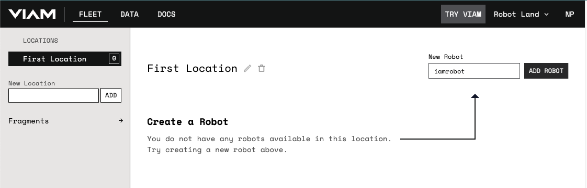
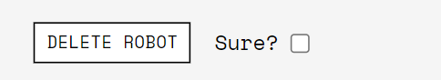

The [Viam app](https://app.viam.com/) has several key features:


  {}
  {}
  {}
  {}


 

You can also manage and control your robots from the command line with our [CLI](CLI).

## Create an account

If you received an invitation from an existing organization, use the email link to sign up.

If you’re signing up without an invitation link, go to [app.viam.com](https://app.viam.com/) and create an account with your Google account or an email and password.

## Add a new robot

Add a new robot by providing a name in the **New Robot** field and clicking **ADD ROBOT**.

Click the name of a robot to go to that robot's page, where you'll find a variety of tools for working with your robot.

### Delete a robot

You can delete a robot by checking the **Sure?** box in the lower left of the robot page and clicking **DELETE ROBOT**.

