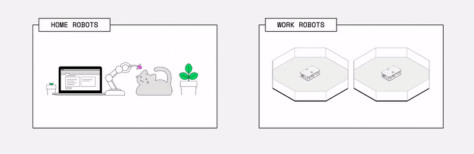
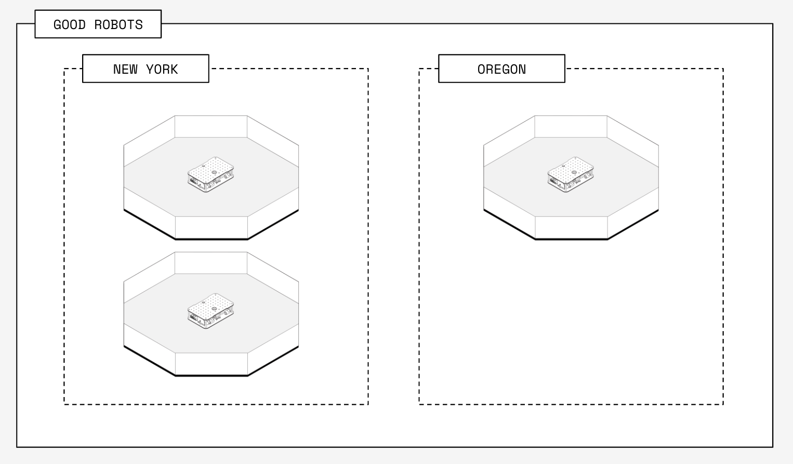
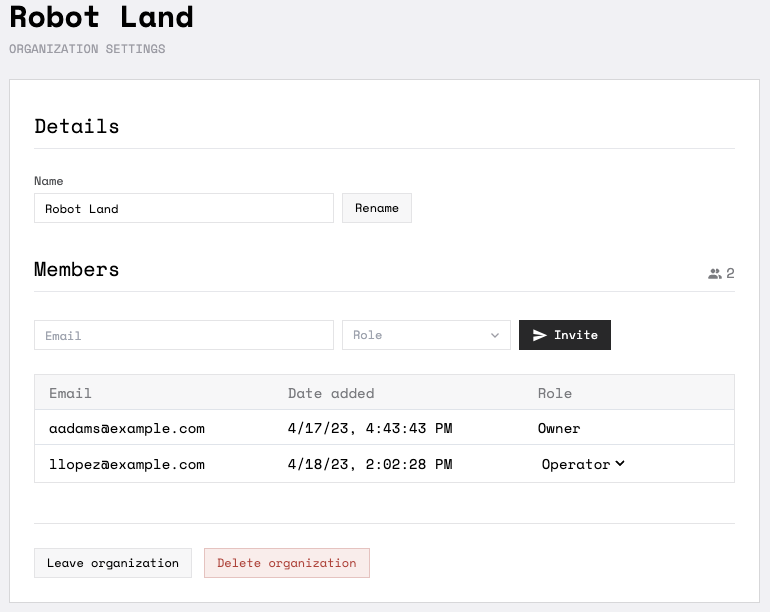

The [Viam app](https://app.viam.com) provides fleet management allowing you to work on any number of robots alone or in collaboration with others.

## Work with groups of robots

With Viam, you can organize  into  and .

For example, you may have separate organizations for your robots at home and at work:

<!-- this is a very small gif - conversion to mp4 caused issues -->

Inside an organization, you can organize robots into one or more locations:

If you are managing a fleet, you can use  when [configuring your robots](../configuration), allowing you to use the same configuration for multiple robots.

## Use Viam for collaboration

To facilitate collaboration, you can add collaborators to organizations, assign [permissions](#permissions) to collaborators, and share locations across multiple organizations.

When you create a Viam account, Viam automatically creates an organization for you.
You can use this organization as your collaboration hub by inviting collaborators to your organization.
You can also add additional organizations as desired at any time.


Everyone you invite as an owner to your organization has complete access to everything in that organization.
This includes the permissions to delete robots and locations, as well as the ability to remove you from the organization.


You can also share locations across different organizations **that you are part of**.

### Permissions

Role Based Access Control (RBAC) ia a way to enforce security in the [Viam app](https://app.viam.com) by assigning organization members roles that confer permissions:

- **Owner**: Can see and edit [every tab on the robot page](robots/#navigating-the-robot-page).
  Can manage users in the app.
- **Operator**: Can see and use only the [remote control tab](robots/#control).
  Cannot see or edit the [**Setup**](robots/#setup), [**Config**](robots#configuration), [**History**](robots/#history), [**Logs**](robots/#logs), [**Code Sample**](robots/#code-sample), or [**Security**](robots/#security) tabs.

To view the roles each organization member has, click on the organization drop down in the top navigation bar and click on **Settings**.

If you have the **Owner** role, you can change the roles assigned to organization members using the role drop down for the respective user.

## Collaborate on your robots

Viam is built in a way that allows you to change configurations, deploy packages, check logs, and control your robots both when you are close to your robot, as well as remotely.

Robot [configuration](robots/#configuration) and robot [code](#control-with-code) is intentionally kept separate, allowing you to keep track of versioning and debug issues separately.

### Configuration

Everyone who has access to the location the robot is in, can change the robot's configuration.
When you or your collaborators change a robot's configuration, the robot will automatically reconfigure itself within 15 seconds.
You can see configuration changes made by yourself or by your collaborators on the [History tab](robots/#history).
You can also revert to an earlier configuration from the History tab.


For some configuration aspects you may require physical access to the robot so you can see how components are connected.


### Package Deployment

_Coming soon._

You and your collaborators can deploy control logic, [modular resources](/extend/modular-resources/), sidecar [processes](../configuration/#processes), or [machine learning models](../../services/ml/) to your fleet of robots without manually copying files by uploading it to Viam's cloud and deploying it to your fleet.

### Remote control

Everyone who has access to the robot can remotely control it using the [**Control** tab](robots/#control).
This allows you to visually test and remotely operate robot components and services

### Control with code

Everyone who has access to the robot's location can obtain the robot address and secret needed to send API calls to the robot.
You can also share the robot address and location secret without granting location access in the Viam app.

With the robot address and the location secret, you can write code, collaborate on your code using tools like GitHub, and run your code to control the robot from anywhere in the world.

{}
Be cautious when sharing location secret keys in your code or messages.

Do not make a secret key publicly available, as anyone who has the secret key can access your location, compromising the security of your system.

It is good practice to note _where_ and _when_ you share a location secret key.
{}

### Logs

Each robot automatically sends logs to the cloud where you can view them from the [**Logs** tab](robots/#logs).
If you are collaborating on a robot and controlling it using the [**Control** tab](robots/#control) or [code](#control-with-code), everyone who has access to the location the robot is in, can see the robot's logs.
