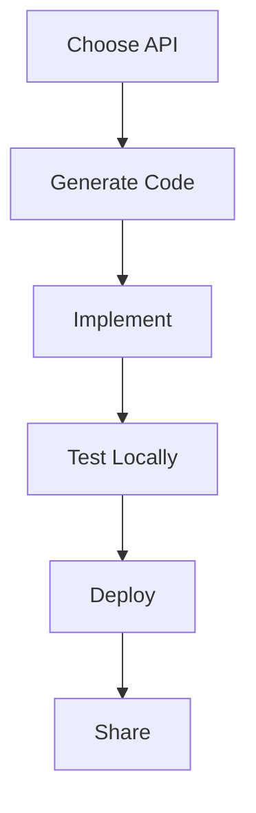

If your physical or virtual hardware is not supported by an existing registry , you can create a new module to add support for it.

This tutorial series walks you through creating a custom module in Python or Go.

## What you'll build

In this tutorial series, you'll create a **hello-world module** with two models:

1. **Camera model** (`hello-camera`): Returns an image from a configured file path on your machine
2. **Sensor model** (`hello-sensor`): Returns a random number

You'll learn how to:
- Map hardware functionality to Viam APIs
- Implement configuration validation
- Create modules with multiple models
- Test modules locally before deployment

## Understanding modules and models

Before you start, it's important to understand the terminology:

**Module** = A package that contains one or more models
- Think of it like a software package (npm package, Python package)
- Example: `hello-world` module
- The distribution unit you upload to the registry

**Model** = A specific implementation of a Viam component API
- A model is the "blueprint" for a type of hardware
- Each model implements exactly one API (Camera, Sensor, Motor, etc.)
- Identified by a  like `exampleorg:hello-world:hello-camera`
- One module can contain multiple models

**Component** = An instance of a model configured on a machine
- When users add your hardware to their machine, they create a component using your model
- Multiple components can use the same model (e.g., if someone has two cameras of the same type)

**In this tutorial:**
- **Module**: `hello-world` (the package)
- **Models**:
  - `hello-camera` (implements Camera API)
  - `hello-sensor` (implements Sensor API)
- **Components**: Users create `camera-1`, `camera-2`, `sensor-1`, etc. using these models


Each model can only implement one API. Since our example hardware has two capabilities (returning images and returning numbers), and the Camera API can't return numbers while the Sensor API can't return images, we need two separate models in the same module.


## Tutorial overview

This tutorial is divided into 5 parts:

| Part | Time | What you'll do |
| ---- | ---- | -------------- |
| [**Part 1: Prerequisites and setup**](part-1-prerequisites-setup/) | 15-20 min | Install CLI, set up your development environment, understand module architecture |
| [**Part 2: Choose an API and generate code**](part-2-choose-api-generate/) | 15 min | Select the right API for your hardware, generate module structure with CLI |
| [**Part 3: Implement your module**](part-3-implement-single-model/) | 30-40 min | Implement configuration validation, reconfiguration, and API methods |
| [**Part 4: Test your module locally**](part-4-test-locally/) | 20 min | Use hot reload to test your module on a real machine |
| [**Part 5: Multiple models**](part-5-multiple-models/) | 20-25 min | **(Advanced)** Add a second model to your module |

**Total time:** ~2 hours | **Difficulty:** Intermediate

### Prerequisites

Before you begin, make sure you have:

- **Viam CLI** installed and authenticated
- **Python 3.11+** or **Go 1.20+** for development
- **(Recommended)** A test machine running `viam-server`

See [Part 1](part-1-prerequisites-setup/) for detailed setup instructions.

## When to create a module

Create a module when:
- Your hardware isn't supported by [existing modules](https://app.viam.com/registry)
- You need to implement custom logic or algorithms
- You want to integrate proprietary hardware or APIs
- You want to share your hardware support with others

## Module creation workflow

1. **Choose an API**: Match your hardware to a Viam component API
2. **Generate code**: Use the CLI to create module structure
3. **Implement**: Write code to control your hardware
4. **Test locally**: Verify functionality on your machine
5. **Deploy**: Upload to the Viam registry
6. **Share**: Make it public or keep it private

## Alternative guides

**For different hardware platforms:**
- **Microcontrollers (ESP32)**: See [Modules for ESP32](/operate/modules/advanced/micro-module/)
- **C++ development**: See [C++ examples on GitHub](https://github.com/viamrobotics/viam-cpp-sdk/tree/main/src/viam/examples/)

**For different module types:**
- **Control logic modules** (no hardware): See [Run control logic](/operate/modules/control-logic/)

## Get started

Ready to create your first module?

**[Begin Part 1: Prerequisites and setup →](part-1-prerequisites-setup/)**

---

## After you finish

Once you complete this tutorial:

1. **Deploy your module**: [Package and deploy to the registry](/operate/modules/deploy-module/)
2. **Manage your modules**: [Update and manage modules](/operate/modules/advanced/manage-modules/)
3. **Learn advanced topics**:
   - [Module dependencies](/operate/modules/advanced/dependencies/)
   - [Module configuration](/operate/modules/advanced/module-configuration/)
   - [Logging in modules](/operate/modules/advanced/logging/)
   - [meta.json reference](/operate/modules/advanced/metajson/)
