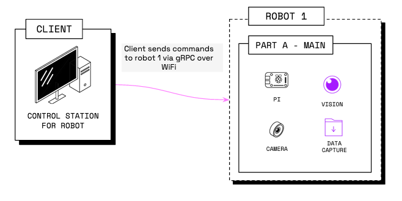

Viam offers software development kits (SDKs) in popular languages which

- Broker connection, authentication, and encryption for communication with robots running `viam-server` using 
- Enable you to interface with robot [gRPC APIs](https://github.com/viamrobotics/api) in a way that is idiomatic to that programming language



Use the SDK of your preferred language to write code to control your robots.

Viam currently offers SDKs for the following languages:

- [Python SDK](https://python.viam.dev/)
- [Go SDK](https://pkg.go.dev/go.viam.com/rdk)
- [TypeScript SDK](https://ts.viam.dev/)
- [C++ SDK (alpha)](https://cpp.viam.dev/)

## Requirements

Before you get started with your program, ensure that you have [installed `viam-server`](/installation/) on the computer you want to use to control your robot [(likely a single-board computer)](/components/board/#configuration) and [configured a robot](/manage/configuration/).

The easiest way to do this is:

1. Go to [app.viam.com](https://app.viam.com/).
2. Create a new robot.
3. Go to the **Setup** tab and follow the instructions there.
4. [Configure](/manage/configuration/) your robot.

Next, to install your preferred Viam SDK on your Linux or macOS development machine or [single-board computer](/components/board/), run one of the following commands in your terminal:


{}

```sh {id="terminal-prompt" class="command-line" data-prompt="$"}
pip install viam-sdk
```

{}
{}

```sh {id="terminal-prompt" class="command-line" data-prompt="$"}
go install go.viam.com/rdk/robot/client@latest
```

{}
{}

```sh {id="terminal-prompt" class="command-line" data-prompt="$"}
npm install --save @viamrobotics/sdk
```

{}
{}

Follow the [instructions on the GitHub repository](https://github.com/viamrobotics/viam-cpp-sdk/blob/main/BUILDING.md).

{}


## Hello World: The Code Sample Tab

Create a program in the language of your choice that connects to your robot and uses methods built into the SDK's client API libraries to [interact with and control](/program/sdks/) the  on the robot.

Start with this by navigating to your robot's page on [the Viam app](https://app.viam.com/robots).
Select the **Code Sample** tab, select your preferred SDK, and copy the code generated for you.
This code snippet imports all the necessary libraries to set up a connection with your robot and interface with its configured components and services.

Your boilerplate code sample should look similar to this:

{}

{}

```python {class="line-numbers linkable-line-numbers"}
import asyncio

from viam.robot.client import RobotClient
from viam.rpc.dial import Credentials, DialOptions

async def connect():
    creds = Credentials(
        type='robot-location-secret',
        payload='SECRET FROM THE VIAM APP')
    opts = RobotClient.Options(
        refresh_interval=0,
        dial_options=DialOptions(credentials=creds)
    )
    return await RobotClient.at_address('ADDRESS FROM THE VIAM APP', opts)

async def main():
    robot = await connect()

    print('Resources:')
    print(robot.resource_names)

    await robot.close()

if __name__ == '__main__':
    asyncio.run(main())
```

{}
{}

```go {class="line-numbers linkable-line-numbers"}
package main

import (
  "context"

  "github.com/edaniels/golog"
  "go.viam.com/rdk/robot/client"
  "go.viam.com/rdk/utils"
  "go.viam.com/utils/rpc"
)

func main() {
  logger := golog.NewDevelopmentLogger("client")
  robot, err := client.New(
      context.Background(),
      "ADDRESS FROM THE VIAM APP",
      logger,
      client.WithDialOptions(rpc.WithCredentials(rpc.Credentials{
          Type:    utils.CredentialsTypeRobotLocationSecret,
          Payload: "SECRET FROM THE VIAM APP",
      })),
  )
  if err != nil {
      logger.Fatal(err)
  }
  defer robot.Close(context.Background())
  logger.Info("Resources:")
  logger.Info(robot.ResourceNames())
}
```

{}
{}


The TypeScript SDK currently only supports building web browser apps.


```ts {class="line-numbers linkable-line-numbers"}
import { Client, createRobotClient, RobotClient } from '@viamrobotics/sdk';

async function connect() {
  // You can remove this block entirely if your robot is not authenticated.
  // Otherwise, replace with an actual secret.
  const secret = '<SECRET>';
  const credential = {
    payload: secret,
    type: 'robot-location-secret',
  };

  // Replace with the host of your actual robot running Viam.
  const host = "<HOST>";

  // Replace with the signaling address. If you are running your robot on Viam,
  // it is most likely https://app.viam.com:443.
  const signalingAddress = 'https://app.viam.com:443';

  const iceServers = [{ urls: 'stun:global.stun.twilio.com:3478' }];

  return createRobotClient({
    host,
    credential,
    authEntity: host,
    signalingAddress,
    iceServers
  });
}

async function main() {
  // Connect to client
  let client: Client;
  try {
    client = await connect();
    console.log('connected!');

    let resources = await client.resourceNames();
    console.log('Resources:');
    console.log(resources);
  } catch (error) {
    console.log(error);
    return;
  }
}

main();
```

{}
{}


The C++ SDK is currently in alpha.


```cpp {class="line-numbers linkable-line-numbers"}
# include <string>
# include <vector>

# include <boost/optional.hpp>

# include <viam/api/common/v1/common.pb.h>
# include <viam/api/robot/v1/robot.grpc.pb.h>

# include <viam/sdk/robot/client.hpp>
# include <viam/sdk/components/camera/client.hpp>

using namespace viam::sdk;

int main() {
  std::string host("ADDRESS FROM THE VIAM APP");
  DialOptions dial_opts;
  Credentials credentials("SECRET FROM THE VIAM APP");
  dial_opts.set_credentials(credentials);
  boost::optional<DialOptions> opts(dial_opts);
  Options options(0, opts);

  auto robot = RobotClient::at_address(host, options);

  std::cout << "Resources:\n";
  for (const ResourceName& resource: *robot->resource_names()) {
    std::cout << resource.namespace_() << ":" << resource.type() << ":"
              << resource.subtype() << ":" << resource.name() << "\n";
  }

  return 0;
}
```

{}

{}

Save this file on your development machine with the file type of your preferred SDK.


Then, [execute this program](/program/run/) on any computer which:

1. has [the appropriate SDK](#requirements) installed
2. can establish a connection to your robot through the cloud, on a local or wide area network (LAN or WAN), or [locally](/program/run/#run-code-locally)

Edit the boilerplate code by [adding control logic](/program/sdks/) to make a client application that connects to your robot and controls it in the way you want.

### `import`: Find Required Imports

The SDK code the Code Sample tab generates for your robot should contain all the import statements needed to execute that sample.

If you are building out your program further or aren't using the Code Sample tab, you can find the right libraries to import to utilize SDK methods, typing, interfaces, and utilities at the start of [each resource's API documentation](/program/sdks/resource-apis/), as well as in the individual SDK documentation sites and [on GitHub](https://github.com/viamrobotics/rdk).

### `connect`: Connect with Your Robot

The `connect` logic of an SDK program establishes a connection for your client application to [communicate with](/internals/robot-to-robot-comms/) the robot's `viam-server` instance.
This section of the boilerplate code contains your robot's address and location secret.
You can think of these as keys or access tokens to your robot that are important to keep private.
This connection must be established for your program to be executed properly on your robot.




    {}
    {}
    {}

