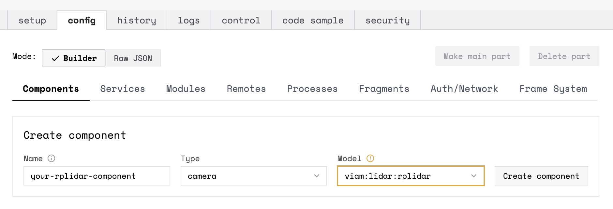
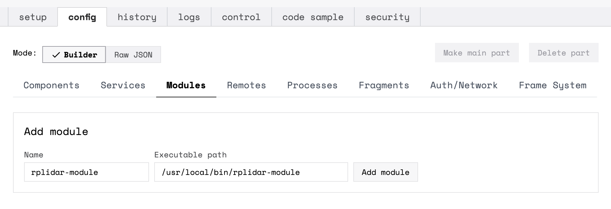
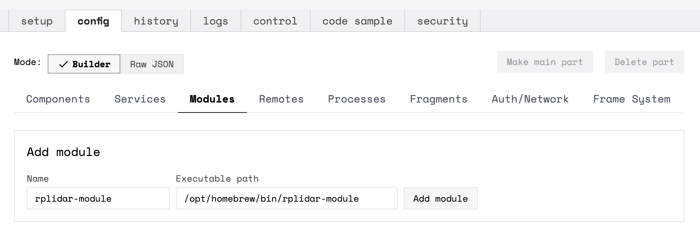

{}
The  Service is an experimental feature.
Stability is not guaranteed.
Breaking changes are likely to occur, and occur often.
{}

## Requirements

Install the `rplidar-module` binary on your machine and make it executable by running the following commands according to your machine's architecture:


{}

```{id="terminal-prompt" class="command-line" data-prompt="$"}
sudo curl -o /usr/local/bin/rplidar-module https://storage.googleapis.com/packages.viam.com/apps/rplidar/rplidar-module-latest-aarch64.AppImage
sudo chmod a+rx /usr/local/bin/rplidar-module
```

{}
{}

```{id="terminal-prompt" class="command-line" data-prompt="$"}
sudo curl -o /usr/local/bin/rplidar-module https://storage.googleapis.com/packages.viam.com/apps/rplidar/rplidar-module-latest-x86_64.AppImage
sudo chmod a+rx /usr/local/bin/rplidar-module
```

{}
{}

```{id="terminal-prompt" class="command-line" data-prompt="$"}
brew tap viamrobotics/brews && brew install rplidar-module
```

{}


## Configuration

Physically connect the Rplidar to your machine. Go to your robot's page on the [Viam app](https://app.viam.com/).


{}
Navigate to the **config** tab on your robot's page, and click on the **Components** subtab.

Add a component with type `camera`, model `viam:lidar:rplidar`, and a name of your choice:



Paste the following into the **Attributes** field of your new component according to your machine's architecture:


{}

```json
{
  "device_path": "/dev/tty.SLAB_USBtoUART"
}
```

{}

{}

```json
{
  "device_path": "/dev/tty.usbserial-0001"
}
```

{}


Click on the **Modules** subtab. Add the rplidar module with a name of your choice and an executable path that points to the location of your installed `rplidar-module` binary:


{}



{}

{}



{}

{}
{}

Navigate to the **config** tab.
Select the **Raw JSON** mode, then copy/paste the following `"components"` and `"modules"` JSON:

  
  {}

  ```json
  {
    "modules": [
      {
        "executable_path": "/usr/local/bin/rplidar-module",
        "name": "rplidar-module"
      }
    ],
    "components": [
      {
        "namespace": "rdk",
        "type": "camera",
        "depends_on": [],
        "model": "viam:lidar:rplidar",
        "name": "rplidar"
      }
    ]
  }
  ```

  {}
  {}

  ```json
  {
    "modules": [
      {
        "executable_path": "/usr/local/bin/rplidar-module",
        "name": "rplidar-module"
      }
    ],
    "components": [
      {
        "namespace": "rdk",
        "type": "camera",
        "depends_on": [],
        "model": "viam:lidar:rplidar",
        "attributes": {
          "device_path": "/dev/tty.SLAB_USBtoUART"
        },
        "name": "rplidar"
      }
    ]
  }
  ```

  {}
  {}

  ```json
  {
    "modules": [
      {
        "executable_path": "/opt/homebrew/bin/rplidar-module",
        "name": "rplidar-module"
      }
    ],
    "components": [
      {
        "namespace": "rdk",
        "type": "camera",
        "depends_on": [],
        "model": "viam:lidar:rplidar",
        "attributes": {
          "device_path": "/dev/tty.usbserial-0001"
        },
        "name": "rplidar"
      }
    ]
  }
  ```

  {}
  

{}


Check the **logs** tab of your robot in the Viam app to make sure your Rplidar has connected and no errors are being raised.

## Troubleshooting

You can find additional assistance in the [Troubleshooting section](/appendix/troubleshooting/).



## Next Steps


  {}
  {}

