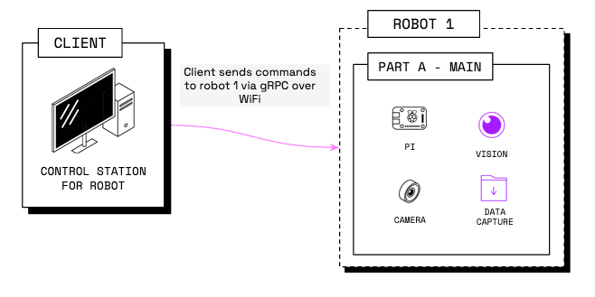

Viam offers software development kits (SDKs) in popular languages which

- Streamline connection, authentication, and encryption against a server using 
- Enable you to interface with robots without calling the `viam-server` [gRPC APIs for robot controls](https://github.com/viamrobotics/api) directly



Use the SDK of your preferred language to write code to control your robots.

Viam currently offers SDKs for the following languages:

- [Python SDK](https://python.viam.dev/)
- [Go SDK](https://pkg.go.dev/go.viam.com/rdk)
- [TypeScript SDK](https://ts.viam.dev/)
- [C++ SDK (alpha)](https://cpp.viam.dev/)

Click on the links above to read more about installation and usage of each SDK.

## Install an SDK


{}

```sh {id="terminal-prompt" class="command-line" data-prompt="$"}
pip install viam-sdk
```

{}
{}

```sh {id="terminal-prompt" class="command-line" data-prompt="$"}
go install go.viam.com/rdk/robot/client@latest
```

{}
{}

```sh {id="terminal-prompt" class="command-line" data-prompt="$"}
npm install --save @viamrobotics/sdk
```

{}
{}

Follow the [instructions on the GitHub repository](https://github.com/viamrobotics/viam-cpp-sdk/blob/main/BUILDING.md).

{}


{}

Before you get started, ensure that you:

1. Go to [app.viam.com](https://app.viam.com/).
2. Create a new robot.
3. Go to the **Setup** tab and follow the instructions there.
4. [Configure](../../manage/configuration) your robot.

{}

### Connect to your robot

The easiest way to get started is to navigate to your robot's page on [the Viam app](https://app.viam.com/robots), select the **Code Sample** tab, select your preferred SDK, and copy the code generated for you.

These boilerplate code samples import all of the necessary libraries and set up a client connection to your robot whether your code runs on your robot or on a different machine.
This connection is established through the Viam app in the cloud.



Your boilerplate code sample should look similar to this:


{}

```python {class="line-numbers linkable-line-numbers"}
import asyncio

from viam.robot.client import RobotClient
from viam.rpc.dial import Credentials, DialOptions

async def connect():
    creds = Credentials(
        type='robot-location-secret',
        payload='SECRET FROM THE VIAM APP')
    opts = RobotClient.Options(
        refresh_interval=0,
        dial_options=DialOptions(credentials=creds)
    )
    return await RobotClient.at_address('ADDRESS FROM THE VIAM APP', opts)

async def main():
    robot = await connect()

    print('Resources:')
    print(robot.resource_names)

    await robot.close()

if __name__ == '__main__':
    asyncio.run(main())
```

{}
{}

```go {class="line-numbers linkable-line-numbers"}
package main

import (
  "context"

  "github.com/edaniels/golog"
  "go.viam.com/rdk/robot/client"
  "go.viam.com/rdk/utils"
  "go.viam.com/utils/rpc"
)

func main() {
  logger := golog.NewDevelopmentLogger("client")
  robot, err := client.New(
      context.Background(),
      "ADDRESS FROM THE VIAM APP",
      logger,
      client.WithDialOptions(rpc.WithCredentials(rpc.Credentials{
          Type:    utils.CredentialsTypeRobotLocationSecret,
          Payload: "SECRET FROM THE VIAM APP",
      })),
  )
  if err != nil {
      logger.Fatal(err)
  }
  defer robot.Close(context.Background())
  logger.Info("Resources:")
  logger.Info(robot.ResourceNames())
}
```

{}
{}


The TypeScript SDK currently only supports building web browser apps.


```ts {class="line-numbers linkable-line-numbers"}
import { Client, createRobotClient, RobotClient } from '@viamrobotics/sdk';

async function connect() {
  // You can remove this block entirely if your robot is not authenticated.
  // Otherwise, replace with an actual secret.
  const secret = '<SECRET>';
  const credential = {
    payload: secret,
    type: 'robot-location-secret',
  };

  // Replace with the host of your actual robot running Viam.
  const host = "<HOST>";

  // Replace with the signaling address. If you are running your robot on Viam,
  // it is most likely https://app.viam.com:443.
  const signalingAddress = 'https://app.viam.com:443';

  const iceServers = [{ urls: 'stun:global.stun.twilio.com:3478' }];

  return createRobotClient({
    host,
    credential,
    authEntity: host,
    signalingAddress,
    iceServers
  });
}

async function main() {
  // Connect to client
  let client: Client;
  try {
    client = await connect();
    console.log('connected!');

    let resources = await client.resourceNames();
    console.log('Resources:');
    console.log(resources);
  } catch (error) {
    console.log(error);
    return;
  }
}

main();
```

{}
{}


The C++ SDK is currently in alpha.


```cpp {class="line-numbers linkable-line-numbers"}
# include <string>
# include <vector>

# include <boost/optional.hpp>

# include <viam/api/common/v1/common.pb.h>
# include <viam/api/robot/v1/robot.grpc.pb.h>

# include <viam/sdk/robot/client.hpp>
# include <viam/sdk/components/camera/client.hpp>

using namespace viam::sdk;

int main() {
  std::string host("ADDRESS FROM THE VIAM APP");
  DialOptions dial_opts;
  Credentials credentials("SECRET FROM THE VIAM APP");
  dial_opts.set_credentials(credentials);
  boost::optional<DialOptions> opts(dial_opts);
  Options options(0, opts);

  auto robot = RobotClient::at_address(host, options);

  std::cout << "Resources:\n";
  for (const ResourceName& resource: *robot->resource_names()) {
    std::cout << resource.namespace_() << ":" << resource.type() << ":"
              << resource.subtype() << ":" << resource.name() << "\n";
  }

  return 0;
}
```

{}


## Add Control Logic

You can add control logic for each [component](/components/) of your robot by using the built-in component methods.

Find documentation on how to use these methods here:

- [Arm](/components/arm/#api)
- [Base](/components/base/#api)
- [Board](/components/board/#api)
- [Camera](/components/camera/#api)
- [Encoder](/components/encoder/#api)
- [Gantry](/components/gantry/#api)
- [Gripper](/components/gripper/#api)
- [Input Controller](/components/input-controller/#api)
- [Motor](/components/motor/#api)
- [Movement Sensor](/components/movement-sensor/#api)
- [Sensor](/components/sensor/#api)
- [Servo](/components/servo/#api)

{}

Each SDK provides example code in its repository:

- [Python SDK examples](https://github.com/viamrobotics/viam-python-sdk/tree/main/examples/server/v1)
- [Go SDK examples](https://github.com/viamrobotics/rdk/tree/main/examples)
- [TypeScript SDK examples](https://github.com/viamrobotics/viam-typescript-sdk/tree/main/examples)
- [Viam C++ SDK examples](https://github.com/viamrobotics/viam-cpp-sdk/tree/main/src/viam/examples)

{}

## Run Your Code

After saving your boilerplate code sample and adding control logic with Viam's API methods, run your program to control your Viam-connected robot.

For example:


{}

```sh {id="terminal-prompt" class="command-line" data-prompt="$"}
python3 ~/myCode/myViamFile.py
```

{}
{}

```sh {id="terminal-prompt" class="command-line" data-prompt="$"}
go run ~/myCode/myViamFile.py
```

{}
{}

For an example, see [this execution demo.](https://github.com/viamrobotics/viam-typescript-sdk/tree/main/examples/vanilla)

{}
{}

For information on running C++ code see [here](https://github.com/viamrobotics/viam-cpp-sdk/blob/main/BUILDING.md).

{}


### Run Code Locally

If you need to run [PID control loops](https://en.wikipedia.org/wiki/PID_controller) or other on-robot code, you can run control code on the same board that is running `viam-server`.

To ensure intermittent internet connectivity does not interfere with the code's execution, there are some special steps you need to follow:


Currently, this only works with Python code which is running on the same board that `viam-server` is running on.


1. Change the `connect()` method to disable  and add the auth_entity in the DialOptions and use `localhost:8080`:

    ```python {class="line-numbers linkable-line-numbers"}
    async def connect():
      creds = Credentials(type='robot-location-secret', payload=PAYLOAD_SECRET)
      opts = RobotClient.Options(
        refresh_interval=0,
        dial_options=DialOptions(
            credentials=creds,
            disable_webrtc=True,
            auth_entity=ROBOT_NAME
        )
      )
      return await RobotClient.at_address('localhost:8080', opts)
    ```

2. Replace the `ROBOT_NAME` with your robot's Viam cloud address and the `PAYLOAD_SECRET` with your robot secret.
   Your localhost can now make a secure connection to `viam-server` locally.
   SSL will now check the server hostname against the `auth_entity` required by  from the `auth_entity` dial options.

   This ensures that you can send commands to the robot through localhost without internet connectivity.
   Note that all commands will be sent using  only without .

## Next Steps


  {}
  {}
  {}
  {}

