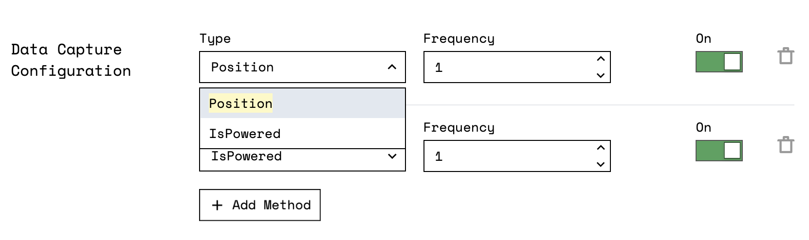

## Add the Data Management Service

To capture data from one or more robots, you must first add the [Data Management Service](../):

1. On your robot's **config** page, navigate to the **Services** tab.
2. At the bottom of the page you can create a service.
   Choose `Data Management` as the type and specify a name for your Data Management Service, for example `data-manager`.
3. Then click `Create Service`.
4. On the panel that appears, you can manage the capturing and syncing functions individually.
   The Data Management Service captures data every 0.1 minutes, that is every 6 seconds, in the `~/.viam/capture` directory by default.

   You can change the interval and directory.

   
   If you change the directory for data capture only new data is stored in the new directory.
   Existing data remains in the directory where it was stored.
   
5. Click **Save Config**.


{}

```json {class="line-numbers linkable-line-numbers"}
{
  "components": [ ],
  "services": [
    {
      "name": "data_manager",
      "type": "data_manager",
      "attributes": {
        "sync_interval_mins": 1,
        "capture_dir": "~/.viam/capture"
      }
    }
  ]
}
```

{}

## Configure Data Capture for Individual Components

Once you have added the data capture service, you can specify the data you want to capture at a component level.
The following components support data capture:

- Arm
- Board
- Camera
- Encoder
- Gantry
- Motor
- Movement Sensor (includes GPS)
- Sensor
- Servo

To add data capture for a component, navigate to the **config** tab of your robot's page in the Viam app.

For each component you can capture data for, there is a `Data Capture Configuration` section in its panel.
Click `Add Method` and then select the method type and the capture frequency.
Click **Save Config** at the bottom of the window.

Now your data will be saved locally on your robot to the directory specified in the Data Management Service.

For example, a camera has the options `ReadImage` and `NextPointCloud` and a motor has the options `Position` and `IsPowered`.



{}

```json {class="line-numbers linkable-line-numbers"}

{
  "services": [
    ...
    ,
    {
      "name": "data_manager",
      "type": "data_manager",
      "attributes": {
        "sync_interval_mins": 5,
        "capture_dir": "~/.viam/capture",
        "sync_disabled": false
      }
    }
  ],
  "remotes": [
    {
        ...
    }
  ],
  "components": [
        ...
    ,
    {
      "service_configs": [
        {
          "attributes": {
            "capture_methods": [
              {
                "capture_frequency_hz": 0.333,
                "disabled": false,
                "method": "ReadImage",
                "additional_params": {
                  "mime_type": "image/jpeg"
                }
              }
            ]
          },
          "type": "data_manager"
        }
      ],
      "model": "webcam",
      "name": "cam",
      "type": "camera",
      "attributes": {
        "video_path": "video0"
      },
      "depends_on": [
        "local"
      ]
    },
    ...
  ]
}
```

{}

You may capture data from one or more component methods:

- To enable or disable data capture for a configured component or method, use the `on/off` toggle.
- To change the frequency of data capture for a method, enter the number of measurements you wish to capture per second in the frequency field.

After adding configuration for the methods, click **Save Config**.

If you want to remove a capture method from the configuration, click the `delete` icon.

## Configure Data Capture for Remote Parts

Viam supports data capture from remote parts.
For example, if you use a component that does not have a Linux operating system or that does not have enough storage or processing power, you can still process and capture the data from the component by adding it as a remote part.

Currently, you can only configure data capture from remote components by adding them to your JSON configuration.
To add them to your JSON configuration you must explicitly add the part's `type`, `model`, `name`, and `additional_params` to the `data_manager` service configuration in the `remotes` configuration:

| Key | Description |
| --- | ----------- |
| `type` | The type tells your robot what the part is. For example, a board. |
| `model` | The model is a __colon-delimited-triplet_ that specifies the namespace, the type of the part, and the part itself. |
| `name` | The name specifies the fully qualified name of the part. |
| `additional_params` | The additional parameters specify the data sources when you are using a board. |

{}

```json {class="line-numbers linkable-line-numbers"}
"type": {
    "Type": {
        "type": "component",
        "namespace": "rdk"
    },
    "subtype": "board"
},
"model": {
    "name": "rdk:esp32:board"
},
"name": "rdk:component:board/esp-home:board",
"additional_params": {
    "A2": "",
    "A1": ""
}
```

{}

{}

The following example captures data from two analog readers that provide a voltage reading and from pin 27 of the board's GPIO:

```json {class="line-numbers linkable-line-numbers"}
{
  "services": [
    {
      "attributes": {
        "capture_dir": ".viam/capture",
        "sync_disabled": true,
        "sync_interval_mins": 5
      },
      "name": "data_manager",
      "type": "data_manager"
    }
  ],
  "components": [],
  "remotes": [
    {
      "name": "esp-home",
      "address": "esp-home-main.33vvxnbbw9.viam.cloud:80",
      "service_configs": [
        {
          "type": "data_manager",
          "attributes": {
            "capture_methods": [
              // Captures data from two analog readers (A1 and A2)
              {
                "method": "Analogs",
                "capture_frequency_hz": 1,
                "name": "rdk:component:board/esp-home:board",
                "additional_params": {
                  "A2": "",
                  "A1": ""
                },
                "disabled": false,
              },
              // Captures data from pin 27 of the board's GPIO
              {
                "method": "Gpio",
                "capture_frequency_hz": 1,
                "name": "rdk:component:board/esp-home:board",
                "additional_params": {
                  "27": ""
                },
                "disabled": false
              }
            ]
          }
        }
      ],
      "secret": "REDACTED"
    }
  ]
}
```

{}

## Next Steps

To sync your captured data with the cloud, [configure cloud sync](../configure-cloud-sync).

For a comprehensive tutorial on data management, see [Intro to Data Management](../../../tutorials/services/data-management-tutorial).
