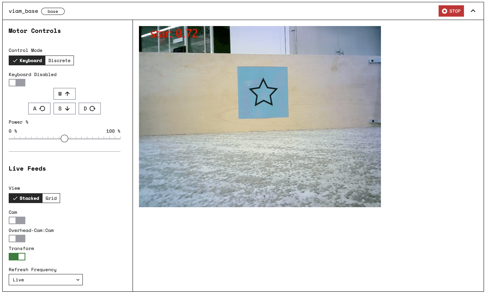

Navigate to your robot's [**CONFIG** tab](https://app.viam.com/robot) and click on the **SERVICES** subtab.

Scroll to the bottom and create a new service with the **Type** `ml_models`.


The created ML Models panel lists all available models.


To add a model to your robot, select it and click on the move right button.


Save the configuration and your model will be added to your robot at <file>$HOME/.viam/packages/<model-name>/<file-name></file>.

To make use of your new model, use the Vision Service.
Still on the **SERVICES** subtab add a new service with **Type** `Vision` and give it a name.

Create a [`tflite_classifier` classifier](../../vision/#classification) by adding the following configuration in the new Vision Service panel.

```json
{
  "register_models": [
    {
      "type": "tflite_classifier",
      "parameters": {
        "num_threads": 1,
        "model_path": "${packages.<model-name>}/<model-name>.tflite",
        "label_path": "${packages.<model-name>}/labels.txt"
      },
      "name": "<classifier-name>"
    }
  ]
}
```

Save the configuration.

## Add a camera component and a "transform" model

You cannot interact directly with the [Vision Service](/services/vision/).
To be able to interact with the Vision Service you must:

1. Configure a physical [camera component](../../../components/camera) to wrap the service.
2. Configure a [transform camera](../../../components/camera/transform) to view output from the detector overlaid on images from the physical camera.

    ```json
    {
    "pipeline": [
        {
        "type": "classifications",
        "attributes": {
            "confidence_threshold": 0.5,
            "classifier_name": "my_classifier"
        }
        }
    ],
    "source": "<camera-name>"
    }
    ```

After adding the component and its attributes, click **SAVE CONFIG**.

Wait for the robot to reload, and then go to the **CONTROL** tab to test the stream of detections.



## Code

The following code gets the robot’s Vision Service and then runs a configured model on the images from a robot's camera named `"camera_1"`:


{}

```python {class="line-numbers linkable-line-numbers"}
from viam.services.vision import VisionServiceClient, VisModelConfig, VisModelType
robot = await connect()
# grab camera from the robot
cam1 = Camera.from_robot(robot, "cam1")
# grab Viam's vision service which has the TFLite detector already registered
vision = VisionServiceClient.from_robot(robot)
print("Vision Resources:")
print(await vision.get_detector_names())
# Apply the tflite_classifier detector to the image from your camera configured as "camera_1"
detections = await vision.get_detections_from_camera("camera_1", "<classifier-detector-name>")
await robot.close()
```

To learn more about the Detection API, see the [Python SDK docs](https://python.viam.dev/autoapi/viam/services/vision/index.html).

{}
{}

```go {class="line-numbers linkable-line-numbers"}
import (
"go.viam.com/rdk/config"
"go.viam.com/rdk/services/vision"
)
visService, err := vision.FirstFromRobot(robot)
if err != nil {
    logger.Fatalf("Cannot get Vision Service: %v", err)
}
detNames, err := visService.DetectorNames(context.Background(), nil)
if err != nil {
    logger.Fatalf("Could not list detectors: %v", err)
}
logger.Info("Vision Resources:")
logger.Info(detNames)
// Apply the tflite_classifier detector to the image from your camera (configured as "camera_1")
detections, err := visService.DetectionsFromCamera(context.Background(), "camera_1", "<classifier-detector-name>", nil)
if err != nil {
    logger.Fatalf("Could not get detections: %v", err)
}
if len(detections) > 0 {
    logger.Info(detections[0])
}
```

To learn more about the Detection API, see the [Go SDK docs](https://pkg.go.dev/go.viam.com/rdk/vision).

{}

