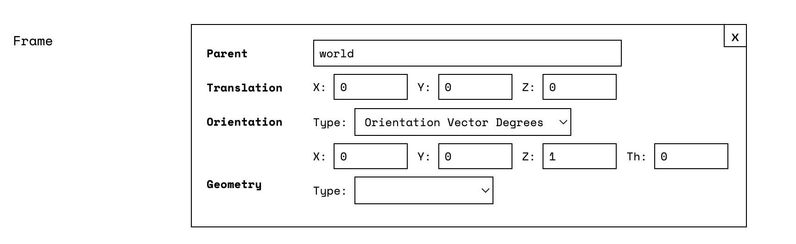
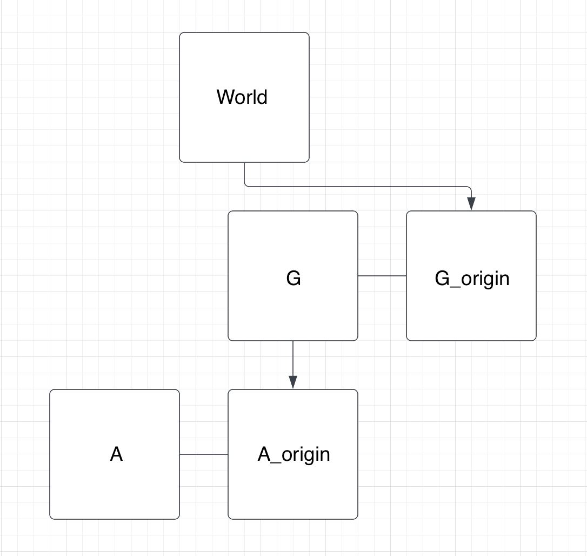

Any robot configured in Viam comes with the Frame System service: an internally managed and mostly static system for storing the "reference frame" of each component of a robot within a coordinate system configured by the user.

The Frame System is the basis for many of Viam's other services, like [Motion](/services/motion) and [Vision](/services/vision).
It stores the required contextual information to use the position and orientation readings returned by some components.

## Configuration

To enable the default frame for a given [component](/components), click **Add Frame**, then click **Save Config**.

To adjust the frame from its default configuration, change the parameters as needed for your robot before saving.


{}

Navigate to the **config** tab on your robot's page in [the Viam app](https://app.viam.com), select the **Builder** mode, scroll to a component's card, and click **Add Frame**:



Select a `parent` frame and fill in the coordinates for `translation` (*mm*) and `orientation` (*deg*, *rad*, or *q*), according to the position and orientation of your component in relation to the `parent` frame.

{}
{}

```json {class="line-numbers linkable-line-numbers"}
{
  "components": [
    {
      "name": <"your_component_name_1">,
      "type": <"your_component_type_1">,
      "model": <"your_component_model_1">,
      "attributes": { ... },
      "depends_on": [],
      "frame": {
        "parent": <"world">,
        "translation": {
          "y": <int>,
          "z": <int>,
          "x": <int>
        },
        "orientation": {
          "type": <"ov_degrees">,
          "value": {
            "x": <int>,
            "y": <int>,
            "z": <int>,
            "th": <int>
          }
        }
      }
    }
  ]
}
```

{}


Configure the reference frame as follows:

| Parameter | Inclusion | Required |
| --------- | ----------- | ----- |
| `Parent`  | **Required** | Default: `world`. The name of the reference frame you want to act as the parent of this frame. |
| `Translation` | **Required** | Default: `(0, 0, 0)`. The coordinates that the origin of this component's reference frame has within its parent reference frame. <br> Units: *mm*. |
| `Orientation`  | **Required** | Default: `(0, 0, 1), 0`. The [orientation vector](/internals/orientation-vector/) that yields the axes of the component's reference frame when applied as a rotation to the axes of the parent reference frame. <br> Types: `Orientation Vector Degrees`, `Orientation Vector Radians`, and `Quaternion`. |
| `Geometry`  | Optional | Default: `none`. Collision geometries for defining bounds in the environment of the robot. <br> Types: `Sphere`, `Box`, and `Capsule`. |

{}

The `Orientation` parameter offers `Types` for ease of configuration, but the Frame System always stores and returns [orientation vectors](/internals/orientation-vector/) in `"Orientation Vector Radians"`.
`"Degrees"` and `"Quaternion"` will be converted to `"Radians"`.

{}

{}

Viam's coordinate system considers `+X` to be forward, `+Y` to be left, and `+Z` to be up.
You can use [the right-hand rule](https://en.wikipedia.org/wiki/Right-hand_rule) to determine the orientation of these axes.

{}

For more information about determining the appropriate values for these parameters, see these two examples:

- [A component attached to a static surface](/services/frame-system/component-on-static)
- [A component attached to another, dynamic, component](/services/frame-system/component-on-dynamic)

## Building the Frame System

`viam-server` builds a tree of reference frames for your robot with the `world` as the root node and regenerates this tree following reconfiguration.

Access a [topologically-sorted list](https://en.wikipedia.org/wiki/Topological_sorting) of the generated reference frames in the robot's logs at `--debug` level:


Consider the example of a [component attached to a dynamic component](/services/frame-system/component-on-dynamic): a robotic arm, `A`, attached to a gantry, `G`, which in turn is fixed in place at a point on the `World` of a table.

The resulting tree of reference frames looks like:



`viam-server` builds the connections in this tree by looking at the `"frame"` portion of each component in the robot's configuration and defining *two* reference frames for each component:

1. One with the name of the component, representing the actuator or final link in the component's kinematic chain: like `"A"` as the end of an arm.
2. Another representing the origin of the component, defined with the component's name and the suffix *"_origin"*.

## Accessing the Frame System

The [Robot API](https://github.com/viamrobotics/api/blob/main/proto/viam/robot/v1/robot.proto) supplies two methods to interact with the Frame System:

| Method Name | Description |
| ----- | ----------- |
| [`FrameSystemConfig`](#framesystemconfig) | Return a topologically sorted list of all the reference frames monitored by the frame system. |
| [`TransformPose`](#transformpose) | Transform a pose measured in one reference frame to the same pose as it would have been measured in another. |

### FrameSystemConfig

Returns a topologically sorted list of all the reference frames monitored by the frame system. Any [supplemental transforms](#supplemental-transforms) are also merged into the tree, sorted, and returned.


{}

**Parameters:**

- `additional_transforms` (Optional[List[[viam.proto.common.Transform](https://python.viam.dev/autoapi/viam/proto/common/index.html#viam.proto.common.Transform)]]): A list of [additional transforms](#supplemental-transforms).

**Returns:**

- `frame_system` (List[[viam.proto.robot.FrameSystemConfig](https://python.viam.dev/autoapi/viam/proto/robot/index.html#viam.proto.robot.FrameSystemConfig)]): The configuration of a given robot’s frame system.

For more information, see the [Python SDK Docs](https://python.viam.dev/autoapi/viam/robot/client/index.html#viam.robot.client.RobotClient.get_frame_system_config).

```python {class="line-numbers linkable-line-numbers"}
# Get a list of each of the reference frames configured on the robot. 
frame_system = await robot.get_frame_system_config()
print(f"Frame System Configuration: {frame_system}")
```

{}
{}

**Parameters:**

- `ctx` [(`Context`)](https://pkg.go.dev/context): A Context carries a deadline, a cancellation signal, and other values across API boundaries.
- `additionalTransforms` (Optional[[referenceframe.LinkInFrame](https://pkg.go.dev/go.viam.com/rdk@v0.2.36/referenceframe#LinkInFrame)]): A list of [additional transforms](#supplemental-transforms).

**Returns:**

- `error` [(`error`)](https://pkg.go.dev/builtin#error): An error, if one occurred.
- `framesystemparts` [(`framesystemparts.Parts`)](https://pkg.go.dev/go.viam.com/rdk/spatialmath#Pose): The individual parts that make up a robot's frame system.

For more information, see the [Go SDK Docs](https://pkg.go.dev/go.viam.com/rdk/components/arm#Arm).

```go {class="line-numbers linkable-line-numbers"}
// Print the Frame System configuration
frameSystem, err := robot.FrameSystemConfig(context.Background(), nil)
fmt.Println(frameSystem)
```

{}


### TransformPose

Transform a given source Pose from the reference frame to a new specified destination which is a reference frame.


{}

**Parameters:**

- `query` [(`PoseInFrame`)](https://python.viam.dev/autoapi/viam/proto/common/index.html#viam.proto.common.PoseInFrame): The pose that should be transformed.
- `destination` (str): The name of the reference frame to transform the given pose to.
- `additional_transforms` (Optional[List[[Transform](https://python.viam.dev/autoapi/viam/proto/common/index.html#viam.proto.common.Transform)]]): A list of [additional transforms](#supplemental-transforms).

**Returns:**

- `PoseInFrame` [(PoseInFrame)](https://python.viam.dev/autoapi/viam/proto/common/index.html#viam.proto.common.PoseInFrame): Transformed pose in destination reference frame.

For more information, see the [Python SDK Docs](https://python.viam.dev/autoapi/viam/robot/client/index.html#viam.robot.client.RobotClient.transform_pose).

```python {class="line-numbers linkable-line-numbers"}
# Transform a pose into the frame of myArm
first_pose = Pose(x=0.0, y=0.0, z=0.0, o_x=0.0, o_y=0.0, o_z=1.0, theta=0.0)
first_pif = PoseInFrame(reference_frame="world", pose=first_pose)
transformed_pif = await robot.transform_pose(first_pif, "myArm")
print("Position: (x:", transformed_pif.pose.x, ", y:", transformed_pif.pose.y, ", z:", transformed_pif.pose.z, ")")
print("Orientation: (o_x:", transformed_pif.pose.o_x,
      ", o_y:", transformed_pif.pose.o_y,
      ", o_z:",transformed_pif.pose.o_z,
      ", theta:", transformed_pif.pose.theta, ")")
```

{}
{}

**Parameters:**

- `ctx` [(`Context`)](https://pkg.go.dev/context): A Context carries a deadline, a cancellation signal, and other values across API boundaries.
- `pose` (Optional[[PoseInFrame](https://pkg.go.dev/go.viam.com/rdk@v0.2.36/referenceframe#PoseInFrame)]): The pose that should be transformed.
- `dst` (string): The name of the reference frame to transform the given pose to.
- `additionalTransforms` (Optional[[LinkInFrame](https://pkg.go.dev/go.viam.com/rdk@v0.2.36/referenceframe#LinkInFrame)]): A list of [additional transforms](#supplemental-transforms).

**Returns:**

- `error` [(`error`)](https://pkg.go.dev/builtin#error): An error, if one occurred.
- `PoseInFrame` [(referenceframe.PoseInFrame)](https://pkg.go.dev/go.viam.com/rdk@v0.2.36/referenceframe#PoseInFrame): Transformed pose in destination reference frame.

For more information, see the [Go SDK Docs](https://pkg.go.dev/go.viam.com/rdk/components/arm#Arm).

```go {class="line-numbers linkable-line-numbers"}
// Define a Pose coincident with the world reference frame
firstPose := spatialmath.NewPoseFromPoint(r3.Vector{X: 0.0, Y: 0.0, Z: 0.0})

// Establish the world as the reference for firstPose
firstPoseInFrame := referenceframe.NewPoseInFrame(referenceframe.World, firstPose)

// Calculate firstPoseInFrame from the perspective of the origin frame of myArm
transformedPoseInFrame, err := robot.TransformPose(ctx, firstPoseInFrame, "myArm", nil)
fmt.Println("Transformed Position:", transformedPoseInFrame.Pose().Point())
fmt.Println("Transformed Orientation:", transformedPoseInFrame.Pose().Orientation())
```

{}


## Supplemental Transforms

*Supplemental Transforms* exist to help the Frame System determine the location of and relationships between objects not initially known to the robot.

For example:

- In our [example of dynamic attachment](/services/frame-system/component-on-dynamic), the arm can be managed by the Frame System without supplemental transforms because the base of the arm is fixed with respect to the gantry's platform, and the gantry's origin is fixed with respect to the `world` reference frame (centered at `(0, 0, 0)` in the robot's coordinate system).

    However, an arm with an attached [camera](/components/camera) might generate additional information about the poses of other objects with respect to references frames on the robot.

    With the [Vision Service](/services/vision/), the camera might detect objects that do not have a relationship to a `world` reference frame.

    If a [camera](/components/camera) is looking for an apple or an orange, the arm can be commanded to move to the detected fruit's location by providing a supplemental transform that contains the detected pose with respect to the camera that performed the detection.

    The detecting component (camera) would be fixed with respect to the `world` reference frame, and would supply the position and orientation of the detected object.

    With this information, the Frame System could perform the right calculations to express the pose of the object in the `world` reference frame.

Usage:

- You can pass a detected object's frame information to the `supplemental_transforms` parameter in your calls to Viam's Motion Service's [`GetPose`](/services/motion/#getpose) method.
- Functions of some services and components also take in a `WorldState` parameter, which includes a `transforms` property.
- Both [`TransformPose`](#accessing-the-frame-system) and [`FrameSystemConfig`](#accessing-the-frame-system) have the option to take in these supplemental transforms.
