Any robot configured in Viam comes with the Frame System service: an internally managed and mostly static system for storing the "reference frame" of each component of a robot within a coordinate system configured by the user.

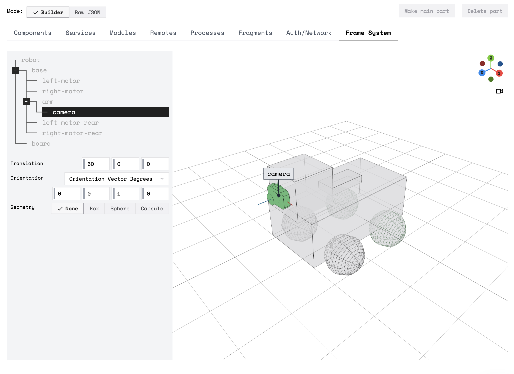

The Frame System is the basis for many of Viam's other services, like [Motion](/services/motion) and [Vision](/services/vision).
It stores the required contextual information to use the position and orientation readings returned by some components.

## Configuration

To enable the default frame for a given [component](/components) on a robot, navigate to the **config** tab of the robot's page in [the Viam app](https://app.viam.com) and click **Components**.
With **mode** as **Builder**, click **Add Frame** on the component's card and **Save Config**.

To adjust the frame from its default configuration, change the parameters as needed for your robot before saving.


{}

Navigate to the **config** tab on your robot's page in [the Viam app](https://app.viam.com), select the **Builder** mode, scroll to a component's panel, and click **Add Frame**:


Select a `parent` frame and fill in the coordinates for `translation` (*mm*) and `orientation` (*deg*, *rad*, or *q*), according to the position and orientation of your component in relation to the `parent` frame.

{}
{}

```json {class="line-numbers linkable-line-numbers"}
{
  "components": [
    {
      "name": "<your_component_name_1>",
      "type": "<your_component_type_1>",
      "model": "<your_component_model_1>",
      "attributes": { ... },
      "depends_on": [],
      "frame": {
        "parent": "<world>",
        "translation": {
          "y": <int>,
          "z": <int>,
          "x": <int>
        },
        "orientation": {
          "type": "<ov_degrees>",
          "value": {
            "x": <int>,
            "y": <int>,
            "z": <int>,
            "th": <int>
          }
        }
      }
    }
  ]
}
```

{}


Configure the reference frame as follows:

| Parameter | Inclusion | Required |
| --------- | ----------- | ----- |
| `Parent`  | **Required** | Default: `world`. The name of the reference frame you want to act as the parent of this frame. |
| `Translation` | **Required** | Default: `(0, 0, 0)`. The coordinates that the origin of this component's reference frame has within its parent reference frame. <br> Units: *mm*. |
| `Orientation`  | **Required** | Default: `(0, 0, 1), 0`. The [orientation vector](/internals/orientation-vector/) that yields the axes of the component's reference frame when applied as a rotation to the axes of the parent reference frame. <br> Types: `Orientation Vector Degrees`, `Orientation Vector Radians`, and `Quaternion`. |
| `Geometry`  | Optional | Default: `none`. Collision geometries for defining bounds in the environment of the robot. <br> Types: `Sphere`, `Box`, and `Capsule`. |

{}

The `Orientation` parameter offers `Types` for ease of configuration, but the Frame System always stores and returns [orientation vectors](/internals/orientation-vector/) in `Orientation Vector Radians`.
`Degrees` and `Quaternion` will be converted to `Radians`.

{}

{}

Viam's coordinate system considers `+X` to be forward, `+Y` to be left, and `+Z` to be up.
You can use [the right-hand rule](https://en.wikipedia.org/wiki/Right-hand_rule) to determine the orientation of these axes.

{}

For more information about determining the appropriate values for these parameters, see these two examples:

- [A Reference Frame:](/services/frame-system/frame-config) A component attached to a static surface
- [Nested Reference Frames:](/services/frame-system/nested-frame-config) A component attached to another, dynamic, component

### Visualize the Frame System

You can visualize how your robot is oriented in the Frame System in [the Viam app](https://app.viam.com).
Navigate to the **config** tab on your robot's page, select **mode** as **Builder**, and click on **Frame System**.

The Viam app shows you a 3D visualization of the spatial configuration of the reference frames of components configured on your robot:

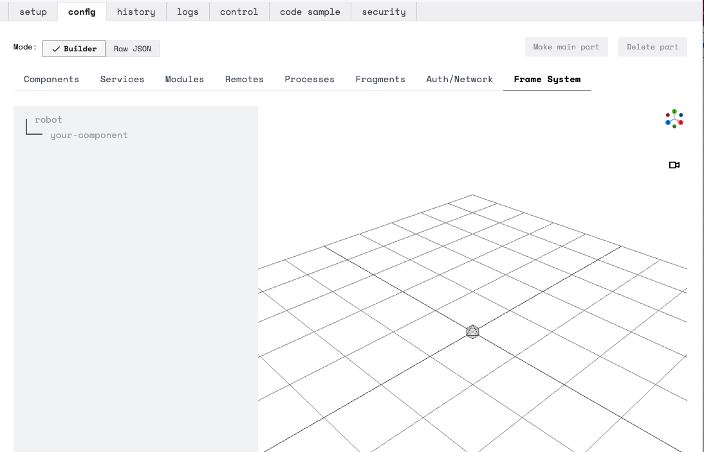

This tab provides a simple interface for simultaneously viewing and editing the position, orientation, and geometries of a robot's components in the Frame System.

For example:

Consider a robot configured with a [`jetson` board](/components/board), wired to a [`webcam` camera](/components/camera/webcam) and a [`wheeled` base](/components/base/wheeled) with two [motors](/components/motor) driving its wheels.

No reference frame configuration has been specified, so on the **Frame System** **config** sub-tab, the components are shown to all be located on the default `world` origin point as follows:

  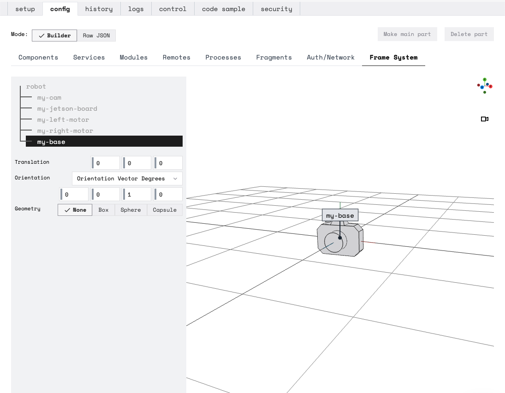

The distance on the floor from the wheeled base to the board and camera setup is 200 millimeters.

Add this value to `"X"` in the base's reference frame `Translation` attribute, and the Frame System readjusts to show the base's translation:

  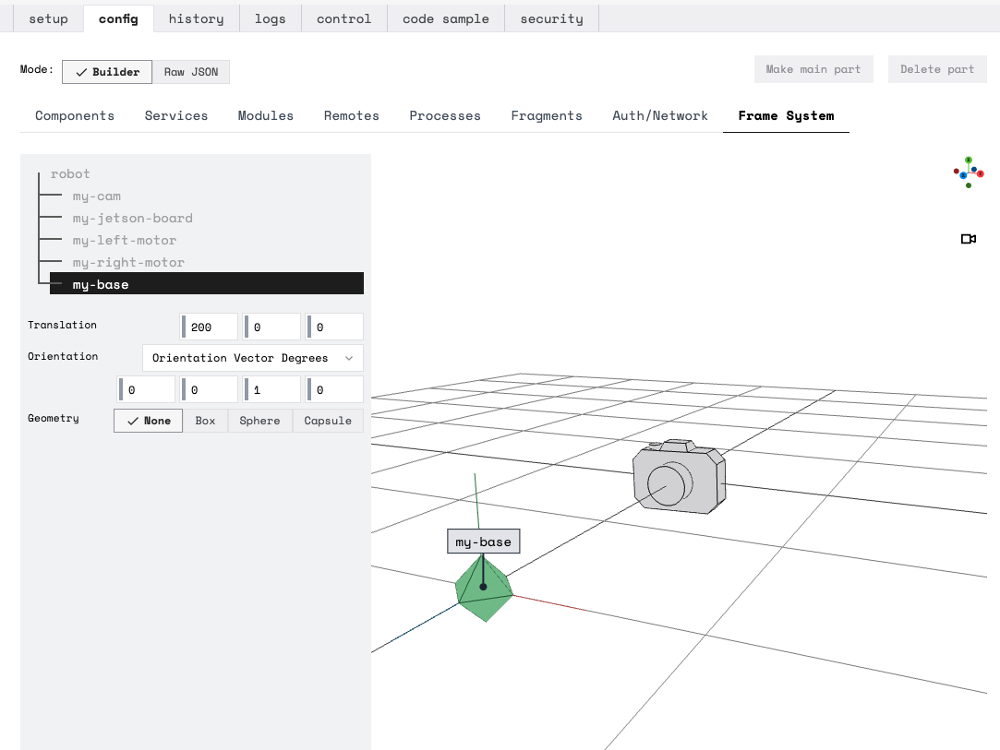

The distance from the board to the camera mounted overhead is 50 millimeters.

Add this value to `"Z"` in the camera's reference frame `Translation` attribute, and the Frame System readjusts to show the camera's translation:

  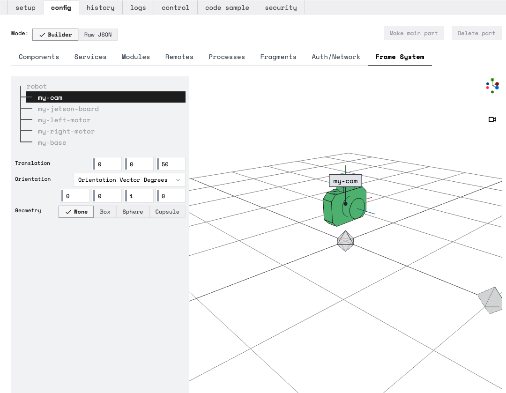

Now the distance between these components is accurately reflected in the visualization.
However, the camera doesn't yet display as oriented towards the base.

Adjust the [orientation vector](/internals/orientation-vector) to 0.5 degrees in `"OX"` in your camera's reference frame `Orientation` attribute, and the Frame System readjusts to show the camera's orientation:

  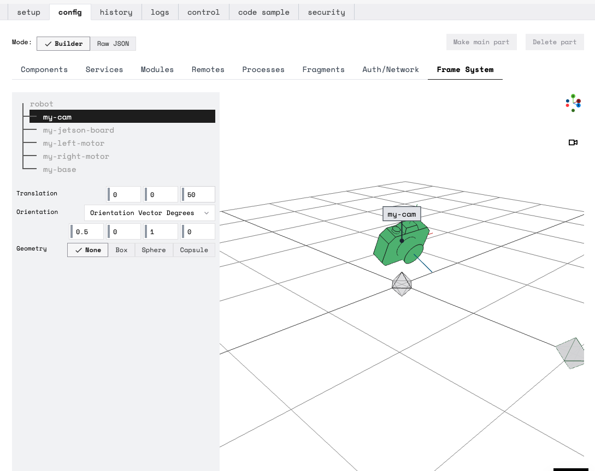

Now that the Frame System is configured so that the spatial visualization for your robot matches its spatial orientation in real life, you can utilize [Motion Service](/services/motion) methods that take in reference frame information.

### Display Options

Click and drag on the **Frame System** visualization to view the display from different angles, and pinch to zoom in and out:

{{<gif webm_src="img/frame_system_demo.webm" mp4_src="img/frame_system_demo.mp4" alt="The frame system visualization zooming in and out around the example robot with a camera, board, and wheeled base.>"}}

Click the video camera icon below and to the right of the **Frame System** button to switch beween the default **Perspective Camera** and the **Orthographic Camera** view:


{}

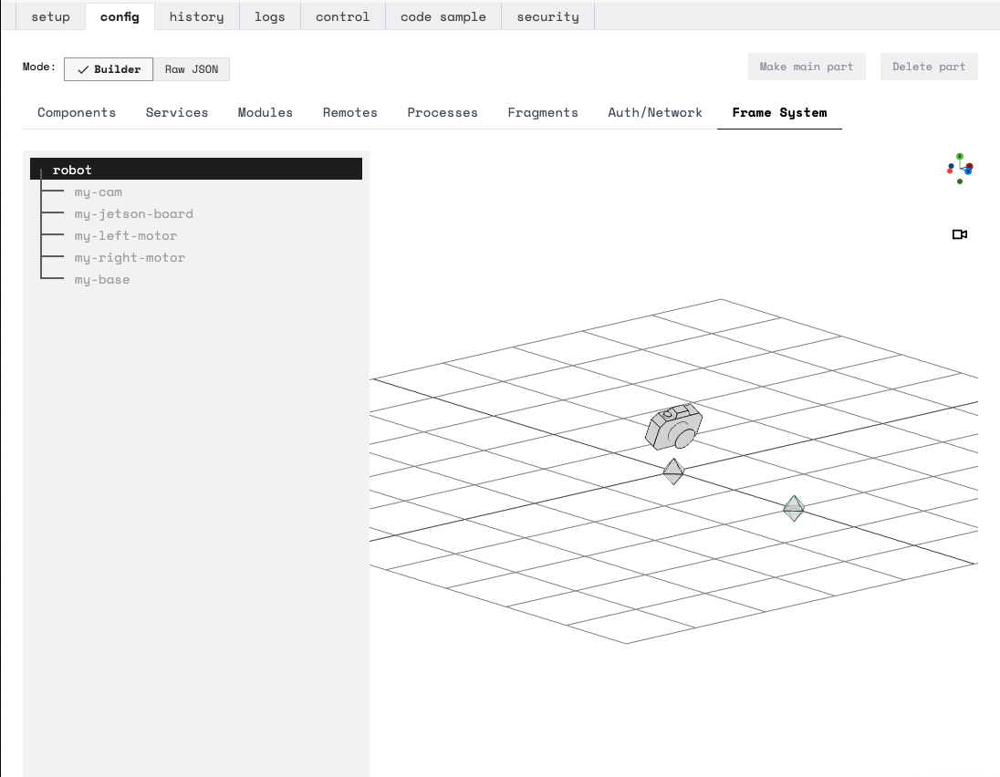

{}
{}

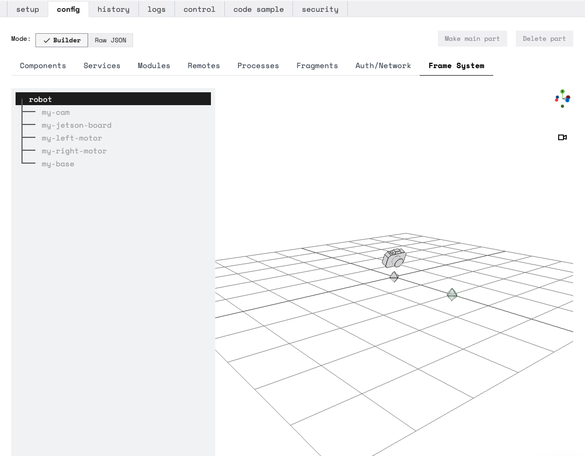

{}


### Bounding Geometries

To visualize a component's spatial constraints, add `Geometry` properties by selecting a component and selecting a **Geometry** type in the **Frame System** sub-tab of the **config** tab of a robot's page on [the Viam app](https://app.viam.com).

By default, a **Geometry** is shown surrounding the origin point of a component:


{}

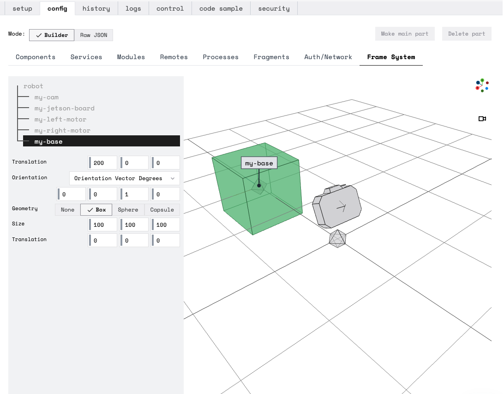

You can adjust the **Size** and **Translation** of a **Geometry** to change these bounds.
For example:

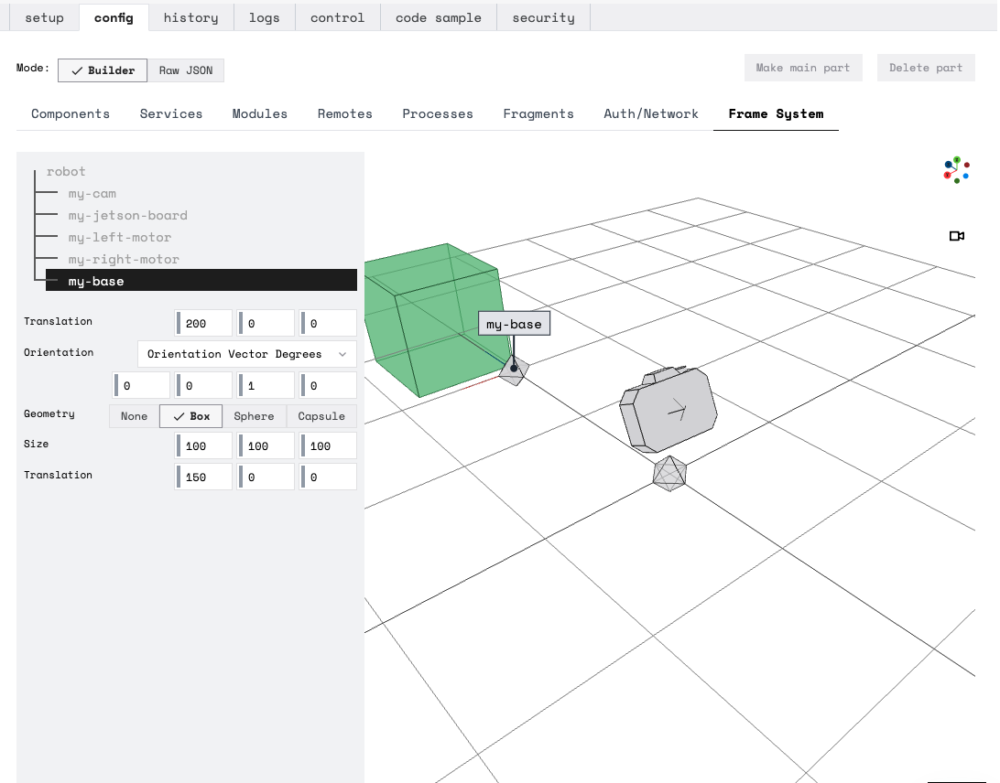


{}
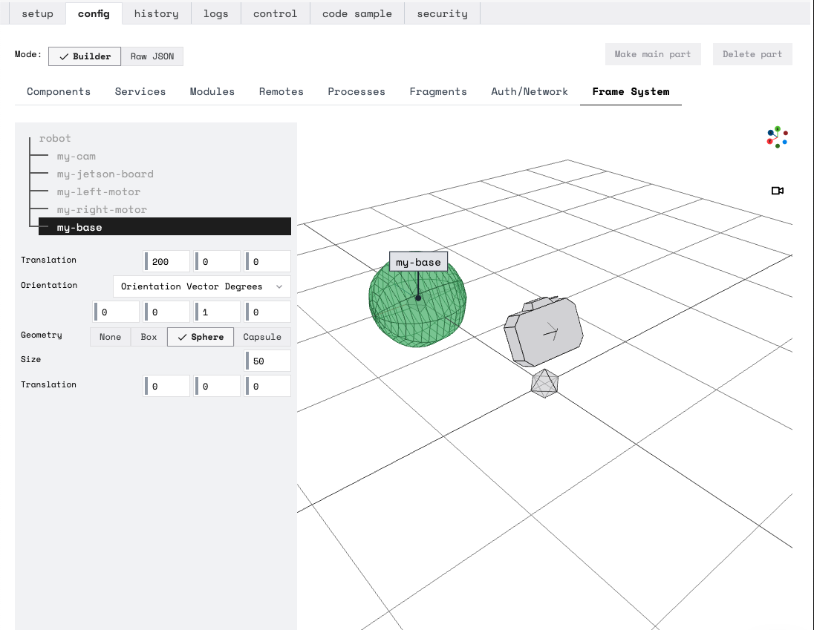

{}
{}

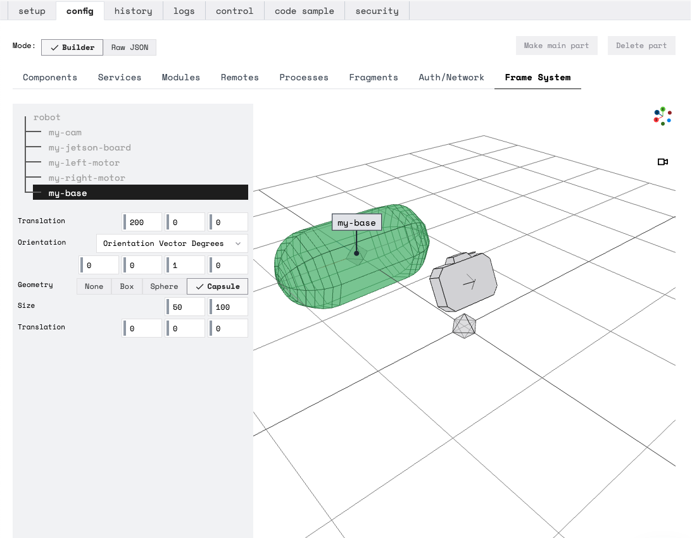

{}


## How the Frame System Works

`viam-server` builds a tree of reference frames for your robot with the `world` as the root node and regenerates this tree following reconfiguration.

Access a [topologically-sorted list](https://en.wikipedia.org/wiki/Topological_sorting) of the generated reference frames in the robot's logs at `--debug` level:


Consider the example of nested reference frame configuration where [two dynamic components are attached](/services/frame-system/nested-frame-config): a robotic arm, `A`, attaches to a gantry, `G`, which in turn is fixed in place at a point on the `World` of a table.

The resulting tree of reference frames looks like:


`viam-server` builds the connections in this tree by looking at the `"frame"` portion of each component in the robot's configuration and defining *two* reference frames for each component:

1. One with the name of the component, representing the actuator or final link in the component's kinematic chain: like `"A"` as the end of an arm.
2. Another representing the origin of the component, defined with the component's name and the suffix *"_origin"*.

## Access the Frame System

The [Robot API](https://github.com/viamrobotics/api/blob/main/proto/viam/robot/v1/robot.proto) supplies two methods to interact with the Frame System through gRPC calls:

1. `TransformPose`: Transforms a pose measured in one reference frame to the same pose as it would have been measured in another.
2. `FrameSystemConfig`: Returns a topologically sorted list of all the reference frames monitored by the frame system.
Any [supplemental transforms](#supplemental-transforms) are also merged into the tree, topologically sorted, and returned.

## Supplemental Transforms

*Supplemental Transforms* exist to help the Frame System determine the location of and relationships between objects not initially known to the robot.

For example:

- In our [example of nested dynamic attachment](/services/frame-system/nested-frame-config), the arm can be managed by the Frame System without supplemental transforms because the base of the arm is fixed with respect to the gantry's platform, and the gantry's origin is fixed with respect to the `world` reference frame (centered at `(0, 0, 0)` in the robot's coordinate system).

    However, an arm with an attached [camera](/components/camera) might generate additional information about the poses of other objects with respect to references frames on the robot.

    With the [Vision Service](/services/vision/), the camera might detect objects that do not have a relationship to a `world` reference frame.

    If a [camera](/components/camera) is looking for an apple or an orange, the arm can be commanded to move to the detected fruit's location by providing a supplemental transform that contains the detected pose with respect to the camera that performed the detection.

    The detecting component (camera) would be fixed with respect to the `world` reference frame, and would supply the position and orientation of the detected object.

    With this information, the Frame System could perform the right calculations to express the pose of the object in the `world` reference frame.

Usage:

- You can pass a detected object's frame information to the `supplemental_transforms` parameter in your calls to Viam's Motion Service's [`GetPose`](/services/motion/#getpose) method.
- Functions of some services and components also take in a `WorldState` parameter, which includes a `transforms` property.
- Both [`TransformPose`](#access-the-frame-system) and [`FrameSystemConfig`](#access-the-frame-system) have the option to take in these supplemental transforms.
