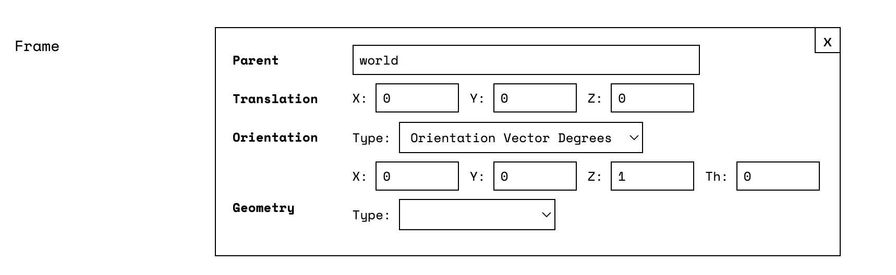
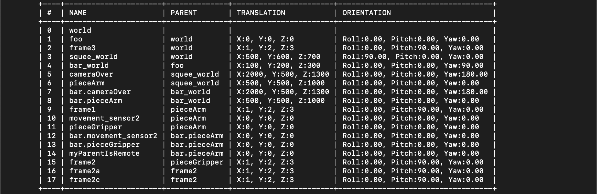
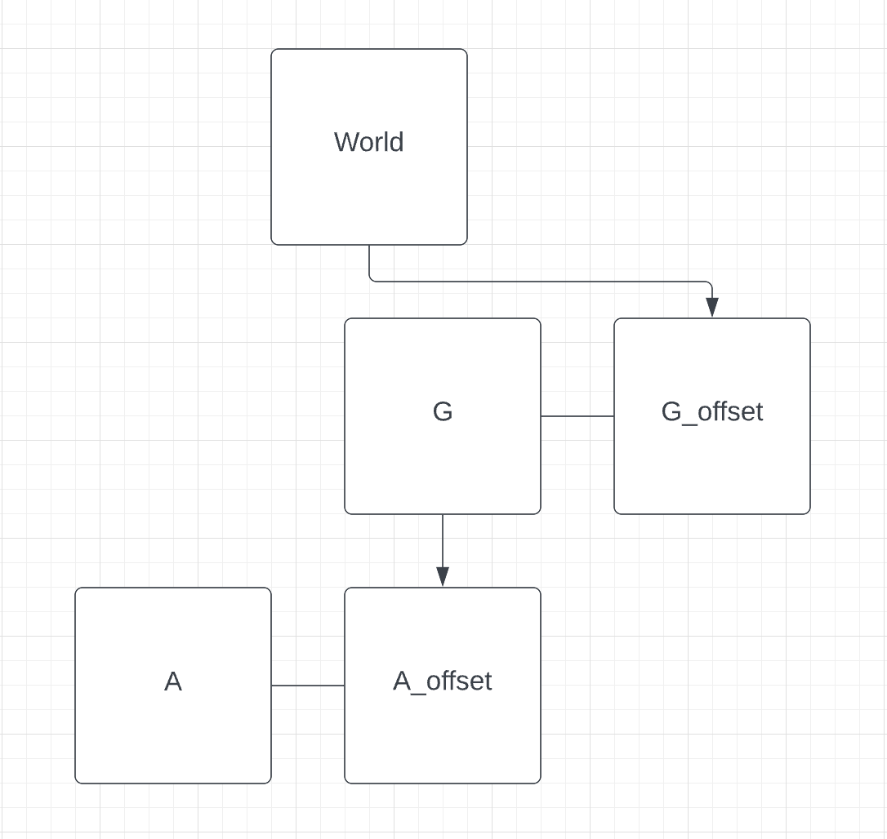

Any robot configured in Viam comes with a service we call the Frame System: an internally managed and mostly static system for storing the "reference frame" of each component of a robot within a coordinate system configured by the user.

The Frame System is the basis for many of Viam's other services, like [motion](/services/motion) and [vision](/services/vision).
It stores the required contextual information to use the position and orientation readings returned by some components.

## Configuration

To adjust the Frame System from its default configuration for a particular [component](/components), add the following to its configuration:


{}

Navigate to the **CONFIG** tab on your robot's page in [the Viam app](https://app.viam.com), select the **Builder** mode, scroll to a component's card, and click **Add Frame**:

{}
{}

{}


Configure the reference frame as follows:

| Parameter | Inclusion | Required |
| --------- | ----------- | ----- |
| `Parent`  | **Required** | Default: `world`. The name of the reference frame you want to act as the parent of this frame. |
| `Translation` | **Required** | Default: `{0, 0, 0}`. The coordinates that the origin of this component's reference frame has within its parent reference frame. |
| `Orientation`  | **Required** | Default: `{0, 0, 1, 0}`. The [orientation vector](/internals/orientation-vector/) that yields the axes of the component's reference frame when applied as a rotation to the axes of the parent reference frame.   Types: `Orientation Vector Degrees`, `Orientation Vector Radians`, and `Quaternion`. |
| `Geometry`  | **Required** | Default: `none`. Collision geometries for defining bounds in the environment of the robot.   Types: `Sphere` and `Box`. |

{}

`Types` are offered in `Orientation` for ease of configuration, but the [orientation vector](/internals/orientation-vector/) type that is always stored and returned by the Frame System is `"Orientation Vector Radians"`.
`"Degrees"` and `"Quaternion"` will be converted to `"Radians"`.

{}

{}

Viam's coordinate system considers `+X` to be forward, `+Y` to be left, and `+Z` to be up.

{}

For more information, see these two examples:

- [A component attached to a static surface](/component-on-static)
- [A component attached to another, dynamic, component](/component-on-dynamic)

## Building the Frame System

Once you configure your robot and run `viam-server`, your robot will builds a tree of reference frames with the `world` as the root node.

A [topologically-sorted list](https://en.wikipedia.org/wiki/Topological_sorting) of the generated reference frames is printed by the server and can be seen in the server logs:

Viam regenerates this tree in the process of [reconfiguration](/manage/fleet-management/#configurationlogging).

Let's consider our example of a [component attached to a dynamic component](/component-attached-to-a-dynamic-component): a robotic arm, `A`, attached to a gantry, `G`, which in turn is fixed in place at a point on the `World` of a table.

Let's use `G_offset` to refer to the configuration for the translation of the gantry from its world parent, and `A_offset` to refer to the configuration for the translation of the arm from its gantry parent.

The resulting tree of reference frames looks like:

Viam builds the connections in this tree by looking at the `"frame"` portion of each component in the robot's configuration and defining *two* reference frames for each component:

1. One with the name of the component, representing the actuator or final link in the component's kinematic chain: like `"A"` as the end of an arm.
2. Another representing the origin of the component, defined with the component's name and the suffix *"_origin"*.

For example, in the robot's `viam-server` behind the reference frame tree shown above, the arm would have two reference frames: `"a_origin"` and `"A"`. `"a_origin"` would be the same as `"G"`.

## Accessing the Frame System

The [Robot API](https://github.com/viamrobotics/api/blob/main/proto/viam/robot/v1/robot.proto) supplies two methods to interact with the Frame System through gRPC calls:

1. `TransformPose`: Transforms a pose measured in one reference frame to the same pose as it would have been measured in another.
2. `FrameSystemConfig`: Returns a topologically sorted list of all the reference frames monitored by the frame system.
Any [supplemental transforms](#handling-motion-with-supplemental-transforms) are also merged into the tree, topologically sorted, and returned.

## Supplemental Transforms

*Supplemental Transforms* exist to compensate for the fact that the Frame System built by a robot only knows how to coordinate the location of components in reference to a `"world"` frame with a fixed origin of `{0, 0, 0}`.

In our [example of a dynamic arm attached to a dynamic gantry](/component-attached-to-a-dynamic-component), the arm can be managed by the Frame System without supplemental transforms because the base of the arm is fixed with respect to the gantry's platform, and the gantry's origin is fixed with respect to the `world` reference frame.

On the other hand, an arm attached to a [rover](/components/base/wheeled) that is unaware of its own position cannot be configured into the Frame System because the rover can move freely with respect to the `world` frame.

To solve this problem:

- You can introduce a [movement-sensor](/components/movement-sensor) or a [camera](/components/camera) in combination with our [Vision Service](/services/vision/) as a third component.
- This component is fixed in space (making it configurable in the Frame System) and can supply the location and orientation of the rover in its own reference frame.
- You can add the name of this component's reference frame into, for example, `supplemental_transforms` in your calls to Viam's motion service [`GetPose`](/services/motion/#getpose) method
- [Both `TransformPose` and `FrameSystemConfig`](#accessing-the-frame-system) also have the option to take in these supplemental transforms. Functions of some services and components also take in a `WorldState` parameter, which includes an entry for supplying supplemental transforms for use by internal calls to the Frame System.

This *supplemental transform* is the missing link to be able to transform a pose in the arm's reference frame to the `world` reference frame.

{}

A knowledgeable user could code a [mobile base](/components/base/wheeled) that is able to report its own position without the need for supplemental transforms, with an organic [SLAM](/services/slam) system.

{}
