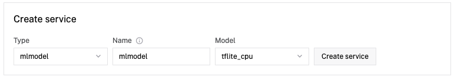

The ML Models service allows you to deploy machine learning models to your robots.

## Create an ML model service

Navigate to your robot's [**config** tab](https://app.viam.com/robot) and click on the **Services** subtab.

Scroll to the bottom and create a new service with the **Type** `mlmodel`.



The created ML Models panel lists all available models that you have [trained](../../manage/ml/train-model/) or [uploaded](../../manage/ml/upload-model/).


To add a model to your robot, select it and click on the move right button.


Save the configuration and your model will be added to your robot at <file>$HOME/.viam/packages/\<model-name\>/\<file-name\></file>.


If you upload or train a new version of a model, Viam automatically deploys the `latest` version of the model to the robot.
If you do not want Viam to automatically deploy the `latest` version of the model, you can change the  `packages` configuration in the [Raw JSON robot configuration](../../manage/configuration/#the-config-tab).


You can get the version number from a specific model version by clicking on **COPY** on the model on the models tab of the **DATA** page.
The model package config looks like this:

```json
{"package":"<model_id>/allblack","version":"1234567891011","name":"<model_name>"}
```

## Next Steps

To make use of your new model, follow the instructions to create a detector or a classifier:

- A [`tflite_cpu` detector](../vision/detection/#configure-a-tflite_cpu-detector)
- A [`tflite_cpu` classifier](../vision/classification/#configure-a-tflite_cpu-classifier)
