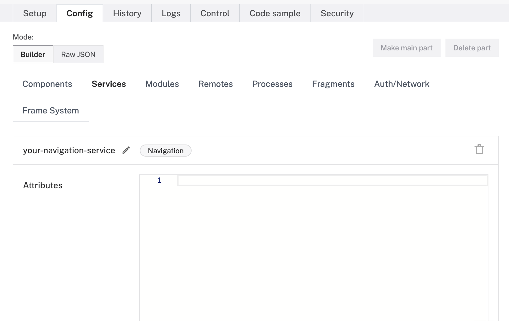

The Navigation Service uses GPS to autonomously navigate a rover to user defined endpoints.

## Configuration


{}

Navigate to the **Config** tab of your robot's page in [the Viam app](https://app.viam.com).
Click on the **Services** subtab and navigate to the **Create service** menu.
Select the type `Navigation` and enter a name for your service.

Click **Create service**:



{}
{}

```json {class="line-numbers linkable-line-numbers"}
{
    "name": "your-navigation-service",
    "type": "navigation"
}
```

{}


<!-- TODO INSERT CONFIG ATTRIBUTES THAT RAYMOND DEFINES HERE -->

Next, add the JSON `"attributes"` you want the service to have.
The following attributes are available for `Navigation` services:

| Name | Type | Inclusion | Description |
| ---- | ---- | --------- | ----------- |
| `store` | obj | ? | ? <br> Default: `` |
| `base` | string | ? | ? <br> Default: ``|
| `movement_sensor` | string | ? | <br> Default: `` |
| `degs_per_sec` | float | ? | Default degrees per second. <br> Default: `` |
| `mm_per_sec` | float | ? | Default millimeters per second. <br> Default: `` |

## API

The Navigation Service supports the following methods:

Method Name | Description
----------- | -----------
[`Mode`](#mode) | Get the mode the service is operating in.
[`SetMode`](#setmode) | Set the mode the service is operating in.
[`Location`](#location) | Get the current location of the robot.
[`Waypoints`](#waypoints) | Get an array of waypoints currently in the service's data storage.
[`AddWaypoint`](#addwaypoint) | Add a waypoint to the service's data storage.
[`RemoveWaypoint`](#removewaypoint) | Remove a waypoint from the service's data storage.

{}

The following code examples assume that you have a robot configured with a `Navigation` service, and that you add the required code to connect to your robot and import any required packages at the top of your code file.
Go to your robot's **Code Sample** tab on the [Viam app](https://app.viam.com) for boilerplate code to connect to your robot.

{}

### Mode

Get the `Mode` the service is operating in.
There are two options for modes: `manual` and `waypoint`.
<!-- TODO: MORE INFO ABOUT MODES -->


{}

**Parameters:**

- `ctx` [(Context)](https://pkg.go.dev/context): A Context carries a deadline, a cancellation signal, and other values across API boundaries.
- `extra` [(map\[string\]interface{})](https://go.dev/blog/maps): Extra options to pass to the underlying RPC call.

**Returns:**

- [(Mode)](https://pkg.go.dev/go.viam.com/rdk@v0.2.49/services/navigation#Mode): The `Mode` the service is operating in.
- [(error)](https://pkg.go.dev/builtin#error): An error, if one occurred.

For more information, see the [Go SDK Docs](https://pkg.go.dev/go.viam.com/rdk@v0.2.49/services/navigation#Service).

```go
myNav, err := navigation.FromRobot(robot, "my_nav")

// Get the Mode the service is operating in
mode, err := myNav.Mode(context.Background(), nil)
```

{}


### SetMode

Set the `Mode` the service is operating in.
There are two options for modes: `manual` and `waypoint`.
<!-- TODO: MORE INFO ABOUT MODES -->


{}

**Parameters:**

- `ctx` [(Context)](https://pkg.go.dev/context): A Context carries a deadline, a cancellation signal, and other values across API boundaries.
- `mode` [(Mode)](https://pkg.go.dev/go.viam.com/rdk@v0.2.49/services/navigation#Mode): The `Mode` for the service to operate in.
- `extra` [(map\[string\]interface{})](https://go.dev/blog/maps): Extra options to pass to the underlying RPC call.

**Returns:**

- [(error)](https://pkg.go.dev/builtin#error): An error, if one occurred.

For more information, see the [Go SDK Docs](https://pkg.go.dev/go.viam.com/rdk@v0.2.49/services/navigation#Service).

```go
myNav, err := navigation.FromRobot(robot, "my_nav")

// Set the Mode the service is operating in
mode, err := myNav.SetMode(context.Background(), "waypoint", nil)
```

{}


### Location

Get the current location of the robot in the navigation service.


{}

**Parameters:**

- `ctx` [(Context)](https://pkg.go.dev/context): A Context carries a deadline, a cancellation signal, and other values across API boundaries.
- `extra` [(map\[string\]interface{})](https://go.dev/blog/maps): Extra options to pass to the underlying RPC call.

**Returns:**

- [(*geo.Point)](https://pkg.go.dev/github.com/kellydunn/golang-geo#Point): The current location of the robot in the navigation service, represented in a `Point` with latitude (lat) and longitude (lng) values.
- [(error)](https://pkg.go.dev/builtin#error): An error, if one occurred.

For more information, see the [Go SDK Docs](https://pkg.go.dev/go.viam.com/rdk@v0.2.49/services/navigation#Service).

```go
myNav, err := navigation.FromRobot(robot, "my_nav")

// Get the current location of the robot in the navigation service
location, err := myNav.Location(context.Background(), nil)
```

{}


### Waypoints

Get an array of waypoints, locations designated within a path for the robot to navigate to, currently in the service's data storage.


{}

**Parameters:**

- `ctx` [(Context)](https://pkg.go.dev/context): A Context carries a deadline, a cancellation signal, and other values across API boundaries.
- `extra` [(map\[string\]interface{})](https://go.dev/blog/maps): Extra options to pass to the underlying RPC call.

**Returns:**

- [([]Waypoints)](https://pkg.go.dev/go.viam.com/rdk@v0.2.49/services/navigation#Waypoint): An array comprised of each `Waypoint` in the service's data storage. These are locations designated within a path for the robot to navigate to.
- [(error)](https://pkg.go.dev/builtin#error): An error, if one occurred.

For more information, see the [Go SDK Docs](https://pkg.go.dev/go.viam.com/rdk@v0.2.49/services/navigation#Service).

```go
myNav, err := navigation.FromRobot(robot, "my_nav")

// Get an array containing each waypoint stored by the navigation service
waypoints, err := myNav.Waypoints(context.Background(), nil)
```

{}


### AddWaypoint

Add a waypoint to the service's data storage.


{}

**Parameters:**

- `ctx` [(Context)](https://pkg.go.dev/context): A Context carries a deadline, a cancellation signal, and other values across API boundaries.
- `point` [(*geo.Point)](https://pkg.go.dev/github.com/kellydunn/golang-geo#Point): The current location of the robot in the navigation service, represented in a `Point` with latitude (lat) and longitude (lng) values.
- `extra` [(map\[string\]interface{})](https://go.dev/blog/maps): Extra options to pass to the underlying RPC call.

**Returns:**

- [(error)](https://pkg.go.dev/builtin#error): An error, if one occurred.

For more information, see the [Go SDK Docs](https://pkg.go.dev/go.viam.com/rdk@v0.2.49/services/navigation#Service).

```go
myNav, err := navigation.FromRobot(robot, "my_nav")

// Create a new waypoint with latitude and longitude values of 0 degrees
location = geo.NewPoint(0, 0)

// Add your waypoint to the service's data storage.
err := myNav.AddWaypoint(context.Background(), location, nil)
```

{}


### RemoveWaypoint

Remove a waypoint from the service's data storage.


{}

**Parameters:**

- `ctx` [(Context)](https://pkg.go.dev/context): A Context carries a deadline, a cancellation signal, and other values across API boundaries.
- `id` [(primitive.ObjectID)](https://pkg.go.dev/go.mongodb.org/mongo-driver/bson/primitive#ObjectID): The MongoDB ObjectID of the `Waypoint` to remove from the service's data storage.
- `extra` [(map\[string\]interface{})](https://go.dev/blog/maps): Extra options to pass to the underlying RPC call.
<!-- TODO: I'm a bit confused about the whole MongoDB object ID thing so need to check here to confirm -->

**Returns:**

- [(error)](https://pkg.go.dev/builtin#error): An error, if one occurred.

For more information, see the [Go SDK Docs](https://pkg.go.dev/go.viam.com/rdk@v0.2.49/services/navigation#Service).

```go
myNav, err := navigation.FromRobot(robot, "my_nav")

// Create a new ObjectID
waypoint_id = primitive.NewObjectID()

// Remove the waypoint matching that ObjectID from the service's data storage
err := myNav.RemoveWaypoint(context.Background(), waypoint_id, nil)
```

{}


<!-- TODO: ADD NAVIGATION STORE INTERFACE? -->