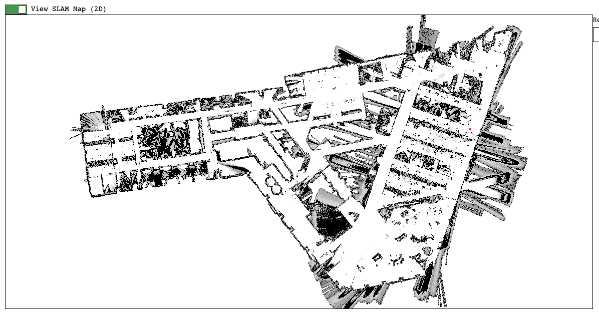

{}
The SLAM Service is an experimental feature.
Stability is not guaranteed.
Breaking changes are likely to occur, and occur often.
{}

[Simultaneous Localization And Mapping (SLAM)](https://en.wikipedia.org/wiki/Simultaneous_localization_and_mapping) allows your robot to create a map of its surroundings and find its location within that map.
SLAM is an important area of ongoing research in robotics, particularly for mobile applications such as drones, boats, and rovers.

The Viam SLAM Service supports the integration of SLAM as a service on your robot.
You can conduct SLAM with data collected live by a [RPlidar](/extend/modular-resources/examples/rplidar/) or with LIDAR data you provide in configuration, and easily view the map you build on the **Control** tab of your robot's page in the [Viam app](https://app.viam.com):

## Configuration

Integrated SLAM Libraries include:

| Model | Description |
| ----- | ----------- |
| [`viam:slam:cartographer`](cartographer/) | [The Cartographer Project](https://github.com/cartographer-project) performs dense SLAM using LIDAR data. |
