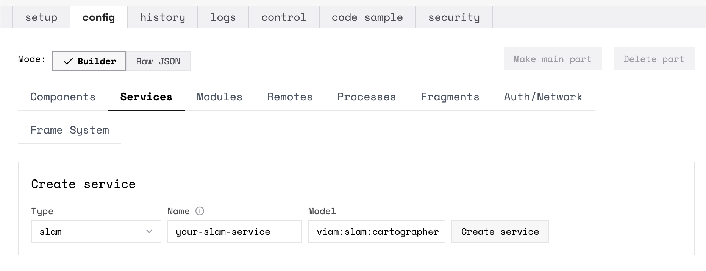
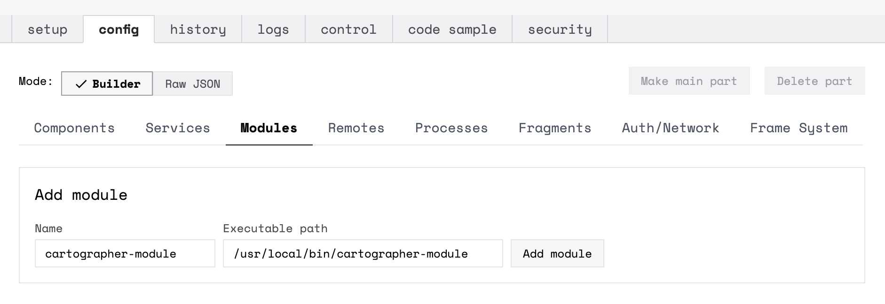
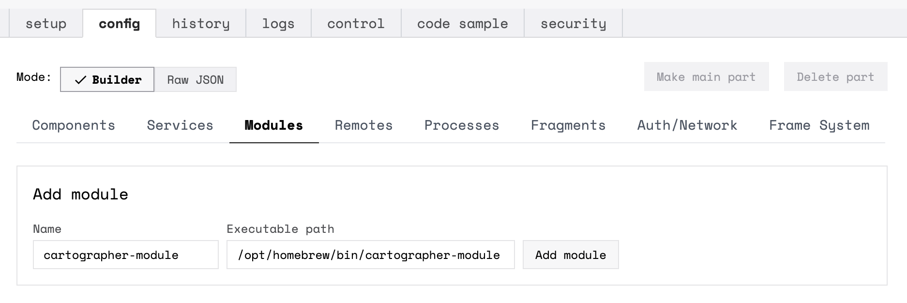

[The Cartographer Project](https://github.com/cartographer-project) performs dense SLAM using LIDAR data.

To easily integrate Cartographer into the Viam ecosystem, Viam provides the [`viam-cartographer`](https://github.com/viamrobotics/viam-cartographer) module which wraps Cartographer as a [modular resource](/program/extend/modular-resources/) in the form of a custom SLAM service.
This module provides the `cartographer-module` binary, which runs in addition to `viam-server`.

## Requirements

To use Cartographer with Viam, install the `cartographer-module` binary on your machine and make it executable by running the following commands according to your machine's architecture:


{}

```sh {id="terminal-prompt" class="command-line" data-prompt="$"}
sudo curl -o /usr/local/bin/cartographer-module https://storage.googleapis.com/packages.viam.com/apps/slam-servers/cartographer-module-stable-aarch64.AppImage
sudo chmod a+rx /usr/local/bin/cartographer-module
```

{}
{}

```sh {id="terminal-prompt" class="command-line" data-prompt="$"}
sudo curl -o /usr/local/bin/cartographer-module https://storage.googleapis.com/packages.viam.com/apps/slam-servers/cartographer-module-stable-x86_64.AppImage
sudo chmod a+rx /usr/local/bin/cartographer-module
```

{}
{}

```sh {id="terminal-prompt" class="command-line" data-prompt="$"}
brew tap viamrobotics/brews && brew install cartographer-module
```

{}


## Configuration

{}

Running `cartographer-module` requires a [RPlidar A1](https://www.slamtec.com/en/Lidar/A1) or [RPlidar A3](https://www.slamtec.com/en/Lidar/A3) LIDAR scanning device. The default ['config_params'](#config_params) for the cartographer library, and the example robot config shown below (which uses the default 'config_params'), show nominal parameters one can use for an RPlidar A3. See the notes next to the 'config_params' for recommended settings for an RPlidar A1.

Before adding a SLAM service, you must follow [these instructions](/program/extend/modular-resources/examples/add-rplidar-module/) to add your RPlidar device as a modular component of your robot.

{}

### Add a SLAM Service


{}

Go to your robot's page on the [Viam app](https://app.viam.com/).
Navigate to the **Config** tab on your robot's page, and click on the **Services** subtab.

Add a service with type `slam`, model `viam:slam:cartographer`, and a name of your choice:



Paste the following into the **Attributes** field of your new service:


{}

```json
{
  "data_dir": "/home/<YOUR_USERNAME>/<CARTOGRAPHER_DIR>",
  "delete_processed_data": true,
  "sensors": ["<YOUR_RPLIDAR_COMPONENT_NAME>"],
  "config_params": {
    "mode": "2d"
  }
}
```

{}

{}

```json
{
  "data_dir": "/Users/<YOUR_USERNAME>/<CARTOGRAPHER_DIR>",
  "delete_processed_data": true,
  "sensors": ["<YOUR_RPLIDAR_COMPONENT_NAME>"],
  "config_params": {
    "mode": "2d"
  }
}
```

{}


Click on the **Modules** subtab. Add the cartographer module with a name of your choice and an executable path that points to the location of your installed `cartographer-module` binary:


{}



{}

{}



{}


{}
{}

Go to your robot's page on the [Viam app](https://app.viam.com/).
Navigate to the **Config** tab.
Select the **Raw JSON** mode, then copy/paste the following `"services"` and `"modules"` JSON to add to your existing RPlidar configuration:


{}

```json
"modules": [
  // { ...}, YOUR RPLIDAR MODULE,
  {
    "executable_path": "/usr/local/bin/cartographer-module",
    "name": "cartographer-module"
  }
],
// "components": [ ...], YOUR RPLIDAR MODULAR COMPONENT,
"services": [
  {
    "model": "viam:slam:cartographer",
    "name": "<your-service-name>",
    "type": "slam",
    "attributes": {
      "data_dir": "/home/<YOUR_USERNAME>/<CARTOGRAPHER_DIR>",
      "delete_processed_data": true,
      "sensors": ["<YOUR_RPLIDAR_COMPONENT_NAME>"],
      "config_params": {
        "mode": "2d"
      }
    }
  }
]
```

{}
{}

```json
"modules": [
  // { ...}, YOUR RPLIDAR MODULE,
  {
    "executable_path": "/usr/local/bin/cartographer-module",
    "name": "cartographer-module"
  }
],
// "components": [ ...], YOUR RPLIDAR MODULAR COMPONENT,
"services": [
  {
    "model": "viam:slam:cartographer",
    "name": "<your-service-name>",
    "type": "slam",
    "attributes": {
      "data_dir": "/Users/<YOUR_USERNAME>/<CARTOGRAPHER_DIR>",
      "delete_processed_data": true,
      "sensors": ["<YOUR_RPLIDAR_COMPONENT_NAME>"],
      "config_params": {
        "mode": "2d"
      }
    }
  }
]
```

{}
{}

```json
"modules": [
  // { ...}, YOUR RPLIDAR MODULE,
  {
    "executable_path": "/opt/homebrew/bin/cartographer-module",
    "name": "cartographer-module"
  }
],
// "components": [ ...], YOUR RPLIDAR MODULAR COMPONENT,
"services": [
  {
    "model": "viam:slam:cartographer",
    "name": "<your-service-name>",
    "type": "slam",
    "attributes": {
      "data_dir": "/Users/<YOUR_USERNAME>/<CARTOGRAPHER_DIR>",
      "delete_processed_data": true,
      "sensors": ["<YOUR_RPLIDAR_COMPONENT_NAME>"],
      "config_params": {
        "mode": "2d"
      }
    }
  }
]
```

{}

{}


### Adjust `data_dir`

Change the `data_dir` attribute to point to a directory on your machine where you want to save the sensor data your SLAM service uses and the maps and config files it produces.

This directory must be structured as follows:

<pre>
.
└──\(<file>CARTOGRAPHER_DIR</file>)
    ├── <file>map</file>
    ├── <file>data</file>
    └── <file>config</file>
</pre>

Click through the following tabs to see the usage of each folder in this directory:

{}
{}

Whether mapping data is present in <file>map</file> at runtime and the attribute `map_rate_sec` determines the SLAM mapping mode:

### Mapping Modes

| Mode | Description | Runtime Dictation |
| ---- | ----------- | ------- |
| PURE MAPPING | Generate a new map in <file>/map</file>. | No map is found in <file>/map</file> + [`map_rate_sec > 0`](#attributes). |
| UPDATING | Update an existing map with new <file>/data</data>. | A map is found in <file>/map</file> + [`map_rate_sec > 0`](#attributes).|
| LOCALIZING | Localize the robot on an existing map without changing the map itself. | A map is found in <file>/map</file> + [`map_rate_sec = 0`](#attributes). |

{}
{}

The <file>data</file> folder stores the LIDAR data gathered by your RPlidar and used for SLAM.

{}
{}

The <file>config</file> folder stores any Cartographer specific config files created.
These are generated at runtime, so there is no need to add anything to this folder.

{}


{}

If this directory structure is not present at runtime, the SLAM Service creates it.

{}

### View the Map

After saving your config and connecting to your robot, navigate to the **Control** tab on your robot's page and click on the drop-down menu matching the `name` of the service you created.

Change the **Refresh frequency** to your desired frequency.
Move your RPlidar around slowly.
Watch a map start to appear.

### Attributes

| Name | Data Type | Inclusion | Description |
| ---- | --------- | --------- | ----------- |
| `data_dir` | string | **Required** | Path to [the directory](#mapping-modes) used for saving input LIDAR data in <file>/data</file> and output mapping data in <file>/map</file>. |
| `sensors` | string[] | **Required** | Names of configured RPlidar devices providing data to the SLAM service. |
| `map_rate_sec` | int | Optional | Rate of <file>/map</file> generation *(seconds)*. <ul> Default: `60`. </ul> |
| `data_rate_msec` | int | Optional | Rate of <file>/data</file> collection from `sensors` *(milliseconds)*. <ul>Default: `200`.</ul> |
| `port` | string | Optional | Port for SLAM gRPC server. If running locally, this should be in the form "localhost:<PORT>". If no value is specified a random available port is assigned. |
| `delete_processed_data` | bool | Optional | <p>Setting this to `true` helps to reduce the amount of memory required to run SLAM.</p> <ul> `true`: sensor data is deleted after the SLAM algorithm has processed it. </ul><ul> `false`: sensor data is not deleted after the SLAM algorithm has processed it. </ul> |
| `config_params` |  map[string] string | Optional | Parameters available to fine-tune the `cartographer` algorithm: [read more below](#config_params). |

### `config_params`

Adjust these parameters to fine-tune the algorithm `cartographer` utilizes in aspects like submap size, mapping update rate, and feature matching details:

| Parameter Mode | Description | Inclusion | Default Value | Notes |
| -------------- | ----------- | --------- | ------------- | ----- |
| `mode` | `2d` | **Required** | None | |
| `optimize_every_n_nodes` | How many trajectory nodes are inserted before the global optimization is run. | Optional | `3` | |
| `num_range_data` | Number of measurements in each submap. | Optional | `100` | |
| `missing_data_ray_length` | Replaces the length of ranges that are further than `max_range` with this value. | Optional | `25` | Nominally set to max length. |
| `max_range` | Maximum range of valid measurements. | Optional | `25` | For an RPlidar A3, set this value to `25`. For an RPlidar A1, use `12`. |
| `min_range` | Minimum range of valid measurements. | Optional | `0.2` | For an RPlidar A3, set this value to `0.2`. For RPlidar A1, use `0.15`. |
| `max_submaps_to_keep` | Number of submaps to use and track for localization. | Optional | `3` | Only for [LOCALIZING mode](#mapping-modes). |
| `fresh_submaps_count` | Length of submap history considered when running SLAM in updating mode. | Optional | `3` | Only for [UPDATING mode](#mapping-modes). |
| `min_covered_area` | The minimum overlapping area, in square meters, for an old submap to be considered for deletion. | Optional | `1.0` | Only for [UPDATING mode](#mapping-modes). |
| `min_added_submaps_count` | The minimum number of added submaps before deletion of the old submap is considered. | Optional | `1` | Only for [UPDATING mode](#mapping-modes). |
| `occupied_space_weight` | Emphasis to put on scanned data points between measurements. | Optional | `20.0` | |
| `translation_weight` | Emphasis to put on expected translational change from pose extrapolator data between measurements. | Optional | `10.0` | |
| `rotation_weight` | Emphasis to put on expected rotational change from pose extrapolator data between measurements. | Optional | `1.0` | |

## Troubleshooting

### Tip: Lidar Mounting for the Viam Rover

If you have a Viam Rover and need a mount for your RPLidar, you can 3D print an adapter plate.
The STL file for an adapter plate is available on [GitHub](https://github.com/viamrobotics/VR1-22-A001/blob/master/CAD/RPIidar_adapter.STL).

### Known Issues

#### Maps not appearing in UI

When generating a larger map, it will take longer for Cartographer to return the desired map.
This can result in errors or failed requests for a map, however, this will not affect the `viam-server` or `cartographer-module` process.
Re-requesting the map can and should be successful, although there is currently a fundamental limit for the size of map that can be transmitted to the UI and this issue will become more common as you approach it.

You can find additional assistance in the [Troubleshooting section](/appendix/troubleshooting/).
