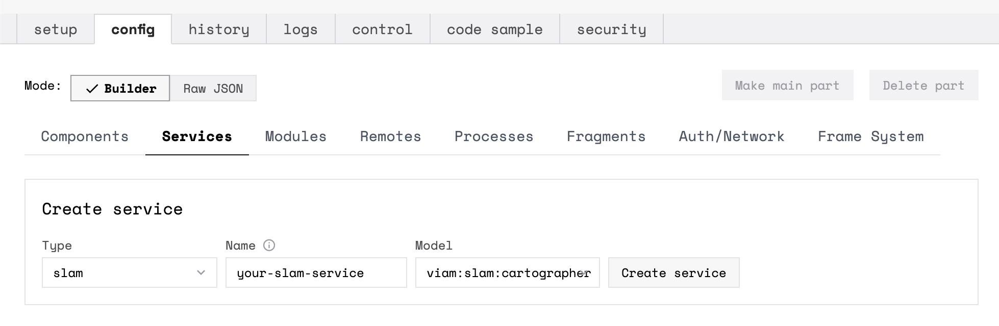

[The Cartographer Project](https://github.com/cartographer-project) performs dense SLAM using LIDAR data.

## Requirements

Install the binary required to utilize the `cartographer` library on your machine and make it executable by running the following commands according to your machine's architecture:


{}

```sh {id="terminal-prompt" class="command-line" data-prompt="$"}
sudo curl -o /usr/local/bin/carto_grpc_server http://packages.viam.com/apps/slam-servers/carto_grpc_server-stable-aarch64.AppImage
sudo chmod a+rx /usr/local/bin/carto_grpc_server
```

{}
{}

```sh {id="terminal-prompt" class="command-line" data-prompt="$"}
sudo curl -o /usr/local/bin/carto_grpc_server http://packages.viam.com/apps/slam-servers/carto_grpc_server-stable-x86_64.AppImage
sudo chmod a+rx /usr/local/bin/carto_grpc_server
```

{}
{}

```sh {id="terminal-prompt" class="command-line" data-prompt="$"}
brew tap viamrobotics/brews && brew install carto-grpc-server
```

{}


## Configuration

How you configure `cartographer` depends on whether you want the SLAM service to build your map with data collected live by a [Rplidar](https://www.slamtec.com/en/Lidar/A1) or with LIDAR data provided in a dataset at runtime.

Select from the following modes to obtain the correct instructions to configure the service:

{}
{}

{}

Running `cartographer` in Live Data Collection mode requires a [Rplidar A1](https://www.slamtec.com/en/Lidar/A1) or [Rplidar A3](https://www.slamtec.com/en/Lidar/A3) LIDAR scanning device.

{}

First, follow [these instructions](/program/extend/modular-resources/add-rplidar-module/) to add your Rplidar device as a modular component of your robot.

Now, add the `cartographer` service:


{}

Go to your robot's page on the [Viam app](https://app.viam.com/).
Navigate to the **CONFIG** tab on your robot's page, and click on the **SERVICES** subtab.

Add a service with type `slam`, model `cartographer`, and a name of your choice:



Paste the following into the **Attributes** field of your new service:

```json
{
  "data_dir": "/home/<YOUR_USERNAME>/<CARTOGRAPHER_DIR>",
  "delete_processed_data": true,
  "use_live_data": true,
  "sensors": ["rplidar"],
  "config_params": {
    "mode": "2d"
  }
}
```


{}
{}

Go to your robot's page on the [Viam app](https://app.viam.com/).
Navigate to the **CONFIG** tab.
Select the **Raw JSON** mode, then copy/paste the following `"services"` JSON to add to your existing Rplidar configuration:

```json
// "modules": [ ...], YOUR RPLIDAR MODULE, 
// "components": [ ...], YOUR RPLIDAR MODULAR COMPONENT,
"services": [
  {
    "model": "cartographer",
    "name": <"your-service-name">,
    "type": "slam",
    "attributes": {
      "data_dir": "/home/<YOUR_USERNAME>/<CARTOGRAPHER_DIR>",
      "delete_processed_data": true,
      "use_live_data": true,
      "sensors": ["rplidar"],
      "config_params": {
        "mode": "2d"
      }
    }
  }
]
```

{}


Change the `data_dir` attribute to point to a directory on your machine where you want to save the sensor data your SLAM service uses and the maps and config files it produces.

This directory must be structured as follows:

<pre>
.
└──\(<file>CARTOGRAPHER_DIR</file>)
    ├── <file>data</file>
    ├── <file>map</file>
    └── <file>config</file>
</pre>

Click through the following tabs to see the usage of each folder in this directory:

{}
{}

The <file>data</file> folder stores the LIDAR data gathered by your Rplidar and used for SLAM.

{}
{}

Whether mapping data is present in <file>data_dir/map</file> at runtime and the attribute `map_rate_sec` determines the SLAM mapping mode:

### Mapping Modes

| Mode | Description | Runtime Dictation |
| ---- | ----------- | ------- |
| PURE MAPPING | Generate a new map in <file>/map</file>. | No map is found in <file>/map</file>. |
| UPDATING | Update an existing map with new data. | A map is found in <file>/map</file> + [`map_rate_sec > 0`](#attributes).|
| LOCALIZING | Localize the robot on an existing map without changing the map itself. | A map is found in <file>/map</file> + [`map_rate_sec = 0`](#attributes). |

{}
{}

The <file>config</file> folder stores any Cartographer specific config files created.
These are generated at runtime, so there is no need to add anything to this folder.

{}


{}

If this directory structure is not present at runtime, the SLAM Service creates it.

{}

{}
{}


{}

Go to your robot's page on the [Viam app](https://app.viam.com/).
Navigate to the **CONFIG** tab on your robot's page, and click on the **SERVICES** subtab.

Add a service with type `slam`, model `cartographer`, and a name of your choice:


Paste the following into the **Attributes** field of your new service:

```json
{
    "config_params": {
        "mode": "2d"
    },
    "data_dir": "/home/<YOUR_USERNAME>/<CARTOGRAPHER_DIR>",
    "delete_processed_data": false,
    "use_live_data": false
}
```


{}
{}

Go to your robot's page on the [Viam app](https://app.viam.com/).
Navigate to the **CONFIG** tab.
Select the **Raw JSON** mode, then copy/paste the following `"services"` JSON to add to your existing configuration:

``` json
"services": [
{
    "type": "slam",
    "name": <"your-service-name">,
    "model": "cartographer",
    "attributes": {
    "config_params": {
        "mode": "2d"
    },
    "data_dir": "/home/<YOUR_USERNAME>/<CARTOGRAPHER_DIR>",
    "delete_processed_data": false,
    "use_live_data": false,
    }
}
]
```

{}


Change the `data_dir` attribute to point to a directory on your machine where you want to save the sensor data your SLAM service uses and the maps and config files it produces.

This directory must be structured as follows:

<pre>
.
└──\(<file>CARTOGRAPHER_DIR</file>)
    ├── <file>data</file>
    ├── <file>map</file>
    └── <file>config</file>
</pre>

Click through the following tabs to see the usage of each folder in this directory:

{}
{}

As you are configuring SLAM to run without live data collection, you need to make sure the <file>data</file> folder contains LIDAR data at runtime for the service to generate a <map>map</file> from.

If you do not already have a dataset from running SLAM live or another dataset you want to use as <file>/data</file>, follow these instructions to use a sample dataset from Viam's lab:

1. Download Viam's [lab dataset](https://storage.googleapis.com/viam-labs-datasets/viam-old-office-small-pcd.zip).

2. Copy the zipped file to the machine running `viam-server` and unzip it. For example:

    ```sh {id="terminal-prompt" class="command-line" data-prompt="$"}
    scp ~/Downloads/viam-old-office-small-pcd.zip <YOUR_USERNAME>@<YOUR_MACHINE>.local:~/.
    unzip viam-old-office-small-pcd.zip
    ```

3. Rename the unzipped folder to <file>data</file> and place inside of the folder at <file>data_dir</file>. For example:

    ```sh {id="terminal-prompt" class="command-line" data-prompt="$"}
    cd /home/YOUR_USERNAME/<CARTOGRAPHER_DIR>
    mv ~/Downloads/viam-old-office-small-pcd data/
    ```

{}
{}

Whether mapping data is present in <file>data_dir/map</file> at runtime and the attribute `map_rate_sec` determines the SLAM mapping mode:

### Mapping Modes

| Mode | Description | Runtime Dictation |
| ---- | ----------- | ------- |
| PURE MAPPING | Generate a new map. | No map is found in <file>/map</file>. |
| UPDATING | Update an existing map with new data. | A map is found in <file>/map</file> + [`map_rate_sec > 0`](#attributes).|
| LOCALIZING | Localize the robot on an existing map without changing the map itself. | A map is found in <file>/map</file> + [`map_rate_sec = 0`](#attributes). |

{}
{}

The <file>config</file> folder stores any Cartographer specific config files created.
These are generated at runtime, so there is no need to add anything to this folder.

{}


{}


{}
{}

| Name | Data Type | Inclusion | Description |
| ---- | --------- | --------- | ----------- |
| `data_dir` | string | **Required** | Path to the directory used for saving input <file>/data</file> and output <file>/map</file> visualizations. |
| `sensors` | string[] | **Required** | Names of configured Rplidar devices providing data to the SLAM service. |
| `use_live_data` | bool | **Required** | <p>Whether to run in Live Data Collection mode.</p> <ul> `true`: Use data collected live by `sensors`to generate <file>/map</file>. </ul><ul>`false`: Use a dataset provided in <file>data_dir/data</file> to generate <file>/map</file>. </ul> |
| `map_rate_sec` | int | Optional | Rate of <file>/map</file> generation *(seconds)*. <ul> Default: `60`. </ul> |
| `data_rate_msec` | int | Optional | Rate of <file>/data</file> collection from `sensors` *(milliseconds)*. <ul>Default: `200`.</ul> |
| `port` | string | Optional | Port for SLAM gRPC server. If running locally, this should be in the form "localhost:<PORT>". If no value is specified a random available port is assigned. |
| `delete_processed_data` | bool | Optional | <p>Setting this to `true` helps to reduce the amount of memory required to run SLAM.</p> <ul> `true`: sensor data is deleted after the SLAM algorithm has processed it. </ul><ul> `false`: sensor data is not deleted after the SLAM algorithm has processed it. </ul> |
| `config_params` |  map[string] string | Optional | Parameters specific to the `model` of SLAM library. |

{}

- If `use_live_data: true`, `delete_processed_data: true` by default.
- If `use_live_data: false`, `delete_processed_data: false` by default.

Setting `delete_processed_data: true` and `use_live_data: false` is invalid and will result in an error.
{}

{}
{}

Adjust these parameters to fine-tune the algorithm `cartographer` utilizes in aspects like submap size, mapping update rate, and feature matching details:

| Parameter Mode | Description | Inclusion | Default Value | Notes |
| -------------- | ----------- | --------- | ------------- | ----- |
| `mode` | `2d` | **Required** | None | |
| `optimize_every_n_nodes` | How many trajectory nodes are inserted before the global optimization is run. | Optional | `3` | |
| `num_range_data` | Number of measurements in each submap. | Optional | `100` | |
| `missing_data_ray_length` | Replaces the length of ranges that are further than max_range with this value. | Optional | `25` | Nominally set to max length. |
| `max_range` | Maximum range of valid measurements. | Optional | `25` | |
| `min_range` | Minimum range of valid measurements. | Optional | `0.2` | |
| `max_submaps_to_keep` | Number of submaps to use and track for localization. | Optional | `3` | Only for [LOCALIZING mode](#mapping-modes). |
| `fresh_submaps_count` | Length of submap history considered when running SLAM in updating mode. | Optional | `3` | Only for [UPDATING mode](#mapping-modes). |
| `min_covered_area` | The minimum overlapping area, in square meters, for an old submap to be considered for deletion. | Optional | `1.0` | Only for [UPDATING mode](#mapping-modes). |
| `min_added_submaps_count` | The minimum number of added submaps before deletion of the old submap is considered. | Optional | `1` | Only for [UPDATING mode](#mapping-modes). |
| `occupied_space_weight` | Emphasis to put on scanned data points between measurements. | Optional | `20.0` | Normalized with translational and rotational. |
| `translation_weight` | Emphasis to put on expected translational change from pose extrapolator data between measurements. | Optional | `10.0` | Normalized with occupied and rotational. |
| `rotation_weight` | Emphasis to put on expected rotational change from pose extrapolator data between measurements. | Optional | `1.0` | Normalized with translational and occupied. |

{}


## View the Map

After saving your config, head over to the **CONTROL** tab and click on the drop-down menu matching the `name` of the service you created.

Change the **Refresh frequency** to your desired frequency.
If in Live Data mode, move your Rplidar around slowly.
Watch a map start to appear.

{}
It might take a couple of minutes before a map is displayed.
Keep moving the camera slowly within your space and wait for the map to visualize.
{}

## Troubleshooting

### Known Issues

#### Maps JPEG not appearing in UI

When generating a larger map, it can take a while for the Cartographer service to return the `JPEG` map.

Reducing the frequency the Cartographer service returns the map by adjusting **Refresh frequency** should help the JPEG visualization to appear consistently.

#### Dataset mode produces an error

If there is a saved map in <file>data_dir/map</file> and saved data in <file>data_dir/data</file> from a previous run, then running SLAM with an existing dataset may raise an error at startup since the data has already been incorporated into the map.

If that occurs, you can clear <file>data_dir/map</file> and restart the service.

You can find additional assistance in the [Troubleshooting section](/appendix/troubleshooting/).
