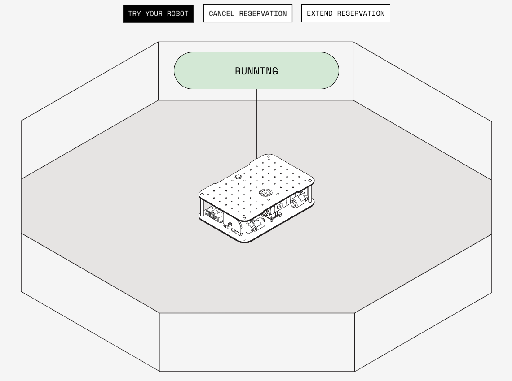

Rent and remotely configure and control a Viam Rover located on-site at Viam in NYC:

## Get started with Viam

Once you have rented your Viam rover, you can [remotely control the Viam rover](/tutorials/viam-rover/):

- teleoperate (that means drive) the rover from wherever you are
- see what the rover sees using services like computer vision or data management
- configure and control the rover's sensors and actuators in the Viam app
- write code to control the rover

## Control your rover with SDKs

If you want to control and automate your rover with Python or Go, use the [Viam SDKs](/program/sdk-as-client).

Viam also exposes exposes a gRPC [API for robot controls](https://github.com/viamrobotics/api).

Both the API and the SDKs support [WebRTC](https://webrtcforthecurious.com/). The SDKs provide a wrapper around the viam-server [gRPC](https://grpc.io/) API and streamline connection, authentication, and encryption against a server.

## Next steps
