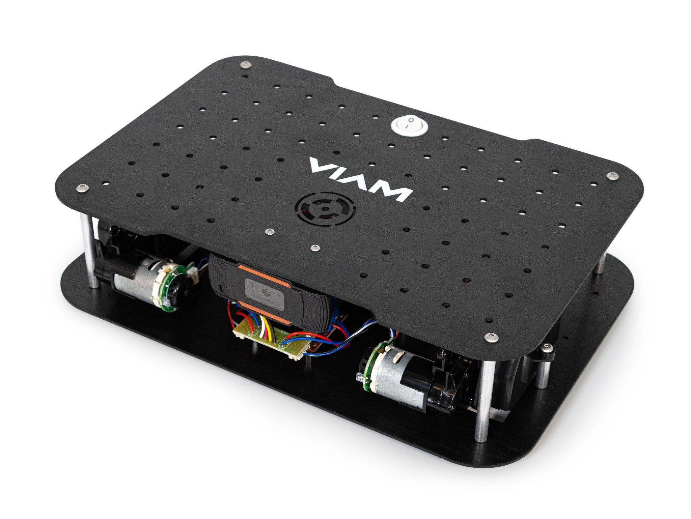

  

    

         
        
         
        <a href="try-viam-tutorial/">
            <h4 style="text-align: left; margin-left: 0px; margin-top: 1em;">Borrow a rover right now</h4>
            
Rent and remotely configure and control a Viam Rover located on-site at Viam in NYC.

        </a>
    

    

         
        
         
        <a href="../../tutorials/viam-rover/try-viam-color-detection">
            <h4 style="text-align: left; margin-left: 0px; margin-top: 1em;">Order and build your own rover</h4>
            
 Order your own preassembled rover, add a raspberry pi and some batteries, and get rolling.

        <a>
    

  

## Get started with Viam

Once you have rented or received yout Viam rover, you can:

- teleoperate (that means drive) the rover from wherever you are
- see what the rover sees using services like computer vision or data management
- configure and control the rover's sensors and actuators in the Viam app
- write code to control the rover

If you have rented a rover, follow the [Try Viam tutorial](/tutorials/viam-rover/).
If you have ordered and received your own rover, start by [unboxing and setting up your Viam rover].

## Control your rover with SDKs

If you want to control and automate your rover with Python or Go, use the [Viam SDKs](/program/sdk-as-client).

Viam also exposes exposes a gRPC [API for robot controls](https://github.com/viamrobotics/api).

Both the API and the SDKs support [WebRTC](https://webrtcforthecurious.com/). The SDKs provide a wrapper around the viam-server [gRPC](https://grpc.io/) API and streamline connection, authentication, and encryption against a server.

## Next steps
