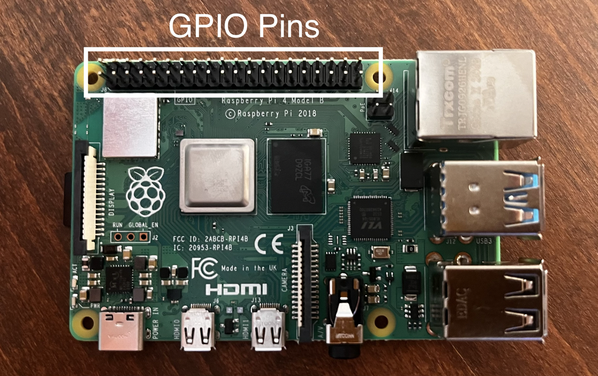
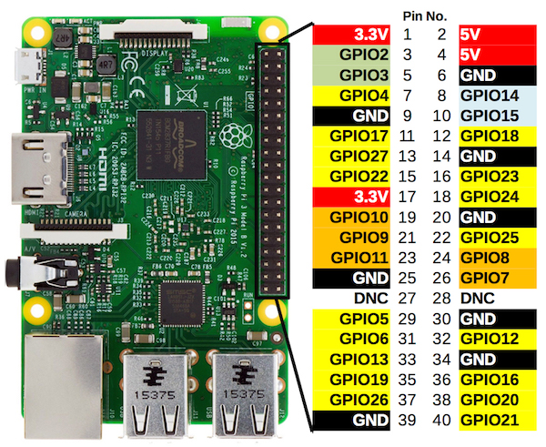
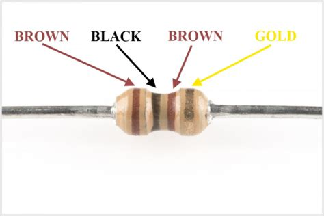
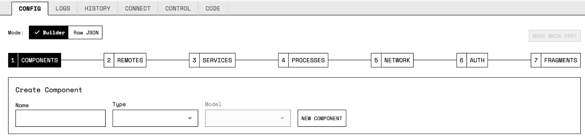
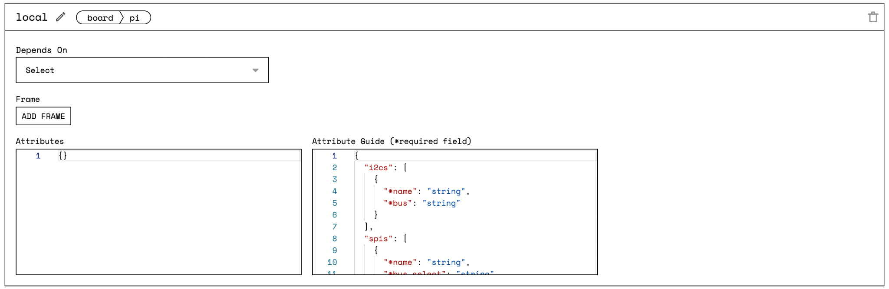
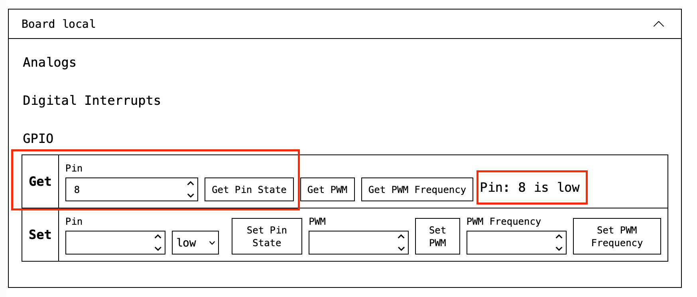
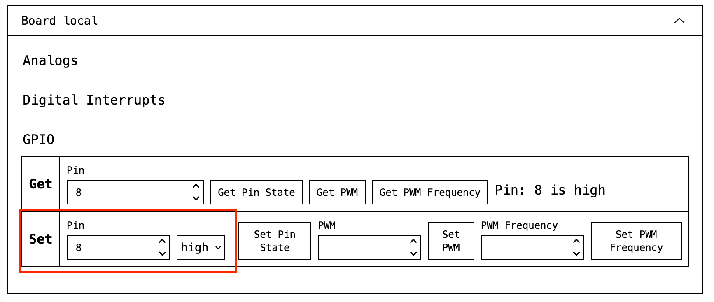

# How to Make an LED Blink with a Raspberry Pi Using the Viam App

## Intro

In this post, we will show you how to use Viam to make an LED blink with a Raspberry Pi. This tutorial is a great place to start if you have never built a robot or a circuit before.

## What you'll need for this guide

You will need the following tools to complete the project:

-   [Raspberry Pi 3 or 4](https://a.co/d/5Tn67G3)

    -   [Check out the Viam Raspberry Pi Setup Guide for steps on how to get started](https://docs.viam.com/getting-started/installation/)

    -   [Be sure that you have setup Viam Server on your Raspberry Pi as well.](https://docs.viam.com/getting-started/installation/#installing-viam-server)

-   [Solderless breadboard](https://amzn.to/2Q4Z5Ta)

-   [Jumper wires for easy hookup](http://amzn.to/2qVhd4y)

-   [Resistor pack](http://amzn.to/2Dmainw)

    -   You will be using a 220Ω or 1K Ω resistor, which is the resistor colored with brown-black-brown.

-   [Red LED](http://amzn.to/2Ex2v5q)

-   [Multimeter](http://amzn.to/2qWurxS) (optional)

-   [Viam Server](https://github.com/viamrobotics/rdk/tree/0c550c246739b87b4d5a9e8d96d2b6fdb3948e2b)

## Project setup

Before you proceed with building your circuit, you are going to need to set up the operating system on your Raspberry Pi and install Viam Server on the Pi. We recommend that you follow along with the [Installing Viam RDK Server on Raspberry Pi](https://docs.viam.com/getting-started/installation/) guide in the Viam documentation. Be sure to follow all the steps including [adding your Pi on the Viam App.](https://docs.viam.com/getting-started/installation/#adding-your-pi-on-the-viam-app-httpsappviamcom)

> **_NOTE:_**  If you have any issues whatsoever getting Viam set up on your Raspberry Pi, let us know on the [Viam Community Slack](http://viamrobotics.slack.com), and we will be happy to help you get up and running.

## Building the circuit

The first step in this project is to design a simple LED circuit. Then you will make the LED circuit controllable from the Raspberry Pi by connecting the circuit to the **general purpose input/output** (GPIO) pins on the Raspberry Pi.

A simple LED circuit consists of a LED and resistor. The resistor is used to limit the current that is being drawn and is called a *current-limiting resistor*.

### GPIO Pinout

**General-purpose input/output** (**GPIO**) is a digital signal [pin](https://en.wikipedia.org/wiki/Pin_(electronics)) on a circuit board, like a Raspberry Pi, which may be used as an input or output, or both, and is controllable by software.

As you may have guessed, **each pin has a specific role, and you can use it only for that role**. Some of them are input/output, power (3.3V or 5V), or ground. As you can see in the diagram below, there are 40 output pins on the Pi. You can program 26 of the GPIO pins.

One thing to note that might be confusing with the pin numbering on Raspberry Pi's: There are 40 physical pins numbered from 1 to 40. That is **board pin numbering,** corresponding to the pin's physical location on the board. When working with the GPIO pins with Viam, you will use the board numbers.

Then there's numbering them by function or GPIO connection. These are the big numbers, e.g. "GPIO 22". These numbers are helpful for understanding the function of each pin.

When in doubt, the website [pinout.xyz](https://pinout.xyz/) is useful for identifying pins. It gives you the exact layout and role of each pin.

### Circuit Explanation

Here's the circuit diagram used in this tutorial for making the LED blink.

You can now hook the LED and resistor up to GPIO pin 8 on the Raspberry Pi. The resistor and LED need to be in series as in the diagram above. To find the right resistor use the resistor color code -- for a 100 ohm resistor, it needs to be brown-black-brown. You can use your multimeter to double-check the resistor value or check yours using the photo below.

When hooking up the circuit, note the *polarity* of the LED. You will notice that the LED has long and short leads. The long lead is the positive side, which is known as the anode, the short lead is the negative side, which is known as the cathode. The long anode should be connected to the resistor and the short cathode should be connected to the ground via the blue jumper wire and pin 6 on the Raspberry Pi as shown on the diagram.

## Configuring your Bot using the Viam App

Before proceeding, be sure that you have added your Pi to the Viam App. Steps on how to do this can be found in the [Adding your Pi on the Viam App](https://docs.viam.com/getting-started/installation/#adding-your-pi-on-the-viam-app-httpsappviamcom) section of the Viam Documentation.

Now that we have got that out of the way, let's get back to setting up your robot in the Viam App. First, go to the Viam App at [app.viam.com](https://app.viam.com/) on your web browser, and select the robot's config.

The first component you will add is the `**board**`, which represents your single board computer, which in this case is the Raspberry Pi. This is where you will wire all other components. To create a new component, select `**Create a component**`. For the component `**Type**`, select `**board**`. Then you can name the `**board**` whatever you like as long as you are consistent when referring to it later; we'll name this component `**local**` since it is the `**board**` we will communicate with directly. For `**Model**`, select `**pi**`, then click '**Add new component**.' Your board component's config will generate the following JSON attributes:

As you add your board component to your robot in the Viam App, it generates a tab for your board in the Control tab. Here, you can click on "**Get**" to get the current status of your pin. When you first click **Get Pin State**, it should return "Pin: 8 is low."

You can now select "**Set**" to control the status of your pin to "high." It will look like this:

After setting your pin to "high" the LED should be illuminated! You should play around with values "**low**" and "**high**" by setting them differently. You will see your LED toggle on and off.

## Summary

Congratulations! If you have followed along, you have just successfully used Viam to make an LED blink with a Raspberry Pi! Hopefully, you have learned how the GPIO on a Raspberry PI works, and how to build circuits for LED bulbs. You are ready for your next robotics project. If you are looking for some projects that would be a great next step, we would recommend that you check out the following:

-   [Tutorial List](tutorials.md)

If you want to connect with other developers learning how to build robots, or if you have any issues whatsoever getting Viam set up, let us know on the [Viam Community Slack](http://viamrobotics.slack.com), and we will be happy to help you get up and running.
