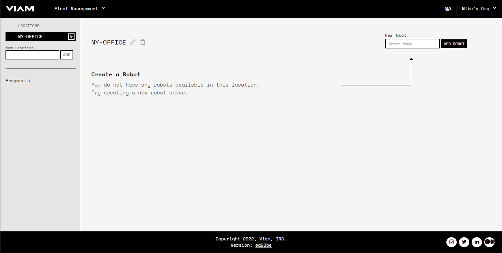

# Installing Viam RDK Server on Raspberry Pi


## Resources

The instructions assume you have the following hardware:

* Raspberry Pi Single Board Computer
* microSD card
* computer
* a way to connect the microSD card to the computer (ex, microSD slot or microSD reader)

Before installing the Viam RDK, you’ll need a Raspberry Pi running a 64-bit linux distribution. If you do not have linux installed on your Raspberry Pi, skip ahead to [Installing Raspian on the Raspberry Pi](install-on-pi.md#installing-raspian-on-the-raspberry-pi). If you already have a Raspberry Pi with linux installed on it, check if the linux installation on your Raspberry Pi is 64-bit. First, `ssh` into your pi and then run `lscpu`. Example output:

If the line of output which reads “Architecture:     <value>” has a value which ends in 64, skip ahead to [Installing viam-server](install-on-pi.md#installing-viam-server). Otherwise continue to [Installing Raspian on the Raspberry Pi](install-on-pi.md#installing-raspian-on-the-raspberry-pi).

## Installing Raspian on the Raspberry Pi
A Raspberry Pi boots from a microSD card. Our first step is to set up a linux installation on that microSD card. Connect the microSD card to your computer.

Since we need a 64-bit version of linux, you’ll need to download the raspberry pi OS 64-bit beta image [here](https://downloads.raspberrypi.org/raspios_lite_arm64/images/).


Select and click on the most recent folder listed:


Select and download the `.zip` file. Unzip the `.zip` file by double clicking it in your Downloads folder. This should result in a `.img` file.

We’ll be using the Raspberry Pi Imager to flash the microSD card. If you do not already have the Raspberry Pi Imager, you can download it following the install instructions [here](https://www.raspberrypi.com/software/). After successful installation, connect your microSD card to your computer and launch the Raspberry Pi Imager. You should be greeted with a window that looks like:  


Select `CHOOSE OS`. Then, scroll to the bottom and select `Use custom`:


Navigate to and select the 64-bit raspios image (`.img` file) you downloaded earlier:


This should return you to the initial screen. Now we need to pick our storage medium, so click `CHOOSE STORAGE`:


You may have many devices listed, select the microSD card you intend to use in your Raspberry Pi:


You should be returned to the initial launch screen. To make your Raspberry Pi easier to access, we recommend configuring hostname, ssh credentials, and wifi. On Mac OS X, hit command+shift+x, to bring up the Advanced options menu (NB: if you are using a non-raspberry pi OS, altering the Advanced options will cause the initial bootup to fail):


Check `Set hostname` and enter the name you’d like to access the pi by in that field. Remember the name you choose as you will need to make use of it later. I’ve chosen "viam-pi". Then check `Enable SSH` and either set a password or use `Allow public-key authentication only` if Raspberry Pi Imager has populated the `Set authorized_keys for ‘pi’` field:


Lastly, check `Configure wifi` and enter your wireless network credentials:


After clicking save, doublecheck your OS and Storage settings and then click WRITE:


You’ll be prompted to confirm erasing your microSD card, select `YES`. You may also be prompted by your operating system to enter an Administrator password. After granting permissions to the Imager, it will begin writing and then verifying the linux installation to the MicroSD card:


Remove the microSD card from your computer. Place it into your Raspberry Pi and boot the Pi by plugging it in.

## Installing viam-server

Once your Raspberry Pi is plugged in and turned on, wait a minute or two and then attempt to access your pi from your terminal emulator. Launch your terminal and run:
```bash
ssh pi@<hostname>.local
```

If you are prompted “Are you sure you want to continue connecting?”, type “yes” and hit enter. You should be greeted by a login message and a command prompt (`pi@$HOSTNAME:~ $`). Now that you’re on the Pi, download the latest viam-server AppImage package: 
```bash
wget http://packages.viam.com/apps/viam-server/viam-server-latest-aarch64.AppImage -O viam-server
```

Make it executable by running the following command:
```bash
chmod 755 viam-server
```

Then install it as root:
```bash
sudo ./viam-server --aix-install
```

## Adding your pi on app.viam.com

In your web browser, navigate to app.viam.com and log in. Then if you have not already, create a new location by filling out the form on the left  and then clicking `New Location`.


Select your location and use the form on the right to create a new Robot:


Navigate to your new robot, which should show an empty conifg like below:


Click `COPY RDK CONFIG` at the bottom, this should fill your clipboard with the json config needed for your pi talk to app.viam.com as this robot.

Copy this json data into the /etc/viam.json file on your pi. This can be done by going back to the terminal window connected to your pi and running the following: 
```bash
echo ‘<paste copied config into these quotes, but dont forget the quotes themselves>’ | sudo tee /etc/viam.json
```

Then restart the viam-server:
```bash
sudo systemctl restart viam-server.service
```

Back on app.viam.com we can confirm the Pi has connected and pulled the config by looking at the `config` portion of the robot's page and seeing that `ips` field is populated and that the `last access` field reads `less than a minute ago`.

## Next Steps
Now that you've got the viam-server up and running, we can start adding components to your robot and the real fun can begin!
Why not plug it into a Yahboom 4WD Rover and set that up by following [these instructions](yahboom-rover.md)?
