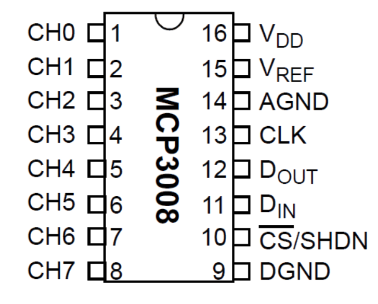
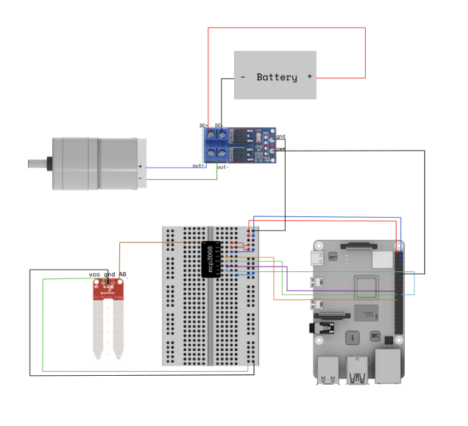

## Hardware Requirements

- A Raspberry Pi with SD card
- A [Capacitive Soil Moisture Sensor](https://www.amazon.com/KeeYees-Sensitivity-Moisture-Watering-Manager/dp/B07QXZC8TQ/ref=asc_df_B07QXZC8TQ/?tag=hyprod-20&linkCode=df0&hvadid=343238573411&hvpos=&hvnetw=g&hvrand=14606440922488452520&hvpone=&hvptwo=&hvqmt=&hvdev=c&hvdvcmdl=&hvlocint=&hvlocphy=9067609&hvtargid=pla-757549749596&psc=1&tag=&ref=&adgrpid=71762478951&hvpone=&hvptwo=&hvadid=343238573411&hvpos=&hvnetw=g&hvrand=14606440922488452520&hvqmt=&hvdev=c&hvdvcmdl=&hvlocint=&hvlocphy=9067609&hvtargid=pla-757549749596)
- A [Peristaltic Pump Motor](https://www.amazon.com/Gikfun-Peristaltic-Connector-Aquarium-Analytic/dp/B01IUVHB8E/ref=asc_df_B01IUVHB8E/?tag=hyprod-20&linkCode=df0&hvadid=198093101467&hvpos=&hvnetw=g&hvrand=13835398343702336934&hvpone=&hvptwo=&hvqmt=&hvdev=c&hvdvcmdl=&hvlocint=&hvlocphy=9067609&hvtargid=pla-384674250225&psc=1) and [tubing](https://www.amazon.com/dp/B08H1ZD5VZ?psc=1&ref=ppx_yo2ov_dt_b_product_details)
- An [Adafruit MCP3008 ADC](https://www.amazon.com/dp/B00NAY3RB2?psc=1&ref=ppx_yo2ov_dt_b_product_details)
- A [Motor Speed Controller](https://www.amazon.com/CHENBO-Trigger-Adjustment-Electronic-Controller/dp/B099RF72R1/ref=asc_df_B099RF72R1/?tag=hyprod-20&linkCode=df0&hvadid=532384528241&hvpos=&hvnetw=g&hvrand=11376239784428845641&hvpone=&hvptwo=&hvqmt=&hvdev=c&hvdvcmdl=&hvlocint=&hvlocphy=9067609&hvtargid=pla-1410298730875&th=1)
- 9V Battery

## Getting Started

First, follow the [Raspberry Pi Setup Guide](/installation/prepare/rpi-setup/) to prepare your Pi to run `viam-server`.

Folliow this tutorial to set up the hardware for your plant watering robot and code a Python file utilizing the Viam Python SDK to control the plant watering robot with your Pi running `viam-server`.

## Set Up your Plant Watering Robot

### Wire your ADC

First, start by wiring your ADC to your Raspberry Pi board.

Refer to the following pinout diagram for your MCP3008 Analog to Digital Converter:



Consult your Raspberry Pi's data sheet for your board's pinout diagram.

[Wiring Diagram](#wiring-diagram)

### Wire your Moisture Sensor

[Wiring Diagram](#wiring-diagram)

### Enable SPI on your Pi

### Configure your ADC readings on your Pi

### Wire your Pump / Motor

Now, wire and power your Peristaltic pump to complete your hardware setup.

1. Connect your battery to the DC power pins on the motor speed controller.
2. Then, connect the output pins to the pump.
3. Connect the GND pin on the pump to the breadboard and terminal.
4. Connect the PWM pin on the pump to Pin 12 of the Pi.

### Wiring Diagram

Refer to the following full wiring diagram for your hardware setup:



## Program Your Plant Watering Robot

### Configure the Components of your Robot

### Add Python Control Code

Follow the below instructions to start working on your Python Control Code:

1. Navigate to your `viam-server` robot's page in [the Viam app](https://app.viam.com), and click on the **CONTROL** tab.
Follow the instructions in this tab.

   - Install the Python SDK if you have not already.
   - Then, click **COPY CODE** to copy a code sample that establishes a connection with this robot when run.

1. Paste this code sample into a new file in the directory where you have saved your micro-RDK template code, using your preferred IDE.

   - Name the file whatever you want, and save it.
   - In the [example code](#full-example-code) this tutorial follows, the control code is named <file>Water-esp32.py</file>.

The beginning of your new file should look similar to the following:

``` python {class="line-numbers linkable-line-numbers"}
import asyncio
import datetime
import signal

from viam.robot.client import RobotClient
from viam.rpc.dial import Credentials, DialOptions
from viam.components.board import Board

async def connect():
    creds = Credentials(
        type='robot-location-secret',
        payload='xyz12345678910somerobotlocationsecret') // Your robot location secret
    opts = RobotClient.Options(
        refresh_interval=0,
        dial_options=DialOptions(credentials=creds)
    )
    return await RobotClient.at_address('some-robot-name-main.123xyz.viam.cloud', opts) // Your robot address

```

<br>
Add the following imports to the beginning of your file if they are not already present:

``` python {class="line-numbers linkable-line-numbers"}
import datetime
import signal

from viam.components.board import Board
```

#### `WaterLevelUnit` Class

## Next Steps
