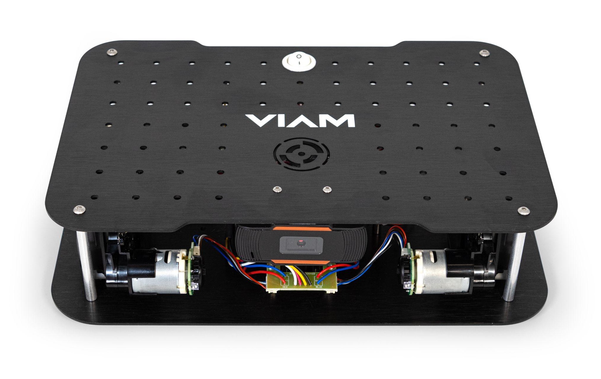
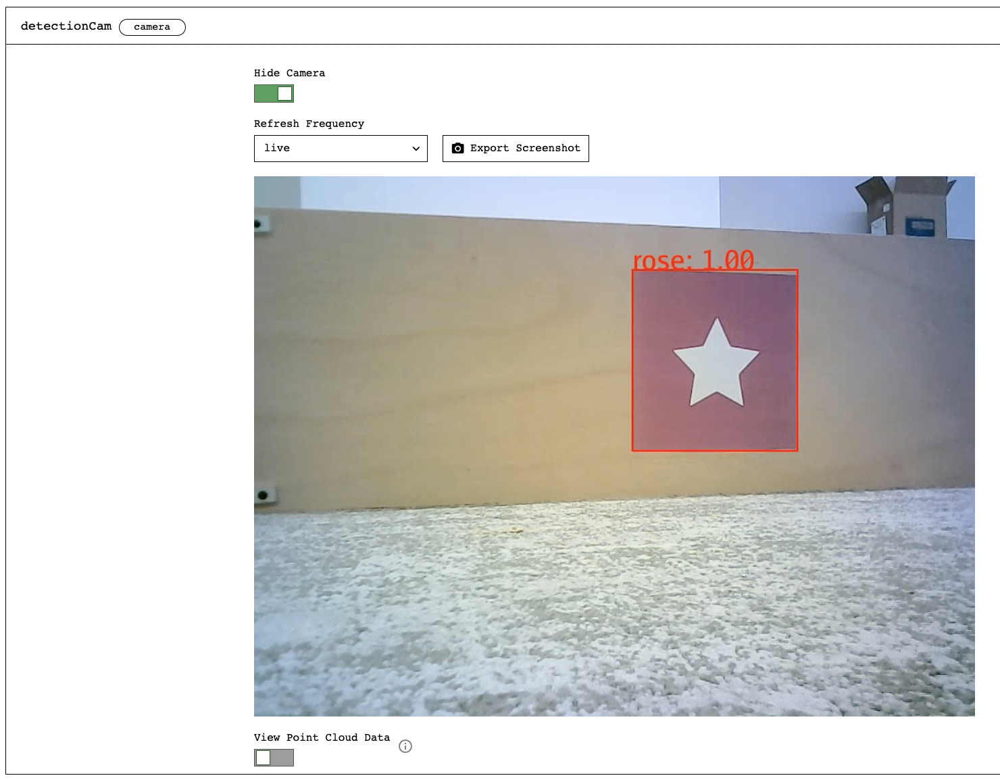

Follow one of these tutorials with your borrowed or owned rover:




<h4>Unbox and Set Up your Viam Rover</h4>

Contents of the Viam Rover kit and instructions for wiring your rover.






<h4>Drive with the Viam SDK</h4>

Use the Viam SDK to make your Viam Rover move in a square.




<h4>Detect a Color</h4>

Use the Vision Service in the Viam app to detect a color.




 

Have questions, or want to meet other people working on robots? Join our [Community Discord](https://discord.gg/viam).
