# Configuring a Four Wheeled Rover Controlled by Gamepad
TODO: introduce the config concept, attributes, and depends_on.

Let's go to app.viam.com on our web browser, and click to our robot's config.

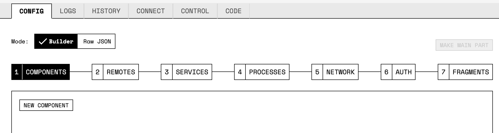

The first component we will add is our `board`, which represents our Single Board Computer, the Raspberry Pi into which we are wiring all other components. To create a new component, simply click to `NEW COMPONENT`. For component `Type`, select `board`. Then you can name the `board` whatever you like as long as you are consistent when referring to it later; we'll name this component `local` since it is the `board` we will communicate with directly. For `Model`, select `pi`:

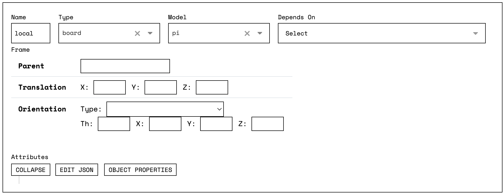

Next we’ll add one of the `motor` controllers and see if we can make the wheel spin. As with all other components, the first step is to click `NEW COMPONENT`. We'll start with the right wheels, so let's name the component `right`. For the `Type` select `motor`, for the `Model` select `pi`, and for `Depends On` select `local` since that is what this motor is wired to.

We'll need to tell Viam how this motor is wired up to the Pi. If the Yahboom setup instructions were followed correctly, the following `pins` should be correct: set `a` to `35`, `b` to `37`, and `pwm` (pulse-width modulation) to `33`. You should leave `dir` pin blank, because Yahboom's motor driver uses an a/b/pwm configuration. For the `board` we again put `local`, and `max_rpm` should be `300`. You should leave `ticks_per_rotation` at zero (if you are using a motor with encoders, you need to specify the ticks per rotation):

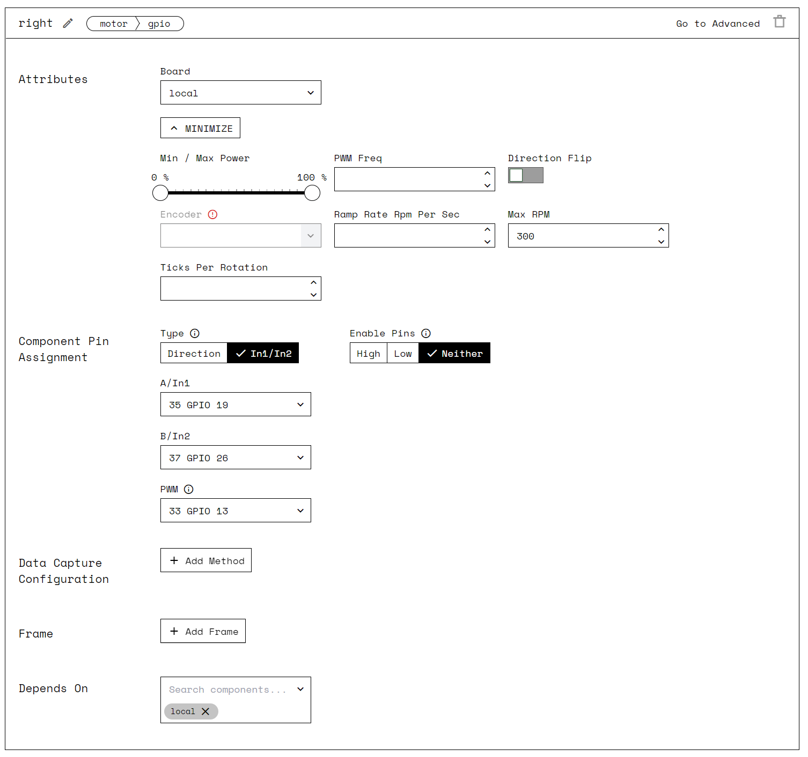

Having entered these two components, you should now be able to actuate your motor. Save the config by clicking `SAVE CONFIG` at the bottom of the page and click `CONTROL` at the top of the page to navigate to the Control Page. There, you should see a panel for the right `motor`. You can use this panel to set the motor's `power` level. Please be careful when activating your robot! Start with the power level set to 10% and incrementally increase it (about 10% each time), activating the motor at each step until the wheels are rotating at a reasonable rate. Ensure the rover has sufficient space to drive around without hitting anyone or anything. Consider possibly holding your robot off the ground so it cannot run away or collide with anything unexpected.

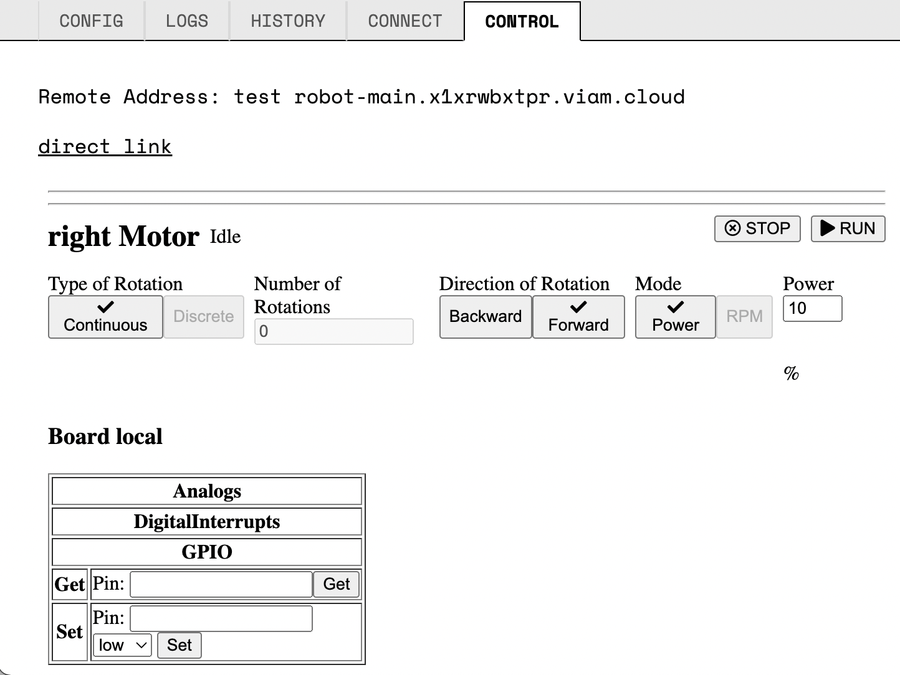

At this point, the wheels on one side of your robot should be working through app.viam. Very cool! Now let’s try to add the other set of wheels and see if we can get this bot driving in a coordinated manner. To do this, we’ll have to add the other `motor` controller and link them together with a `base`.

We'll once again click `NEW COMPONENT`. The config attributes for this `motor` will be very similar to the `right` motor, which makes sense as the hardware is the same and it is connected to the same `board`. The only difference will be the `Name` which will be `left` and the pins it's connected to, which should be set as follows: `a` to `38`, `b` to `40`, and `pwm` to `36`.

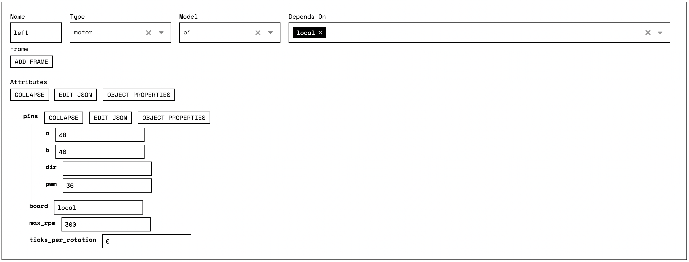

If you save the config and hop over to the control view again, you should now see two motors and be able to make each set of wheels spin.

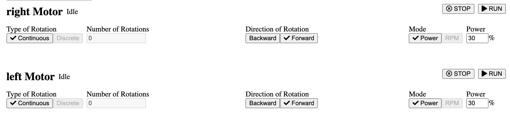

Now let’s unite these wheel sets with a `base` component, which is used to describe the physical structure onto which our components are mounted. Configuring a `base` component will give us a nice API for moving the rover around.

As you're likely accustomed to at this point, we'll start by clicking `NEW COMPONENT`. Let's name the component `yahboom-base`. For the `Type` select `base`, for the `Model` select `wheeled`, and for `Depends On` select `local`, `left`, and `right` since these are the components that comprise our `base`. For `width_mm` we'll use `150` (the board is 230mm in height, 180mm in the longest side of the width, and 120mm in the shortest side of the width since the shape of the base is irregular, we can average the width to 150mm) and for `wheel_circumference_mm` we'll use `220`. The `left` and `right` attributes are intended to be the set of motors corresponding to the left and right sides of the rover. Since we were clever about naming our motors, we can simply add one item to each of `left` and `right` which will be our motors `left` and `right`, respectively.

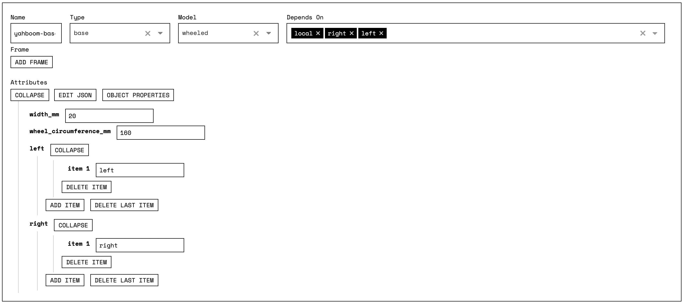

When you save the config and switch to the control view once more, you should have new buttons for the `base` functionality including `Forward`,`Backward`, `Arc Forward`, `Spin Clockwise` and similar. Try playing around with these and the `Speed`, `Distances`, and `Angle` fields below them to get a sense for what they do. We tried 300mm per sec for the speed, 500mm for the distances, and 0 degree for the angle. 

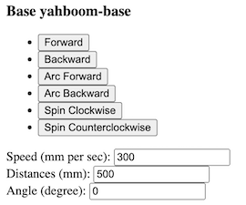

Awesome! Now we have a rover which we can drive via a webUI. But wouldn’t it be more fun to drive it around like an RC car? Let’s try attaching a bluetooth controller and using that to control the rover. If you’ve ever connected a bluetooth device via the linux command line, great! If not, strap in, it’s a bit of a pain. 

Make sure the 8bitdo controller mode switch is set to S, hold down Start for a few seconds, and when the LED underneat the controller rotates green, press the pair button for 3 seconds. For more information about the controller buttons and bluetooth modes, consult the manual included with the controller.

Run `sudo bluetoothctl scan on` to list all Bluetooth devices within reach of the Raspberry Pi. As you do this, in terminal make sure you are in your pi and not your computer. This command will scan all the devices but the 8bitdo controller will have a MAC address that begins E4:17:D8. 

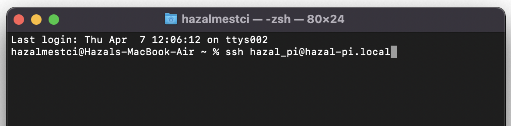

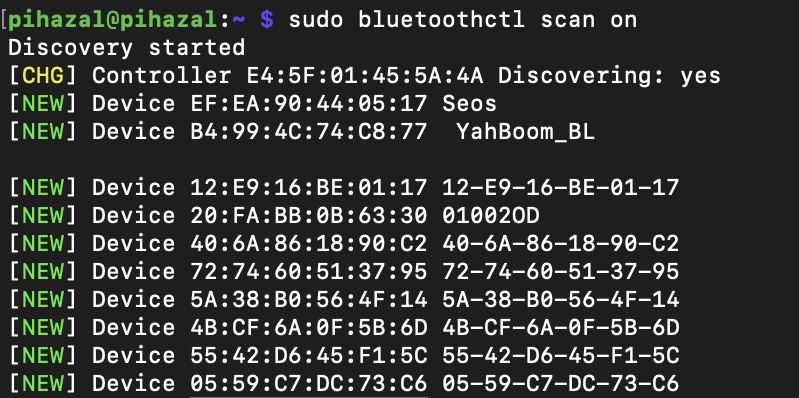

If you see a large log of devices, to see the addresses that only begin with E4:17:D8, you can use the grep command line tool. It is an acronym that stands for Global Regular Expression Print and allows to search for a string of characters in a specified file: `sudo bluetoothctl scan on | grep "E4:17:D8"`

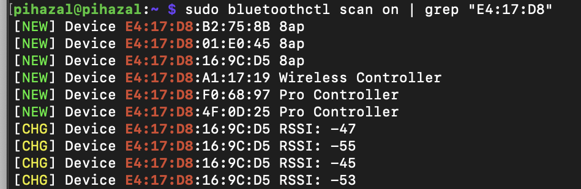

Once you find it in the listings, pair with the controller: `sudo bluetoothctl pair <8bitdo-mac-address>`. Don't forget to take the < and > symbols out as you paste your address. 

Then connect the controller: `sudo bluetoothctl connect <8bitdo-mac-address>`

Lastly trust the controller, which make reconnecting easier in the future: `sudo bluetoothctl trust <8bitdo-mac-address>`

To confirm the connection, you can list connected devices with: `sudo bluetoothctl devices | cut -f2 -d' ' | while read uuid; do sudo bluetoothctl info $uuid; done|grep -e "Device\|Connected\|Name"`

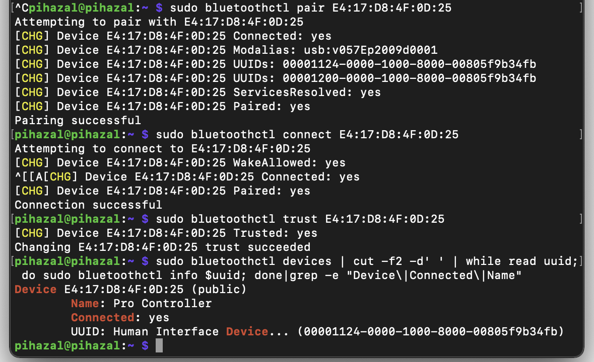

If you'd a stronger understanding of `bluetoothctl` and managing bluetooth devices in linux, we recommend [this guide](https://www.makeuseof.com/manage-bluetooth-linux-with-bluetoothctl/).

Now let’s add this controller to the robot’s config. Click on our old friend `NEW COMPONENT`. Let's name the component `8bit-do-controller`. For the `Type` select `input_controller` and for the `Model` select `gamepad`. Lastly, let's set the `auto_reconnect` attribute to `true`. This config adds the controller to the robot, but doesn’t wire it up to any functionality.

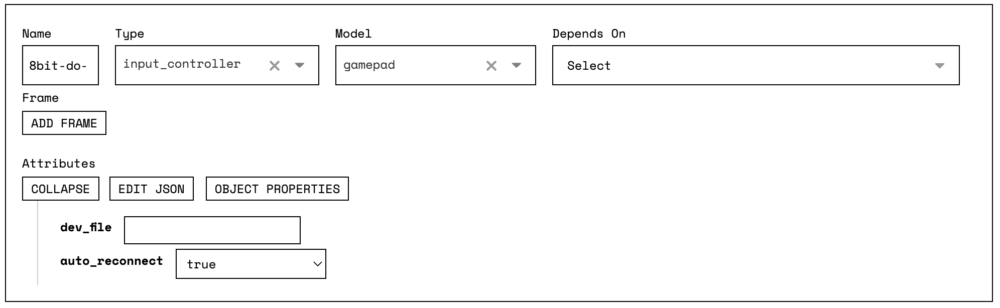

To link the controller input to the four-wheel base functionality, we need to add our first `service`. Services are the software packages which provide our robots with cool and powerful functionality.

This time around we'll have to click `ADD ITEM` under `services` on the top of the page. We'll `name` this service `yahboom_gamepad_control` and give it the `type` `base_remote_control`, which is a service we've provide for driving a rover with a gamepad. We'll need to configure the following attributes for this services as follows: `base` should be `yahboom-base` and `input_controller` should be `8bit-do-controller`.

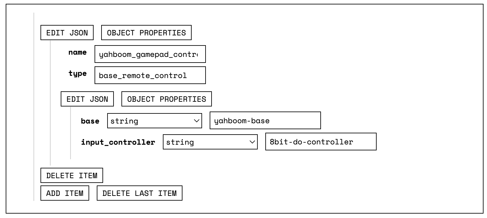

If you can't see a section where you can add the attributes, you can go to your raw json mode, and add this code: 

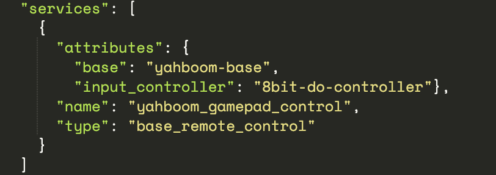

Save the config and visit the control UI. You should have a panel for the controller which indicates whether or not it is connected. At this point moving the left analogue stick should result in movement of the rover!

But wait! This rover has a `camera` on it. Let's see if we can get that going as well! Once again, click `NEW COMPONENT`.
Let's name this camera `rover_cam`. For the `Type` select `camera` and for `Model` select `webcam`. Lastly, we'll set the `path` attribute to the linux path where the device is mounted, which should be `/dev/video0`. If you can't see the attributes, you can click object properties and select path, and then add the path. That should be enough to get the `camera` streaming to the webUI.

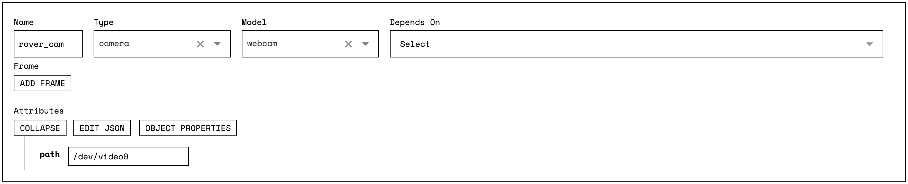

If you click on your webUI, you will be able to see your camera streaming. 

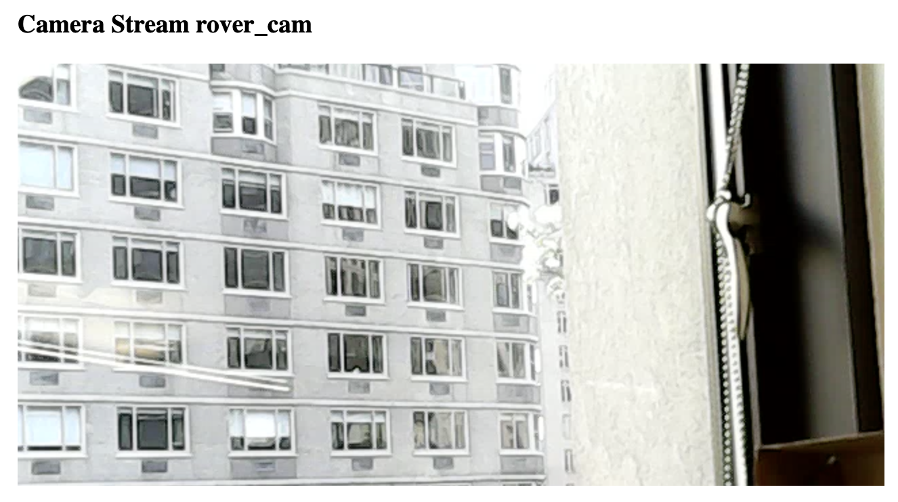

You may have noticed that the `camera` is mounted on a pair of `servo`s which control the pan and tilt of the `camera`. Again, we'll click `NEW COMPONENT`. We'll set the `Name` to `pan`, the `Type` to `servo`, the `Model` to `pi`, `Depends On` to `local`, and `pin` to `23`, which is the pin the servo is wired to.

Let's add the tilt `servo` as well. Same process as the first `servo`, but with the `Name` set to `tilt` and the `pin` to `21`.

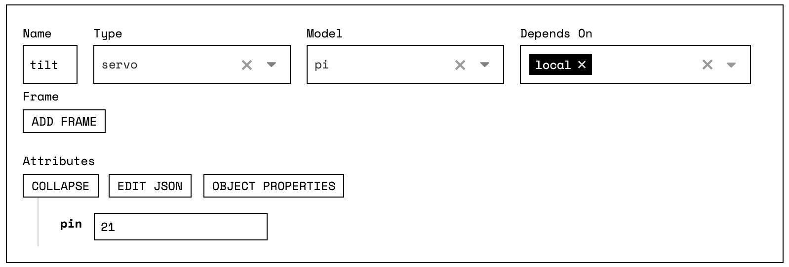

Saving the config and moving to the control UI, you should notice two new panels for adjusting these servos.

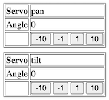

Wow! This is cool! But all the control is manual. It'd sure be nice to have the robot move in an automated manner. To learn more about that, check out our [python SDK tutorial](python-sdk-yahboom.md).
