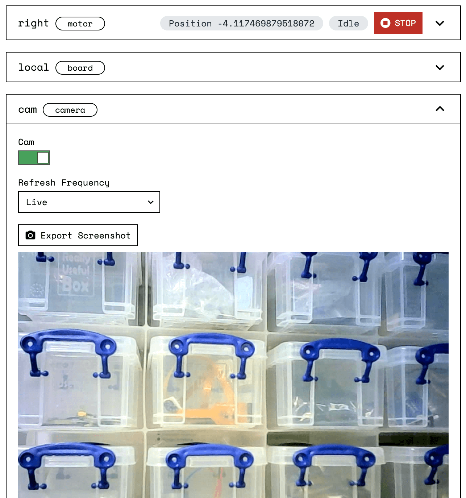

Viam is a complete software platform that supports every step of your robot development lifecycle.

## Plan your robot

When using Viam, this is what you'll need to know to plan your robot:

</img>

- **Hardware**:
Many [robotic components](/components) are natively supported by the Viam platform. You will not need to write a single line of code to integrate them, and swapping out component models will not require code changes.
- **Functionality**:
You can make use of computer vision, motion planning, SLAM, data management, machine learning, and more by configuring Viam built-in [services](/services).
- **Architecture**:
You can build simple robots or multi-part robots that use secure communication channels across local networks and the cloud, all of which can be managed with a uniform API.
- **Extensibility**: If you need additional functionality, you can leverage community contributed and custom resources to [extend](/program/extend) Viam.

Join the [**Viam community**](https://join.slack.com/t/viamrobotics/shared_invite/zt-1f5xf1qk5-TECJc1MIY1MW0d6ZCg~Wnw) to collaborate during planning and beyond.

## Get started

A *robot* in Viam consists of at least one computer, like a [Raspberry Pi](https://www.raspberrypi.com/documentation/computers/raspberry-pi.html) single-board computer, running `viam-server` and communicating with any hardware connected to it by signaling through digital data pins.

</img>

The Viam platform provides a user interface for connecting to and managing robots, the [Viam app](https://app.viam.com/).

To use the Viam platform with your robot, add the robot in the app and [install](/installation) the [`viam-server`](https://github.com/viamrobotics/rdk) binary which:

- Creates, configures, and maintains the robot.
- Securely handles all communications.
- Runs drivers, custom code, and any other software.
- Accepts API requests.
- Runs services like computer vision, data synchronization, and motion planning.

{}
Everything Viam runs on your robot is [open-source](https://github.com/viamrobotics).
{}

## Configure your robot

Robots can be small and simple or very complex.
A robot can be a single-board computer with a single [sensor](/components/sensor/) or LED wired to it, or a robot can consist of multiple computers with many physical components connected, acting as one unit.

The term *component* describes a piece of hardware that a computer controls, like an arm or a motor.

For each component that makes up your robot:

</img>

1. Add it to your robot by [choosing the component type](/manage/app-usage/#config) (example: `camera`) and model (example: `webcam`)
2. Test it with the visual [control tab](/manage/app-usage/#control)
3. See any problems with in-app [logs](/manage/app-usage/#logs), review or roll back configuration [history](/manage/app-usage/#history)

After configuring your robot's hardware, you can configure high level functionality the same way:

- **Data Management** enabling you to capture and sync data from one or more robots, and use that data for machine learning and beyond.
- **Fleet management** enabling you to configure, control, debug, and manage entire fleets of robots.
- **Motion planning** enabling your robot to plan and move itself.
- **Vision** enabling your robot to intelligently see and interpret the world around it.
- **Simultaneous Localization And Mapping (SLAM)** enabling your robot to map its surroundings and find its position on a map.

## Control your robot

</img>
  s
The Viam platform provides a consistent programming interface for all robots, allowing you to [control your robots](/program/sdk-as-client/) with code in the **language of your choice**.
Viam currently has SDKs for [Go](https://pkg.go.dev/go.viam.com/rdk) and [Python](https://python.viam.dev/).
Additional SDKs are coming soon, including Typescript, Rust, Java, C++, and Flutter.

TLS certificates provided by [app.viam.com](https://app.viam.com) ensure that all communication is authenticated and encrypted.
Viam uses [WebRTC](https://webrtc.org/) to create secure peer-to-peer paths between robots and clients for fast, low latency communication.
The Viam cloud does not receive any command or control information regarding your robots, ensuring low latency, robustness, and privacy.
With WebRTC established, Viam uses [gRPC](https://grpc.io/) so you can program your robot in many common programming languages.

This provides flexibility and security whether you are building tight control loops for autonomous mobile robots, event-based triggers for IoT devices, or custom web-based robot management interfaces.

There are four categories of APIs:

- [Robot](/services/robot-service/) - high level robot commands
- [Components](/components) like motors, arms, GPS
- [Services](/services) like computer vision, motion planning, SLAM
- Cloud applications like [Fleet Management](/manage/fleet-management), [Data Management](/manage/data-management)

You can see the Viam API specification on [GitHub](https://github.com/viamrobotics/api).

### Network flexibility

Your robot does not need to be connected to the cloud.

The `viam-server` software resides on your robot alongside your configurations, your code, and appropriate services.
In scenarios without cloud connectivity, you can still connect your robot to a LAN, or to any relevant devices (such as a gamepad).
It all depends on your use case and configuration.

- All APIs work locally or in the cloud
- Data is cached locally and synced when possible
- Configuration is cached

When your robot is connected (to either LAN or WAN), `viam-server` can act as both a client and a server.
In other words, each instance can request resources, as well as provide them.
This allows for tremendous flexibility in terms of your architecture design.

## Scale

With robots in production, Viam provides [fleet management capabilities](/manage/fleet-management/) to help you scale.
With it you can:

- Manage permissions within your organization and locations.
- Manage software across your fleet, including deployment of code and machine learning models.
- Keep your robot configuration and capabilities up-to-date.

## Next steps

Start by borrowing one of our robots.
Use [Try Viam](/try-viam/).

If you already have your own robot, [set up `viam-server`](/installation/) and learn how Viam helps you prototype and scale.

For more inspiration, check out our [tutorials](/tutorials) or visit our community on [Slack](https://join.slack.com/t/viamrobotics/shared_invite/zt-1f5xf1qk5-TECJc1MIY1MW0d6ZCg~Wnw/) to get help or workshop ideas with others!
